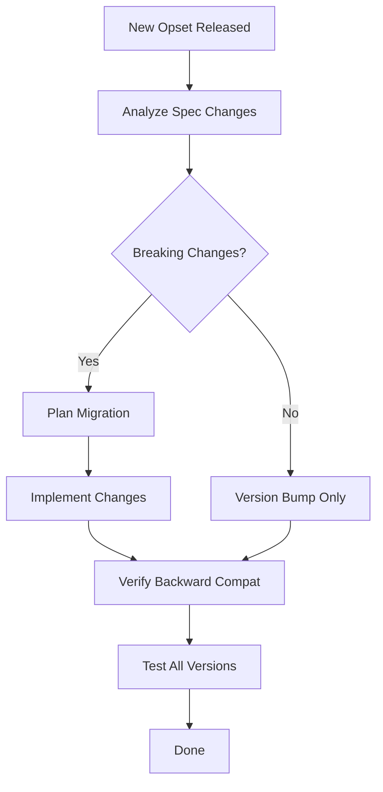

# Purpose

Guide the process of updating GPU plugin operations when OpenVINO introduces new Opset versions. Ensures backward compatibility, proper spec analysis, and correct handling of new data types (bf16, fp16).

# When to Use

Use this skill when:
- A new OpenVINO Opset version is released and existing GPU ops need updating
- Migrating an operation from an older Opset version to a newer one
- Adding support for new data types introduced in a new Opset



# Procedure

1. **Step 1: Spec Analysis** — Compare old and new Opset versions for the target Op
2. **Step 2: Backward Compatibility** — Ensure legacy behavior is preserved
3. **Step 3: Data Type Support** — Add new data type support if required
4. **Step 4: Implementation** — Update the GPU plugin code
5. **Step 5: Verification** — Test both old and new Opset versions

---

# Prerequisites Check

Verify you have access to the OpenVINO Opset specifications:

**Windows (PowerShell):**
```powershell
# Check if OpenVINO source is available with opset definitions
Test-Path "src\core\include\openvino\op\ops.hpp"
```

**Ubuntu:**
```bash
# Check if OpenVINO source is available with opset definitions
test -f src/core/include/openvino/op/ops.hpp && echo "OK" || echo "MISSING"
```

- **If successful:** Proceed to "Quick Start - Main Steps"
- **If failed:** Clone or checkout the OpenVINO repository first

---

# Quick Start

## Installation (Prerequisites Check failed)

Ensure the OpenVINO source tree is available. Clone from:
```bash
git clone https://github.com/openvinotoolkit/openvino.git
```

---

## Main Steps (Prerequisites Check passed)

### Step 1: Spec Analysis

Compare Opset versions to identify changes. Invoke `parse-op-spec` for both the old and new Opset version specs to produce structured summaries, then compare:

1. **Locate the Op specification** in:
   - `src/core/include/openvino/op/` — C++ Op definitions
   - OpenVINO Opset documentation: https://docs.openvino.ai/latest/openvino_docs_ops_opset.html

2. **Compare versions** — Identify:
   - New attributes or parameters added
   - Changed behavior or semantics
   - New input/output specifications
   - Deprecated features

3. **Document changes** in a comparison table:

| Aspect | Old Version | New Version | Impact |
|---|---|---|---|
| Attributes | ... | ... | ... |
| Inputs/Outputs | ... | ... | ... |
| Behavior | ... | ... | ... |

### Step 2: Backward Compatibility

**Critical rule:** Legacy behavior must be preserved.

- If the new version adds optional parameters, set defaults matching the old version's behavior
- If semantics changed, maintain a version check in the implementation
- Support both old and new Opset versions simultaneously

**Pattern:**
```cpp
// Example: Version-aware implementation
if (op_version >= 14) {
    // New behavior
} else {
    // Legacy behavior (must match old opset exactly)
}
```

### Step 3: Data Type Support

Check `clinfo` extensions for hardware data type support:

| Extension | Data Type | Notes |
|---|---|---|
| `cl_khr_fp16` | fp16 (half) | Most Intel GPUs support this |
| `cl_intel_bfloat16_conversions` | bf16 | Xe-HPG (Arc) and newer |
| `cl_khr_fp64` | fp64 (double) | Rarely needed; not on all GPUs |

**Windows (PowerShell):**
```powershell
clinfo | Select-String -Pattern "cl_khr_fp16|cl_intel_bfloat16|cl_khr_fp64"
```

**Ubuntu:**
```bash
clinfo | grep -E "cl_khr_fp16|cl_intel_bfloat16|cl_khr_fp64"
```

If a new Opset requires `bf16`/`fp16`:
- Add data type support to the kernel selector
- Update JitConstants with appropriate type definitions
- Add test cases for new data types

### Step 4: Implementation

Update the following files (see `gpu-op-file-structure` skill for paths):

1. **Op translation** (`src/plugins/intel_gpu/src/plugin/ops/<op_name>.cpp`):
   - Update `Create<OpName>Op` to handle new Opset version
   - Map new attributes to primitive parameters

2. **Primitive** (`src/plugins/intel_gpu/include/intel_gpu/primitives/<op_name>.hpp`):
   - Add new fields if the Opset adds parameters

3. **Kernel implementation** (kernel selector files):
   - Update JitConstants for new parameters
   - Modify OpenCL kernel if operation logic changed

### Step 5: Verification

Invoke `write-gpu-tests` to add test cases for the new Opset version and data types, then invoke `run-gpu-tests` to execute:

1. **New version tests:** Run functional tests filtered to the target op
2. **Backward compatibility:** Run functional tests also for the old Opset version filter (`*<OpName>*v<OldVersion>*`)

Both must pass before the migration is considered complete.

---

# Troubleshooting

- **Old tests fail after migration**: Check that default values match the old Opset behavior
- **New data type not supported**: Verify hardware support via `clinfo` extensions
- **Type mismatch errors**: Ensure kernel selector handles all supported data types
- **Missing Op in new Opset**: Check if the Op was renamed or merged with another Op
- **Backward compat breaks**: Review all code paths — version checks must cover all branches

---

# References

- Related skills: `gpu-kernel-enabling`, `gpu-op-file-structure`, `collect-gpu-hardware-spec`, `write-gpu-tests`, `run-gpu-tests`
- OpenVINO Opset documentation: https://docs.openvino.ai/latest/openvino_docs_ops_opset.html
- Op definitions: `src/core/include/openvino/op/`
