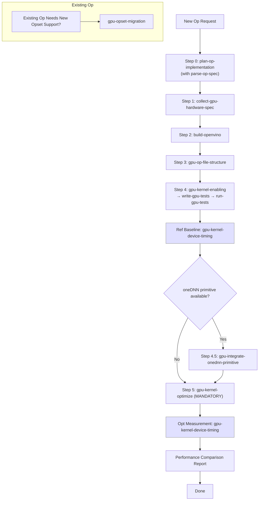

# Purpose

Orchestrate the full development workflow for Intel OpenVINO GPU plugin kernel implementation, covering both custom OpenCL kernels and oneDNN primitive integration, by routing to specialized sub-skills for each phase.

# When to Use

Use this skill as the **entry point** for any Intel OpenVINO GPU plugin kernel implementation task. It will guide you through the complete workflow by referencing the appropriate sub-skill at each stage.

**CRITICAL**: Before generating any kernel code, you must collect the target hardware specifications via `clinfo` (see `collect-gpu-hardware-spec` skill).

# Procedure

Follow this workflow in order. Each step links to a dedicated skill with detailed procedures.

1. **Step 0:** Analyze the Op spec and create an implementation plan (`plan-op-implementation` with `parse-op-spec`)
2. **Step 1:** Collect target GPU hardware specs via clinfo (`collect-gpu-hardware-spec`)
3. **Step 2:** Build the OpenVINO tree with GPU enabled (`build-openvino`)
4. **Step 3:** Determine file locations and naming conventions (`gpu-op-file-structure`)
5. **Step 4:** Implement C++ primitives, create ref kernel, write and run tests (`gpu-kernel-enabling` → `write-gpu-tests` → `run-gpu-tests`)
6. **Step 4.5:** *(Conditional)* Integrate oneDNN primitive if available (`gpu-integrate-onednn-primitive`)
7. **Step 5:** *(Mandatory)* Apply hardware-aware optimizations and produce Performance Comparison Report (`gpu-kernel-optimize`)

> `gpu-kernel-device-timing` is used as a utility within Steps 4, 4.5, and 5.

---

# Prerequisites Check

This is a routing skill — it delegates work to sub-skills. Verify you are in the OpenVINO source tree:

**Windows (PowerShell):**
```powershell
# Verify OpenVINO GPU plugin source tree is available
Test-Path "src\plugins\intel_gpu\src\kernel_selector\kernels"
```

**Ubuntu:**
```bash
# Verify OpenVINO GPU plugin source tree is available
test -d src/plugins/intel_gpu/src/kernel_selector/kernels && echo "OK" || echo "MISSING"
```

- **If successful:** Proceed to "Quick Start - Main Steps"
- **If failed:** Ensure you are in the OpenVINO source root directory

---

# Quick Start

## Installation (Prerequisites Check failed)

Clone or navigate to the OpenVINO source repository:
```bash
git clone https://github.com/openvinotoolkit/openvino.git
cd openvino
```

---

## Main Steps (Prerequisites Check passed)

Follow the Development Workflow below. Each step routes to a dedicated sub-skill.

# Development Workflow



> **Note:** `gpu-kernel-device-timing` is a utility sub-skill used within Steps 4 and 5 to measure kernel device time via clintercept. It is not a standalone step — invoke it whenever you need a performance baseline or need to verify optimization progress.

## Step 0: Plan Op Implementation
**Skill:** `plan-op-implementation`

Before any specs are collected or code is written, analyze the OpenVINO operation specification (often provided via docs URL) to map inputs, outputs, attributes, supported data types, and formulate a Single Layer Test (SLT) and kernel strategy.

## Step 1: Collect Hardware Specs
**Skill:** `collect-gpu-hardware-spec`

Before writing any code, collect GPU hardware specs via `clinfo`. This determines SIMD size, sub-group preferences, SLM capacity, and tuning parameters.

## Step 2: Build the GPU Plugin
**Skill:** `build-openvino`

Build the OpenVINO tree with Intel GPU enabled. In the GPU kernel workflow, use Debug builds for development and functional verification, Release builds for profiling and optimization, and Python/Wheel builds only when packaging or Python integration is required.

## Step 3: File Structure & Naming
**Skill:** `gpu-op-file-structure`

Determine the exact file locations and naming conventions for the new operation. New ops use the `ocl_v2` co-located structure where `.cl` kernel files sit alongside `.cpp` graph impl files. All files must follow `snake_case` for filenames and `CamelCase` for class names across directories (kernel selector, `ocl_v2` graph impls with co-located CL kernels, primitives, plugin ops, tests).

## Step 4: Kernel Enabling & Verification
**Skills:** `gpu-kernel-enabling` → `write-gpu-tests` → `run-gpu-tests`

Implement C++ primitives and create the reference OpenCL kernel (`gpu-kernel-enabling`), then write test code (`write-gpu-tests`), and finally execute tests to verify correctness (`run-gpu-tests`). After the ref kernel passes tests, measure the **Ref Baseline** via `gpu-kernel-device-timing`, then proceed to the optional oneDNN integration (Step 4.5).

## Step 4.5: oneDNN Primitive Integration (Conditional)
**Skill:** `gpu-integrate-onednn-primitive`

If the target operation has an available oneDNN primitive, integrate the oneDNN-based path alongside the OpenCL kernel. This step runs **after** the Ref Baseline has been measured via `gpu-kernel-device-timing`. After integration, use `gpu-kernel-device-timing` again to profile the oneDNN path for comparison.

## Step 5: Hardware-Aware Optimization
**Skill:** `gpu-kernel-optimize`

This step is **mandatory** — it produces the Performance Comparison Report (Ref vs Opt). Apply optimizations: sub-group size selection, block reads (fsv16), local work size tuning, and register pressure management. Create optimized kernel variants. Use `gpu-kernel-device-timing` iteratively during this step to measure each optimization iteration and verify improvement.

## Opset Migration (When Needed)
**Skill:** `gpu-opset-migration`

Use this branch when you are updating an existing GPU operation for a newer OpenVINO Opset rather than enabling a brand-new operation. This migration path is separate from the main new-op flow above and focuses on backward compatibility, spec deltas, and new data type support.

---

# Sub-Skills Reference

| Skill | Purpose | When |
|---|---|---|
| `parse-op-spec` | Fetch and parse Op specification into structured summary | Called by `plan-op-implementation` in Step 0 |
| `plan-op-implementation` | Analyze Op spec and formulate primitive/kernel/test plan | Always first, before writing code |
| `collect-gpu-hardware-spec` | Collect GPU specs via clinfo | After planning, before optimizing |
| `build-openvino` | Build OpenVINO with the required GPU-oriented configuration | Before development/testing |
| `gpu-op-file-structure` | Files to implement for new operation | When creating new op files |
| `gpu-kernel-enabling` | Implement C++ primitives & create ref OpenCL kernel | Initial kernel enabling phase |
| `write-gpu-tests` | Create SLT and unit test code for GPU ops | During enabling, migration, oneDNN integration |
| `run-gpu-tests` | Execute GPU tests and dump kernel sources | After writing tests — verification utility |
| `gpu-integrate-onednn-primitive` | Integrate oneDNN-based primitive | When oneDNN supports the op |
| `gpu-kernel-device-timing` | Measure device timing with clintercept | During Steps 4, 4.5, and 5 — baseline and optimization iterations |
| `gpu-kernel-optimize` | Hardware-aware kernel optimization | After ref kernel baseline is measured |
| `gpu-opset-migration` | Opset version migration | When updating to new Opset |

---

# Troubleshooting

- **Sub-skill not found by agent**: Ensure all sub-skill files exist under `skills/add-gpu-op/` and each has a valid YAML frontmatter with the correct skill name
- **Wrong step order**: Always follow the numbered steps in sequence — skipping `plan-op-implementation` or `collect-gpu-hardware-spec` leads to incorrect kernel code
- **Opset migration vs new op confusion**: If the Op already exists and only needs a version bump, use `gpu-opset-migration` instead of the full new-op flow
- **Performance loop not converging**: If Step 5 optimization iterations do not improve timing, review the kernel strategy in the original `plan-op-implementation` output

---

# References

- Skills directory: `skills/add-gpu-op/`
- Repository guidelines: `.github/agents/gpu.agent.md`
