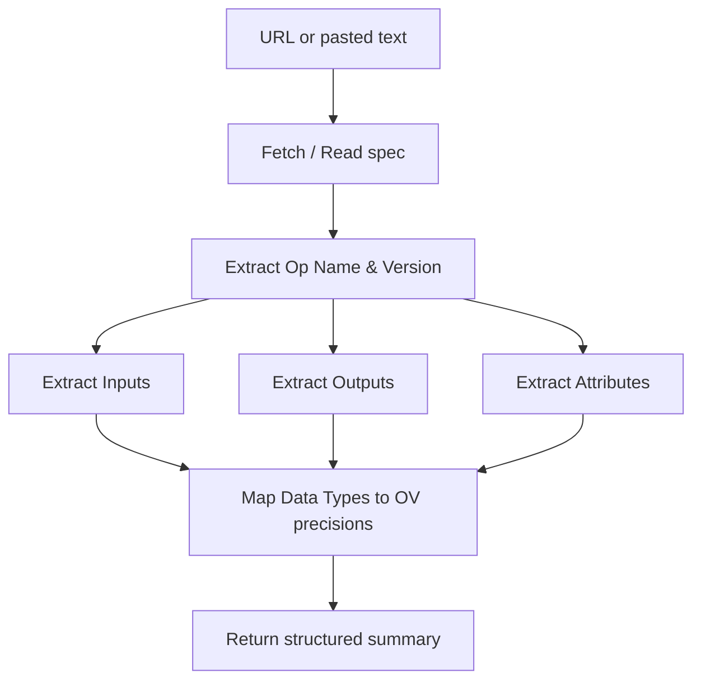

# Purpose

Parse an Operation (Op) specification from a URL or pasted text and produce a structured summary of its inputs, outputs, attributes, and data types. This is a pure **extraction** utility — it does not make implementation decisions. The caller (e.g., `plan-op-implementation`, `gpu-opset-migration`) uses the extracted data for planning.

# When to Use

Use this skill whenever an Op specification needs to be read and structured:
- As the first step of `plan-op-implementation` — parse a new Op spec
- During `gpu-opset-migration` — parse the new Opset version spec for comparison with the old version



# Procedure

1. **Step 1: Acquire Specification** — Fetch URL or read pasted text
2. **Step 2: Extract Elements** — Parse inputs, outputs, attributes, data types
3. **Step 3: Map to OpenVINO Precisions** — Convert framework types to OV types
4. **Step 4: Produce Structured Summary** — Return standardized output to the caller

---

# Prerequisites Check

This skill requires an Op specification as input. No tools needed.

**Windows (PowerShell):**
```powershell
Write-Host "Ready: Provide an Op spec URL or paste the specification text."
```

**Ubuntu:**
```bash
echo "Ready: Provide an Op spec URL or paste the specification text."
```

- **If Op spec is provided:** Proceed to "Quick Start - Main Steps"
- **If no Op spec:** Ask the user for the specification URL or text

---

# Quick Start

## Installation (Prerequisites Check failed)

No installation required. Ask the user to provide:
- An OpenVINO docs URL (e.g., `https://docs.openvino.ai/.../operation-specs/...`)
- A PyTorch/TensorFlow/ONNX docs URL
- Or directly pasted specification text

---

## Main Steps (Prerequisites Check passed)

### Step 1: Acquire Specification

- **If URL provided:** Fetch the webpage content.
- **If text provided:** Read directly.
- Note that framework documentation (PyTorch, TensorFlow, ONNX) may be structured differently than OpenVINO IR specifications.

### Step 2: Extract Key Elements

Parse the specification and extract:

1. **Operation Name** — Name and version if applicable (e.g., `ScatterNDUpdate-15`)
2. **Inputs** — For each input tensor:
   - Name, rank/shape constraints (1D, 2D, etc.)
   - Required data types
   - Whether optional
3. **Outputs** — For each output tensor:
   - Name, rank/shape, deduced types
4. **Attributes** — Static parameters:
   - Name, type, default value, valid range
   - Note: some frameworks treat attributes as inputs (or vice versa)
5. **Broadcasting rules** — If mentioned in the spec

### Step 3: Map Data Types to OpenVINO Precisions

Convert framework-specific or generic types to supported OpenVINO precisions:

| Framework Type | OpenVINO Precision |
|---|---|
| float / float32 | FP32 |
| float16 / half | FP16 |
| bfloat16 | BF16 |
| int / int32 | I32 |
| int64 / long | I64 |
| int8 | I8 |
| uint8 | U8 |
| bool | BOOL |

### Step 4: Produce Structured Summary

Return the parsed data in this format:

```markdown
## Op Spec Summary: <OpName>

**Version:** <version or N/A>
**Source:** <URL or "pasted text">

### Inputs
| # | Name | Shape Constraint | Data Types | Optional |
|---|------|-----------------|------------|----------|
| 1 | ...  | ...             | ...        | No       |
| 2 | ...  | ...             | ...        | Yes      |

### Outputs
| # | Name | Shape | Data Types |
|---|------|-------|------------|
| 1 | ...  | ...   | ...        |

### Attributes
| Name | Type | Default | Description |
|------|------|---------|-------------|
| ...  | ...  | ...     | ...         |

### Data Type Mapping
| Role | Supported Precisions |
|------|---------------------|
| Data (T) | FP32, FP16, I32, I64 |
| Index (T_IDX) | I32, I64 |

### Broadcasting
<rules or "None">
```

This summary is consumed by the caller — do not make implementation decisions here.

---

# Troubleshooting

- **Op spec URL returns 404 or empty page**: Try the nightly docs URL variant or ask the user to paste the spec text directly
- **Framework spec lacks explicit input/output types**: Infer types from usage context and document assumptions clearly
- **Ambiguous attribute vs input distinction**: List both interpretations and let the caller decide

---

# References

- Related skills: `plan-op-implementation`, `gpu-opset-migration`
- OpenVINO Op specs: https://docs.openvino.ai/latest/openvino_docs_ops_opset.html
- ONNX Op specs: https://onnx.ai/onnx/operators/
