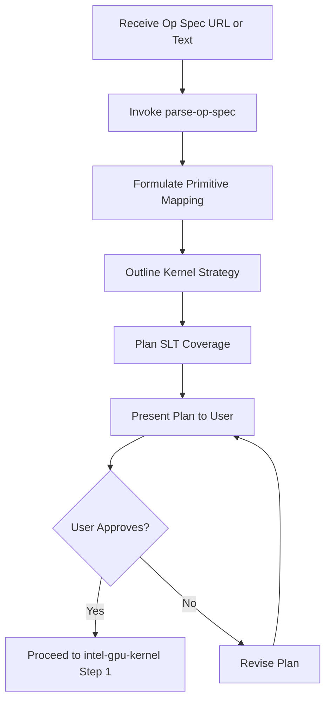

# Purpose

Analyze a new Operation (Op) specification and formulate a comprehensive implementation plan for the OpenVINO GPU plugin before any code is written or hardware metrics are gathered.

# When to Use

Use this skill as the **first step** (Step 0) in the `intel-gpu-kernel` workflow whenever a new GPU Op implementation is requested. The user provides an Op spec URL (OpenVINO, PyTorch, TensorFlow, or ONNX docs) or pasted text.



# Procedure

Follow these steps exactly to plan the operation implementation.

1. **Step 1: Analyze the Operation Specification** — Invoke `parse-op-spec` to fetch and extract inputs/outputs/attributes/types
2. **Step 2: Formulate the Primitive Mapping Plan** — Design cldnn primitive, shape inference, precision support
3. **Step 3: Outline Kernel Design Strategy** — Map to OpenCL work-items, identify dependencies, check oneDNN
4. **Step 4: Plan Single Layer Test (SLT) Coverage** — Define test parameters, corner cases, reference impl
5. **Step 5: Deliver the Implementation Plan** — Present summary and wait for user approval

---

# Prerequisites Check

This skill requires an Op specification as input. No build tools are needed.

**Windows (PowerShell):**
```powershell
# Verify the user has provided an Op spec URL or text
# No tool installation needed — this is a planning-only skill
Write-Host "Ready: Provide an Op spec URL or paste the specification text."
```

**Ubuntu:**
```bash
# Verify the user has provided an Op spec URL or text
# No tool installation needed — this is a planning-only skill
echo "Ready: Provide an Op spec URL or paste the specification text."
```

- **If Op spec is provided:** Proceed to "Quick Start - Main Steps"
- **If no Op spec:** Ask the user for the specification URL or text

---

# Quick Start

## Installation (Prerequisites Check failed)

No installation required. Ask the user to provide the Operation Specification:
- An OpenVINO docs URL (e.g., `https://docs.openvino.ai/.../operation-specs/...`)
- A PyTorch/TensorFlow/ONNX docs URL
- Or directly pasted specification text

---

## Main Steps (Prerequisites Check passed)

## Step 1: Analyze the Operation Specification

Invoke the `parse-op-spec` skill to fetch/read the spec and produce a structured summary of the Op (name, inputs, outputs, attributes, data type mapping).

Review the returned summary and verify completeness before proceeding to Step 2.

## Step 2: Formulate the Primitive Mapping Plan

Plan how this operation maps to the OpenVINO GPU plugin (cldnn) graph structure.

1. **Primitive Creation:** What will the `cldnn::primitive` struct look like? What fields does it need to store the operation attributes?
2. **Shape Infer Logic:** How will the output shape be calculated from the inputs? Are there dynamic shapes to consider?
   - **Static Shape:** Output dimensions are fully determined at graph compilation time.
   - **Dynamic Shape:** If output size depends on data values at runtime (e.g., the number of filled rows), `shape_infer` must return `ov::PartialShape::dynamic()` for that dimension. Document the runtime mechanism needed to determine the actual output size (e.g., a counting pass, `set_output_shape`, or shape-of sub-graph).
3. **Data Type / Precision Support:** Determine which layout (e.g., `bfyx`, `b_fs_yx_fsv16`) and precisions (e.g., `f32`, `f16`, `i32`) must be supported in the custom OpenCL kernel. Usually, coordinate types (`T_IDX`) must support `i32`/`i64` and data types (`T`) must support floating-point + integer types.

## Step 3: Outline Kernel Design Strategy

1. **Work Items and Execution Space:** How will the problem be mapped to OpenCL work-items? (e.g., 1 work-item per output element? 1 work-item per row?).
2. **Dependencies:** Are there dependencies between elements that would prevent naive parallelization? If sequential dependencies exist, propose a concrete GPU-friendly strategy:
   - **Two-pass approach:** Pass 1 counts/scans, Pass 2 scatters results (recommended for most cases).
   - **Parallel prefix-sum (scan):** When cumulative counts determine output positions.
   - **Atomic operations:** When contention is low and output order is unimportant.
   - Document the chosen strategy and why it fits the operation.
3. **Existing implementations:** Check if oneDNN provides an existing optimized primitive for this type of operation (e.g. convolution, matmul). If so, suggest integrating via `gpu-integrate-onednn-primitive` in later steps.

## Step 4: Plan Single Layer Test (SLT) Coverage

Define the scope for the functional tests (`SingleLayerTests`):
1. **Test Parameters:** What parameters (precisions, input shapes, attributes) need to be iterated over?
2. **Corner Cases:** Identify potential edge cases from the spec (e.g., empty rows, empty tensors, negative numbers, Out-of-Bounds handling).
3. **Reference Implementation:** A reference implementation (e.g., in `ov::reference`) must exist or be created to check against.

## Step 5: Deliver the Implementation Plan to User

Present the summary to the user using the following format:
1. **Summary of Op Spec** (Name, Inputs, Outputs, Attributes).
2. **GPU Plugin Mapping** (Primitive struct design, precision/layout support).
3. **Proposed Kernel Strategy** (GWS/LWS mapping idea).
4. **SLT Test Plan** (Parameter sweep and corner cases).

**WAIT FOR APPROVAL**: Ask the user to review the plan. Do not proceed to `intel-gpu-kernel` (Step 1) without user confirmation.

---

# Troubleshooting

- **Op spec URL returns 404 or empty page**: Try the nightly docs URL variant or ask the user to paste the spec text directly
- **Framework spec lacks explicit input/output types**: Infer types from usage context and document assumptions in the plan
- **Dynamic output shape detected but unclear mechanism**: Default to two-pass approach (count pass + scatter pass) and note it in the plan for user review
- **No reference implementation exists in `ov::reference`**: Flag this in the plan — a custom reference must be written during the enabling phase
- **oneDNN availability uncertain**: List the operation as "check during Step 4.5" and proceed with OpenCL-first strategy

---

# Next Steps

Once the plan is approved, the `intel-gpu-kernel` orchestrator routes you through the remaining steps. Proceed to **Step 1: `collect-gpu-hardware-spec`**.

---

# References

- Related skills: `parse-op-spec`, `intel-gpu-kernel`, `gpu-integrate-onednn-primitive`
