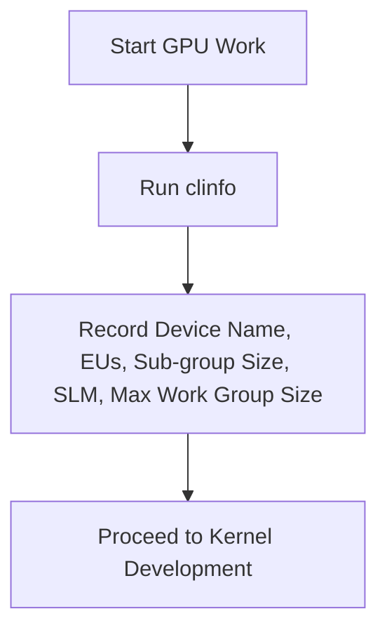

# Purpose

Collect the target Intel GPU hardware specifications via `clinfo` for use by other GPU skills. This is a mandatory first step before writing any OpenCL kernel code.

# When to Use

Use this skill **before** any GPU kernel development or optimization task. It provides the hardware context that all other GPU skills depend on.



# Procedure

Follow these steps in order:

1. **Step 1: Acquire Hardware Specs** — Run `clinfo` and collect key parameters. If system has both iGPU and dGPU, collect specs for both.
2. **Step 2: Identify Architecture** — Map Device Name to architecture family using the table below.
3. **Step 3: Record Baseline** — Save the collected parameters for use by `gpu-kernel-enabling` and `gpu-kernel-optimize` skills.

---

# Prerequisites Check

Verify that `clinfo` is available on the system:

**Windows (PowerShell):**
```powershell
# Check if clinfo is available
clinfo --version
```

**Ubuntu:**
```bash
# Check if clinfo is available
clinfo --version
```

- **If successful:** Proceed to "Quick Start - Main Steps"
- **If failed:** Follow "Quick Start - Installation" below

---

# Quick Start

## Installation (Prerequisites Check failed)

**Windows (PowerShell):**
```powershell
# clinfo is typically bundled with Intel GPU drivers
# Ensure Intel GPU drivers are installed
# Or install via package manager if available
winget install --id Intel.clinfo --source winget
```

**Ubuntu:**
```bash
# Install clinfo
sudo apt-get update
sudo apt-get install -y clinfo
```

---

## Main Steps (Prerequisites Check passed)

### Step 1: Collect Hardware Specs

**Windows (PowerShell):**
```powershell
# Collect GPU hardware specifications
clinfo | Select-String -Pattern "Device Name|Max compute units|Max work group size|Max sub-groups|Max sub-group size|Local memory type|Local memory size|Global memory cache size"
```

**Ubuntu:**
```bash
# Collect GPU hardware specifications
clinfo | grep -E "Device Name|Max compute units|Max work group size|Max sub-groups|Max sub-group size|Local memory type|Local memory size|Global memory cache size"
```

### Step 2: Identify Architecture

Classify the GPU based on Device Name:

| Device Name Pattern | Type | Architecture |
|---|---|---|
| HD Graphics, UHD Graphics | iGPU | Gen9 |
| Iris Xe (TigerLake/AlderLake/RaptorLake) | iGPU | Xe-LP |
| Intel Graphics (Meteor Lake / Arrow Lake) | iGPU | Xe-LPG |
| Intel Graphics (Lunar Lake) | iGPU | Xe2-LPG |
| Intel Graphics (Panther Lake) | iGPU | Xe3 |
| Arc A-series (A370M, A580, A770, etc.) | dGPU | Xe-HPG |
| Arc B-series (B570, B580) | dGPU | Xe2-HPG |
| Data Center GPU Max (Ponte Vecchio) | dGPU | Xe-HPC |

**If system has both iGPU and dGPU:** Collect specs for both and verify/validate/optimize on both devices.

### Step 3: Record Baseline

From the `clinfo` output, record these values. Tuning decisions (SIMD size, LWS, SLM usage) are made by the `gpu-kernel-optimize` skill based on these numbers.

| Parameter | What It Determines |
|---|---|
| **Device Name** | iGPU vs dGPU, architecture family |
| **Max compute units (EUs)** | Parallelism level needed |
| **Max sub-group size** | SIMD width (8, 16, or 32) |
| **Local memory size (SLM)** | Max tile size for blocked algorithms |
| **Max work group size** | Upper bound for local work size |

---

# Troubleshooting

- **"clinfo: command not found"**: Install Intel GPU compute runtime or clinfo package
- **No GPU devices listed**: Ensure Intel GPU drivers and OpenCL runtime are installed
- **Multiple devices shown**: Record specs for each device; use `--device_suffix` in tests to target specific GPU
- **Missing sub-group info**: Older drivers may not report sub-group details; assume SIMD 16 as default

---

# References

- Related skills: `gpu-kernel-enabling`, `gpu-kernel-optimize`, `build-openvino`
- Intel OpenCL documentation: https://www.intel.com/content/www/us/en/developer/tools/opencl/overview.html
- **Next Step:** Proceed to `build-openvino` (Step 2 of `intel-gpu-kernel` workflow)