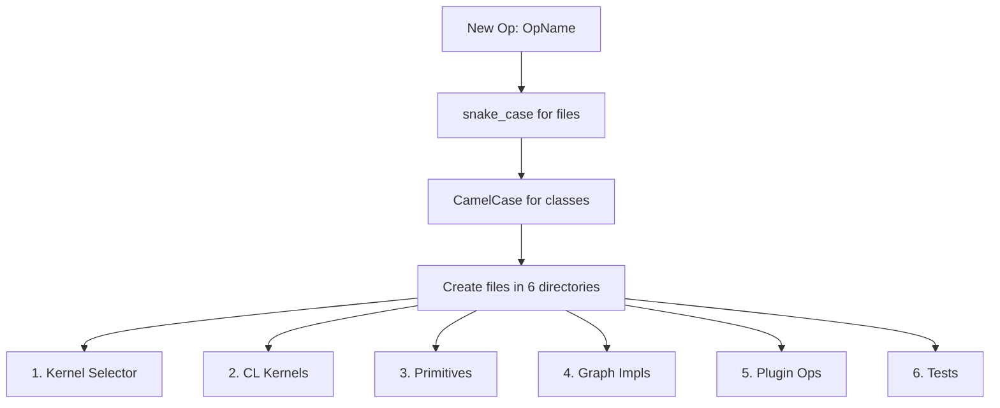

# Purpose

Define the exact file locations, naming conventions, and directory structure for implementing a new operation in the OpenVINO GPU plugin. This is the authoritative reference for where every file must be placed.

# When to Use

Use this skill whenever creating or modifying files for a GPU plugin operation. The architecture and code inside these files should be directed by the design established in the `plan-op-implementation` skill. Reference this structure from other GPU skills (`gpu-kernel-enabling`, `gpu-kernel-optimize`, etc.) to ensure files are placed correctly.



# Procedure

1. **Step 1: Determine Op Name** — Convert to `snake_case` for files, `CamelCase` for classes
2. **Step 2: Create All Required Files** — In the 6 directories listed below
3. **Step 3: Verify Structure** — Ensure all files are in the correct locations

---

# Prerequisites Check

Verify the OpenVINO GPU plugin source tree is available:

**Windows (PowerShell):**
```powershell
Test-Path "src\plugins\intel_gpu\src\kernel_selector\kernels"
```

**Ubuntu:**
```bash
test -d src/plugins/intel_gpu/src/kernel_selector/kernels && echo "OK" || echo "MISSING"
```

- **If successful:** Proceed to "Quick Start - Main Steps"
- **If failed:** Ensure you are in the OpenVINO source root directory

---

# Quick Start

## Installation (Prerequisites Check failed)

Navigate to the OpenVINO source root directory:
```bash
cd /path/to/openvino
```

---

## Main Steps (Prerequisites Check passed)

### Naming Conventions

| Item | Convention | Example (Op: FillEmptyRows) |
|---|---|---|
| File names | `snake_case` | `fill_empty_rows` |
| Class names | `CamelCase` | `FillEmptyRows` |
| Kernel names | `snake_case` | `fill_empty_rows_ref` |
| Directory names | `snake_case` | `fill_empty_rows/` |

---

### 1. Kernel Selector Layer (Host Logic)

Defines parameters and selects the best kernel implementation.

**Directory:** `src/plugins/intel_gpu/src/kernel_selector/kernels/<op_name>/`

**Files to create:**

| File | Purpose |
|---|---|
| `<op_name>_kernel_selector.h` | Kernel selector class declaration |
| `<op_name>_kernel_selector.cpp` | Logic to select between Ref, Opt, or layout-specific kernels |
| `<op_name>_kernel_base.h` | Base kernel class with parameter/JitConstant definitions |
| `<op_name>_kernel_base.cpp` | Base kernel implementation |
| `<op_name>_kernel_ref.h` | Reference kernel binder declaration |
| `<op_name>_kernel_ref.cpp` | Reference kernel binder implementation |
| `<op_name>_kernel_opt.h` | *(Optional)* Optimized kernel binder declaration |
| `<op_name>_kernel_opt.cpp` | *(Optional)* Optimized kernel binder implementation |

---

### 2. OpenCL Kernel Source (Device Code)

Contains the actual OpenCL C code that runs on the GPU.

**Directory (ocl_v2):** `src/plugins/intel_gpu/src/graph/impls/ocl_v2/` — co-located with the Graph Impl `.cpp` file.

**Directory (legacy kernel_selector):** `src/plugins/intel_gpu/src/kernel_selector/cl_kernels/` — used by older ops that have not migrated to ocl_v2.

**Files to create (in the same directory as the Graph Impl):**

| File | Purpose |
|---|---|
| `<op_name>_ref.cl` | Reference OpenCL kernel (clean, no HW-specific optimizations) |
| `<op_name>_opt.cl` | *(Optional)* General optimized OpenCL kernel |
| `<op_name>_<layout>.cl` | *(Optional)* Layout-specific optimized kernel (e.g., `_bfyx`, `_fsv16`) |

> **New ops should use the `ocl_v2` co-located structure.** Place `.cl` files next to the `.cpp` Graph Impl file.

---

### 3. Primitive Definition (Internal API)

Defines the structure used internally by the GPU plugin.

**Directory:** `src/plugins/intel_gpu/include/intel_gpu/primitives/`

**Files to create:**

| File | Purpose |
|---|---|
| `<op_name>.hpp` | Primitive structure inheriting from `primitive_base` |

---

### 4. Implementation Logic (Graph Registration)

Registers the primitive to the OpenCL backend with layout validation and kernel selection.

**Directory:** `src/plugins/intel_gpu/src/graph/impls/ocl_v2/`

**Files to create:**

| File | Purpose |
|---|---|
| `<op_name>.cpp` | `create_<op_name>` implementation and layout validation |

---

### 5. Operation Translation (Plugin Layer)

Converts the OpenVINO Core Op (`ov::op::vX`) to the GPU Plugin Primitive.

**Directory:** `src/plugins/intel_gpu/src/plugin/ops/`

**Files to create:**

| File | Purpose |
|---|---|
| `<op_name>.cpp` | `Create<OpName>Op` function using `ProgramBuilder` |

---

### 6. Verification & Tests

**Functional Single Layer Tests (Shared):**

**Directory:** `src/plugins/intel_gpu/tests/functional/shared_tests_instances/single_layer_tests/`

| File | Purpose |
|---|---|
| `<op_name>.cpp` | Instantiation of shared OpenVINO layer tests |

**Unit Tests (Internal):**

**Directory:** `src/plugins/intel_gpu/tests/unit/test_cases/`

| File | Purpose |
|---|---|
| `<op_name>_gpu_test.cpp` | gtest cases for edge cases, memory layouts, specific scenarios |

---

### Complete Example: `FillEmptyRows`

Given: "Implement `FillEmptyRows`"

| Component | File Path |
|---|---|
| **Kernel Selector** | `src/plugins/intel_gpu/src/kernel_selector/kernels/fill_empty_rows/fill_empty_rows_kernel_selector.h` |
| | `src/plugins/intel_gpu/src/kernel_selector/kernels/fill_empty_rows/fill_empty_rows_kernel_selector.cpp` |
| | `src/plugins/intel_gpu/src/kernel_selector/kernels/fill_empty_rows/fill_empty_rows_kernel_base.h` |
| | `src/plugins/intel_gpu/src/kernel_selector/kernels/fill_empty_rows/fill_empty_rows_kernel_base.cpp` |
| | `src/plugins/intel_gpu/src/kernel_selector/kernels/fill_empty_rows/fill_empty_rows_kernel_ref.h` |
| | `src/plugins/intel_gpu/src/kernel_selector/kernels/fill_empty_rows/fill_empty_rows_kernel_ref.cpp` |
| **Graph Impl + CL Kernel** | `src/plugins/intel_gpu/src/graph/impls/ocl_v2/fill_empty_rows.cpp` |
| | `src/plugins/intel_gpu/src/graph/impls/ocl_v2/fill_empty_rows_ref.cl` |
| **Primitive** | `src/plugins/intel_gpu/include/intel_gpu/primitives/fill_empty_rows.hpp` |
| **Plugin Ops** | `src/plugins/intel_gpu/src/plugin/ops/fill_empty_rows.cpp` |
| **Shared Tests** | `src/plugins/intel_gpu/tests/functional/shared_tests_instances/single_layer_tests/fill_empty_rows.cpp` |
| **Unit Tests** | `src/plugins/intel_gpu/tests/unit/test_cases/fill_empty_rows_gpu_test.cpp` |

---

# Troubleshooting

- **Kernel not found at runtime**: Verify the `.cl` file is co-located in `ocl_v2/` (or in `cl_kernels/` for legacy ops) and registered in CMakeLists.txt
- **Selector not picking the kernel**: Check that the kernel selector `.cpp` properly adds the kernel implementation
- **Primitive not registered**: Ensure `<op_name>.cpp` in `graph/impls/ocl_v2/` registers the factory
- **Tests not discovered**: Verify test file is added to the appropriate CMakeLists.txt
- **Name mismatch errors**: Double-check `snake_case` for files and `CamelCase` for classes

---

# References

- Related skills: `gpu-kernel-enabling`, `gpu-kernel-optimize`, `gpu-integrate-onednn-primitive`
- Previous name: `gpu-file-structure` (renamed per review: this skill is about files-to-implement-for-new-operation)
- OpenVINO GPU plugin source: `src/plugins/intel_gpu/`
- **Next Step:** Proceed to `gpu-kernel-enabling` (Step 4 of `intel-gpu-kernel` workflow)
