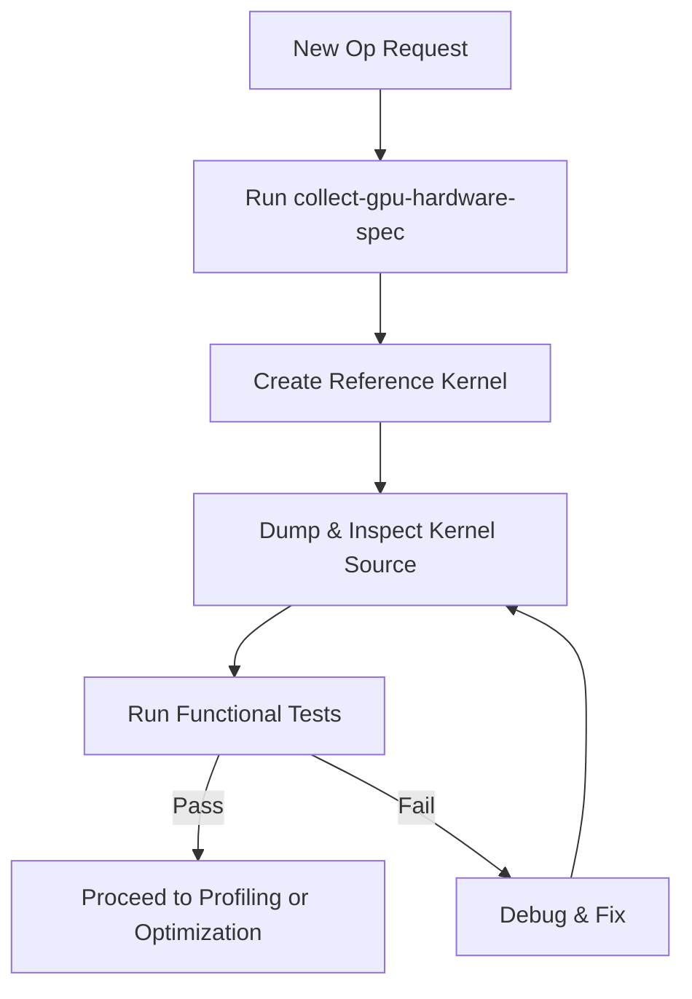

# Purpose

Guide the development of new OpenCL kernels for the OpenVINO GPU plugin. This covers creating reference kernels from OpenVINO core reference implementations, dumping kernel sources for inspection, and running functional verification tests.

# When to Use

Use this skill when implementing a new GPU operation (Op) that requires an OpenCL kernel, or when debugging an existing kernel.



# Procedure

1. **Step 1: Hardware Context** — Run `collect-gpu-hardware-spec` skill first (if not done)
2. **Step 2: Create Reference Kernel** — Write a clean baseline OpenCL kernel
3. **Step 3: Dump & Inspect** — Verify macro substitution and kernel correctness
4. **Step 4: Functional Verification** — Run unit and functional tests

---

# Prerequisites Check

Verify the GPU plugin is built (see `build-openvino` skill):

**Windows (PowerShell):**
```powershell
# Check Debug build exists
Test-Path ".\build\bin\intel64\Debug\ov_gpu_unit_tests.exe"
```

**Ubuntu:**
```bash
# Check Debug build exists
test -f ./build/bin/intel64/Debug/ov_gpu_unit_tests && echo "OK" || echo "MISSING"
```

- **If successful:** Proceed to "Quick Start - Main Steps"
- **If failed:** Run `build-openvino` in Debug mode with tests enabled first

---

# Quick Start

## Installation (Prerequisites Check failed)

Build the GPU plugin first using the `build-openvino` skill in Debug mode.

---

## Main Steps (Prerequisites Check passed)

### Step 1: Create Reference Kernel

**Principle:** The reference kernel must be a clean, correct baseline — no hardware-specific optimizations (no sub-group usage, no local memory tiling).

**Source for logic reference:**
- OpenVINO core reference implementations are in:
  `src/core/reference/include/openvino/reference/`
- Use the C++ reference as a **logic reference only**. The OpenCL code must be written from scratch for correct GPU execution.

**Reference kernel guidelines:**
- Straightforward implementation matching the op specification
- No `intel_sub_group_block_read` or sub-group functions
- No shared local memory (SLM) tiling
- Standard global memory reads/writes only
- Clear, readable code that serves as a correctness baseline

**File location:** See `gpu-op-file-structure` skill for exact paths.
- Reference kernel → `src/plugins/intel_gpu/src/graph/impls/ocl_v2/<op_name>_ref.cl`

### Step 2: Kernel Source Dump & Inspection

After building, dump the compiled kernel source to verify macro substitution.

**Windows (PowerShell):**
```powershell
# Enable kernel dumping
$env:OV_GPU_DUMP_SOURCES_PATH = "<your path>"

# Run a test to trigger kernel compilation
.\build\bin\intel64\Debug\ov_gpu_unit_tests.exe --gtest_filter=*TargetOpName*

# Check dumped .cl files in the working directory
Get-ChildItem -Filter "*.cl" | Sort-Object LastWriteTime -Descending | Select-Object -First 5
```

**Ubuntu:**
```bash
# Enable kernel dumping
export OV_GPU_DUMP_SOURCES_PATH="<your path>"

# Run a test to trigger kernel compilation
./build/bin/intel64/Debug/ov_gpu_unit_tests --gtest_filter=*TargetOpName*

# Check dumped .cl files
ls -lt *.cl | head -5
```

**Verification checklist:**
- [ ] Macros from `clinfo` are correctly substituted (e.g., `#define SIMD_SIZE 16`)
- [ ] Data types match expected precision (float, half, int)
- [ ] No undefined macros or compilation errors in the dumped source

### Step 3: Functional Verification

Run unit tests and functional tests to verify kernel correctness.

**Windows (PowerShell):**
```powershell
# Unit tests
.\build\bin\intel64\Debug\ov_gpu_unit_tests.exe --gtest_filter=*TargetOpName* --device_suffix=0

# Functional tests
.\build\bin\intel64\Debug\ov_gpu_func_tests.exe --gtest_filter=*TargetOpName* --device_suffix=0
```

**Ubuntu:**
```bash
# Unit tests
./build/bin/intel64/Debug/ov_gpu_unit_tests --gtest_filter=*TargetOpName* --device_suffix=0

# Functional tests
./build/bin/intel64/Debug/ov_gpu_func_tests --gtest_filter=*TargetOpName* --device_suffix=0
```

**Parameters:**
- `--gtest_filter=*TargetOpName*` — Filter to the specific operation being developed
- `--device_suffix=0` — GPU.0 (first GPU); use `1` for GPU.1 if testing on second device

**Success criteria:**
- All unit tests pass
- All functional tests pass
- No memory errors (optional: run with address sanitizer)

---

# Troubleshooting

- **Kernel dump produces empty files**: Ensure `OV_GPU_DUMP_SOURCES_PATH` is set
- **Tests not found for new op**: Ensure test files are created (see `gpu-op-file-structure` skill)
- **Macro substitution errors**: Check that JitConstants in the kernel_base are correctly defined
- **Test crashes**: Run in Debug mode; check kernel source dump for compilation errors
- **device_suffix not working**: Verify GPU device numbering with `clinfo` (device order may vary)
- **Runtime errors**: Check OpenVINO verbose output with `OV_VERBOSE=all` environment variable

---

# References

- Related skills: `collect-gpu-hardware-spec`, `build-openvino`, `gpu-op-file-structure`, `gpu-kernel-device-timing`
- OpenVINO reference implementations: `src/core/reference/include/openvino/reference/`