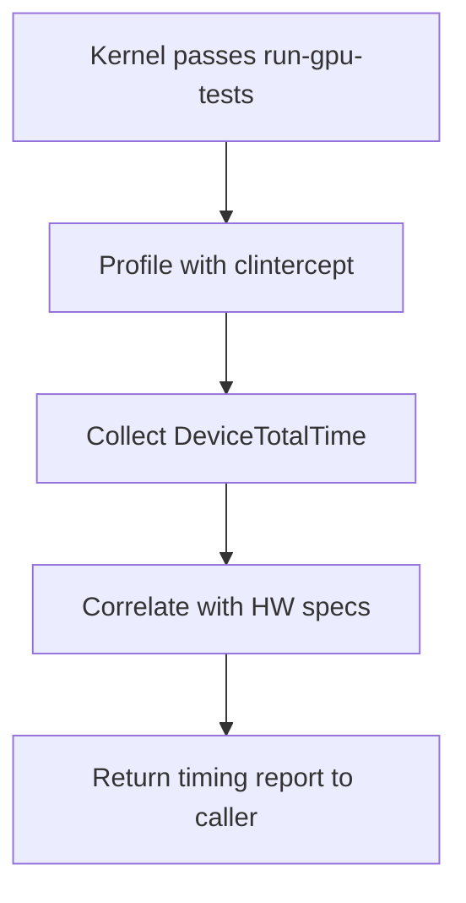

# Purpose

Measure OpenCL kernel device timing using the Intel OpenCL Intercept Layer (clintercept) and produce a structured timing report. This is a pure **measurement and analysis** utility — it does not decide whether to optimize or what to optimize. The caller (e.g., `gpu-kernel-enabling`, `gpu-kernel-optimize`) interprets the results.

# When to Use

Use this skill whenever you need GPU kernel timing data:
- After ref kernel passes tests → measure **Ref Baseline**
- After opt kernel passes tests → measure **Opt Performance**
- After oneDNN integration → measure **oneDNN path** timing
- During optimization iterations → measure each iteration



# Procedure

1. **Step 1: Ensure Release Build** — Verify Release binaries exist (see `build-openvino`)
2. **Step 2: Run Profiling** — Collect kernel execution metrics via clintercept
3. **Step 3: Analyze Metrics** — Extract DeviceTotalTime, Call Count, Average Time
4. **Step 4: Correlate with Hardware** — Cross-reference with `collect-gpu-hardware-spec` data
5. **Step 5: Produce Timing Report** — Return structured results to the caller

---

# Prerequisites Check

Verify clintercept is available:

**Windows (PowerShell):**
```powershell
# Check if clintercept is available
clintercept --version 2>&1 | Select-Object -First 3
```

**Ubuntu:**
```bash
# Check if clintercept is available
clintercept --version 2>&1 | head -3
```

Also verify Release build exists:

**Windows (PowerShell):**
```powershell
Test-Path ".\build\bin\intel64\Release\ov_gpu_unit_tests.exe"
```

**Ubuntu:**
```bash
test -f ./build/bin/intel64/Release/ov_gpu_unit_tests && echo "OK" || echo "MISSING"
```

- **If successful:** Proceed to "Quick Start - Main Steps"
- **If failed:** Install clintercept and/or build in Release mode

---

# Quick Start

## Installation (Prerequisites Check failed)

**Install Intel OpenCL Intercept Layer:**

**Windows (PowerShell):**
```powershell
# Clone and build clintercept
git clone https://github.com/intel/opencl-intercept-layer.git
Push-Location opencl-intercept-layer
mkdir build -Force; Push-Location build
cmake ..
cmake --build . --config Release
Pop-Location; Pop-Location
# Add to PATH or use full path
```

**Ubuntu:**
```bash
# Clone and build clintercept
git clone https://github.com/intel/opencl-intercept-layer.git
cd opencl-intercept-layer
mkdir build && cd build
cmake ..
make -j$(nproc)
# Add to PATH or use full path
```

**Build Release binaries** by running `build-openvino` with a Release configuration and tests enabled.

---

## Main Steps (Prerequisites Check passed)

### Step 1: Basic Profiling

Run clintercept with device timing enabled. Use `benchmark_app` or a dedicated performance test with sufficient iterations for reliable measurement (unit tests typically do not have enough iterations):

**Windows (PowerShell):**
```powershell
# Device timing with benchmark_app
clintercept -d -t -- benchmark_app -m model.xml -d GPU -niter 100

# Or with a specific test (ensure sufficient iterations)
clintercept -d -t -- .\build\bin\intel64\Release\ov_gpu_func_tests.exe --gtest_filter=*TargetOpName*
```

**Ubuntu:**
```bash
# Device timing with benchmark_app
clintercept -d -t -- benchmark_app -m model.xml -d GPU -niter 100

# Or with a specific test (ensure sufficient iterations)
clintercept -d -t -- ./build/bin/intel64/Release/ov_gpu_func_tests --gtest_filter=*TargetOpName*
```

**Flags:**
- `-d` — Device timing (GPU-side timing)
- `-t` — Host timing (CPU-side timing)

### Step 2: Analyze Key Metrics

Focus on these metrics from the clintercept output:

| Metric | What It Tells You |
|---|---|
| **DeviceTotalTime** | Total GPU execution time for the kernel |
| **HostTotalTime** | Total CPU-side overhead (enqueue, sync) |
| **Kernel Name** | Which kernel is being profiled |
| **Call Count** | How many times the kernel was dispatched |
| **Average Time** | Per-invocation GPU time |

**Analysis questions:**
1. Is `DeviceTotalTime` dominated by one kernel or spread across many?
2. Is the kernel memory-bound (high bandwidth utilization) or compute-bound?
3. Is there excessive host-device synchronization overhead?

### Step 3: Correlate with Hardware Specs

Cross-reference profiling results with `collect-gpu-hardware-spec` data:

| Observation | Hardware Check | Action |
|---|---|---|
| High DeviceTotalTime | Check EU count | Need more parallelism? |
| Low occupancy | Check Max work group size | Work-group too small? |
| Memory bottleneck | Check bandwidth, cache | Use block reads, SLM? |
| Suboptimal SIMD | Check Max sub-group size | Wrong SIMD width? |

### Step 4: Produce Timing Report

Return structured timing data to the caller. The caller decides what to do with it.

```markdown
## Kernel Timing Report: <OpName>

| Metric           | Value     |
|------------------|-----------|
| Kernel Name      | <name>    |
| DeviceTotalTime  | X.XX ms   |
| HostTotalTime    | X.XX ms   |
| Call Count       | N         |
| Average Time     | X.XX ms   |
| Hardware         | <GPU name from collect-gpu-hardware-spec> |
| Build            | Release   |
| Test/App Used    | <command> |
```

This report is used by:
- `gpu-kernel-enabling` → as **Ref Baseline**
- `gpu-kernel-optimize` → as **Opt measurement** (compared against Ref Baseline)
- `gpu-integrate-onednn-primitive` → as **oneDNN path** timing

### Step 5: Advanced Profiling (Optional)

For deeper analysis:

**Windows (PowerShell):**
```powershell
# Call logging (shows API call sequence)
clintercept --call-logging -- .\build\bin\intel64\Release\ov_gpu_func_tests.exe --gtest_filter=*TargetOpName*
```

**Ubuntu:**
```bash
# Call logging (shows API call sequence)
clintercept --call-logging -- ./build/bin/intel64/Release/ov_gpu_func_tests --gtest_filter=*TargetOpName*
```

---

# Troubleshooting

- **clintercept not found**: Build from source or add to PATH
- **No GPU timing data**: Ensure `-d` flag is used and GPU drivers support profiling
- **Profiling overhead too high**: Reduce test iterations; profile only the target kernel
- **Results inconsistent**: Run multiple times and average; ensure no other GPU-intensive applications are running
- **Zero DeviceTotalTime reported**: Driver may not support device timing; try updating GPU drivers

---

# References

- Related skills: `build-openvino`, `run-gpu-tests`, `gpu-kernel-enabling`, `gpu-kernel-optimize`, `gpu-integrate-onednn-primitive`, `collect-gpu-hardware-spec`
- Intel OpenCL Intercept Layer: https://github.com/intel/opencl-intercept-layer
