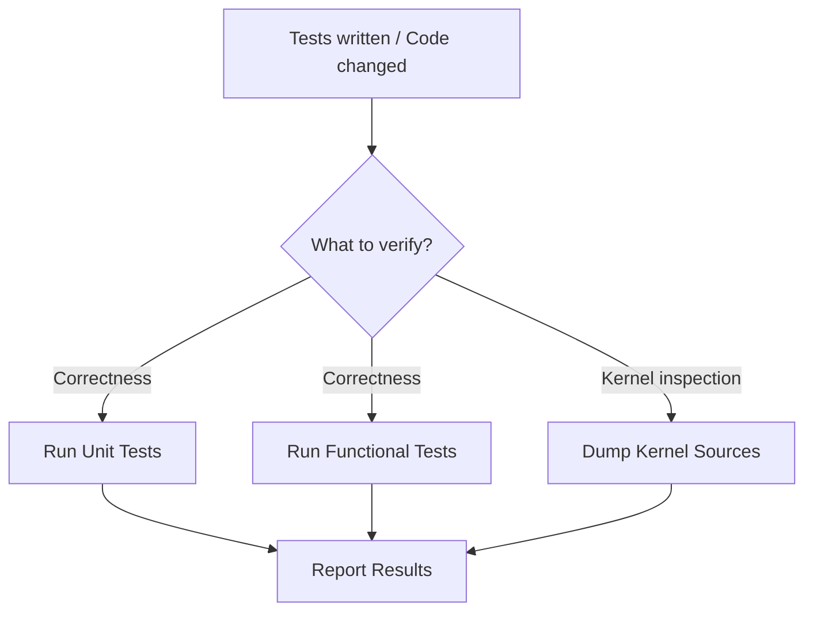

# Purpose

Execute pre-written GPU plugin tests and dump kernel sources for inspection. This is a pure **execution and verification** utility — it does not create test code (see `write-gpu-tests` for that). Designed to be called from any GPU workflow skill that needs to run tests.

# When to Use

Use this skill whenever you need to **run** existing GPU tests or **dump** kernel sources:
- After writing tests in `gpu-kernel-enabling` flow
- After modifying code in `gpu-opset-migration` flow
- After integrating oneDNN in `gpu-integrate-onednn-primitive` flow
- After optimization in `gpu-kernel-optimize` flow



# Procedure

1. **Step 1: Select Mode** — Determine which verification to run (unit, functional, dump, or all)
2. **Step 2: Execute** — Run the selected tests or dump command
3. **Step 3: Report** — Summarize results (pass/fail count, dump file locations)

---

# Prerequisites Check

Verify that GPU test binaries exist:

**Windows (PowerShell):**
```powershell
# Check Debug build (for correctness testing)
Test-Path ".\build\bin\intel64\Debug\ov_gpu_unit_tests.exe"
```

**Ubuntu:**
```bash
# Check Debug build (for correctness testing)
test -f ./build/bin/intel64/Debug/ov_gpu_unit_tests && echo "OK" || echo "MISSING"
```

- **If successful:** Proceed to "Quick Start - Main Steps"
- **If failed:** Run `build-openvino` with Debug configuration and tests enabled

---

# Quick Start

## Installation (Prerequisites Check failed)

Build the GPU plugin first by running `build-openvino` with a Debug configuration and tests enabled.

---

## Main Steps (Prerequisites Check passed)

### Step 1: Select Mode

Choose which verification to perform based on the caller's needs:

| Mode | When to Use | Binary |
|---|---|---|
| `unit` | Verify internal GPU primitive logic | `ov_gpu_unit_tests` |
| `functional` | Verify end-to-end Op correctness via SLT | `ov_gpu_func_tests` |
| `dump` | Inspect compiled OpenCL kernel sources | `ov_gpu_unit_tests` + env var |
| `all` | Full verification (dump + unit + functional) | All of the above |

### Step 2: Run Unit Tests

**Windows (PowerShell):**
```powershell
.\build\bin\intel64\Debug\ov_gpu_unit_tests.exe --gtest_filter=*<OpName>* --device_suffix=0
```

**Ubuntu:**
```bash
./build/bin/intel64/Debug/ov_gpu_unit_tests --gtest_filter=*<OpName>* --device_suffix=0
```

### Step 3: Run Functional Tests

**Windows (PowerShell):**
```powershell
.\build\bin\intel64\Debug\ov_gpu_func_tests.exe --gtest_filter=*<OpName>* --device_suffix=0
```

**Ubuntu:**
```bash
./build/bin/intel64/Debug/ov_gpu_func_tests --gtest_filter=*<OpName>* --device_suffix=0
```

### Step 4: Dump Kernel Sources

**Windows (PowerShell):**
```powershell
$env:OV_GPU_DUMP_SOURCES_PATH = ".\gpu_dump"
.\build\bin\intel64\Debug\ov_gpu_unit_tests.exe --gtest_filter=*<OpName>*
Get-ChildItem -Path .\gpu_dump -Filter "*.cl" | Sort-Object LastWriteTime -Descending | Select-Object -First 5
```

**Ubuntu:**
```bash
export OV_GPU_DUMP_SOURCES_PATH="./gpu_dump"
./build/bin/intel64/Debug/ov_gpu_unit_tests --gtest_filter=*<OpName>*
ls -lt ./gpu_dump/*.cl | head -5
```

**Dump verification checklist:**
- [ ] Macros correctly substituted (e.g., `#define SIMD_SIZE 16`)
- [ ] Data types match expected precision (float, half, int)
- [ ] No undefined macros or compilation errors in dumped source

### Step 5: Report Results

Summarize test results for the caller:

```
## Test Results: <OpName>
- Unit tests:       X passed / Y total
- Functional tests: X passed / Y total
- Kernel dump:      Verified (gpu_dump/<kernel_name>.cl)
```

**Parameters reference:**
- `--gtest_filter=*<OpName>*` — Filter to the specific operation
- `--device_suffix=0` — GPU.0 (first GPU); use `1` for GPU.1
- `OV_GPU_DUMP_SOURCES_PATH` — Directory for kernel source dump output

---

# Troubleshooting

- **Kernel dump produces empty files**: Ensure `OV_GPU_DUMP_SOURCES_PATH` points to a valid writable directory
- **Tests not discovered**: Verify test files exist and are listed in `CMakeLists.txt` (see `write-gpu-tests`)
- **device_suffix not working**: Check GPU device numbering with `clinfo`
- **Test crashes on startup**: Run in Debug mode; check kernel dump for compilation errors
- **Timeout during functional tests**: Some complex ops need longer; ensure sufficient system resources

---

# References

- Related skills: `write-gpu-tests`, `gpu-kernel-enabling`, `gpu-kernel-optimize`, `gpu-integrate-onednn-primitive`, `gpu-opset-migration`, `build-openvino`
- Test code creation: Use `write-gpu-tests` skill to create the test source files before running this skill