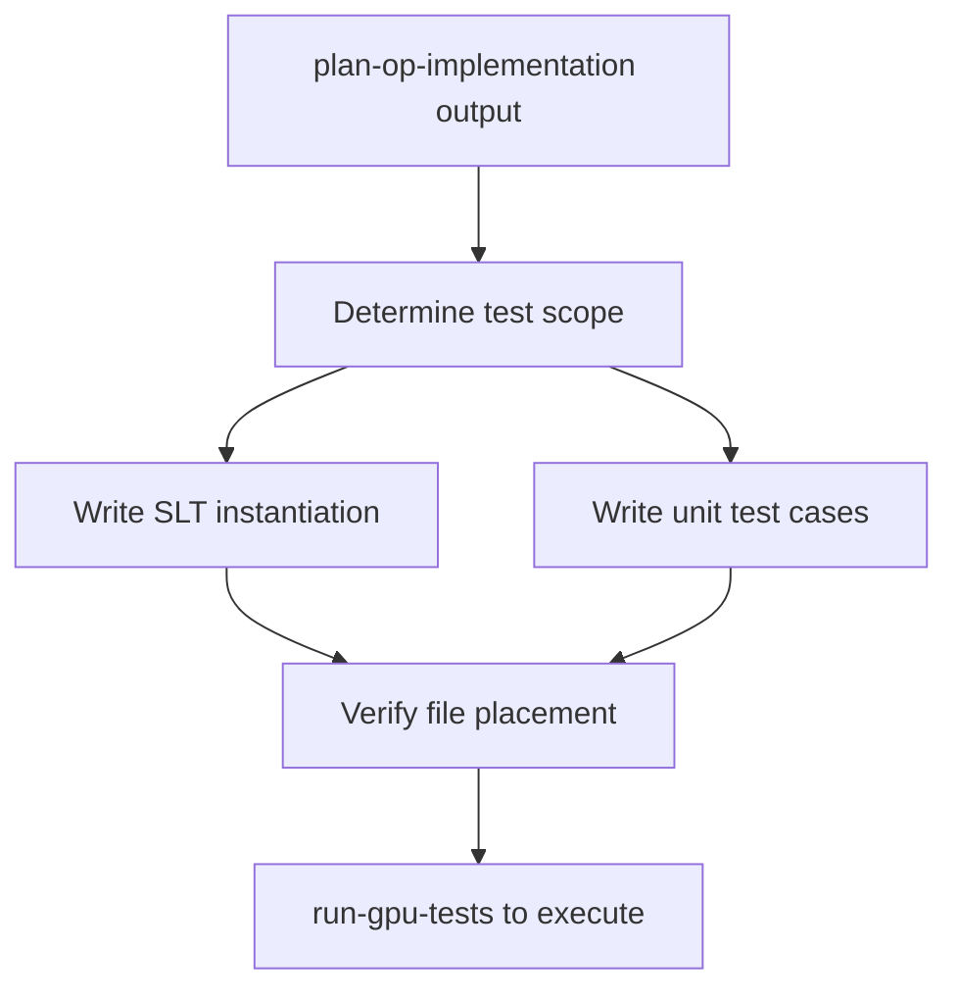

# Purpose

Write functional and unit test code for OpenVINO GPU plugin operations. This skill creates the test source files that are later executed by the `run-gpu-tests` skill. It is designed to be reusable across multiple workflows: new op enabling, opset migration, and oneDNN integration.

# When to Use

Use this skill whenever test code needs to be **created or updated** for a GPU plugin operation:
- During new op enabling (`gpu-kernel-enabling`) — write tests from scratch
- During opset migration (`gpu-opset-migration`) — add test cases for new version/data types
- During oneDNN integration (`gpu-integrate-onednn-primitive`) — add backend-specific test cases



# Procedure

1. **Step 1: Determine Test Scope** — Identify parameters, shapes, corner cases from the plan
2. **Step 2: Write Single Layer Tests (SLT)** — Create shared functional test instantiation
3. **Step 3: Write Unit Tests** — Create gtest cases for edge cases and layout-specific scenarios
4. **Step 4: Verify File Placement** — Ensure files are in the correct directories

---

# Prerequisites Check

Verify the OpenVINO GPU plugin source tree is available:

**Windows (PowerShell):**
```powershell
Test-Path "src\plugins\intel_gpu\tests\functional\shared_tests_instances\single_layer_tests"
```

**Ubuntu:**
```bash
test -d src/plugins/intel_gpu/tests/functional/shared_tests_instances/single_layer_tests && echo "OK" || echo "MISSING"
```

- **If successful:** Proceed to "Quick Start - Main Steps"
- **If failed:** Ensure you are in the OpenVINO source root directory

---

# Quick Start

## Installation (Prerequisites Check failed)

Navigate to the OpenVINO source root directory:
```bash
cd /path/to/openvino
```

---

## Main Steps (Prerequisites Check passed)

### Step 1: Determine Test Scope

Review the `plan-op-implementation` output (Step 4: SLT Coverage) to identify:

1. **Test parameters to sweep:**
   - Precisions: typically `{f32, f16, i32, i64}` for data, `{i32, i64}` for indices
   - Input shapes: small (1×1), medium (batch×channel×H×W), large stress tests
   - Attributes: all valid combinations from the Op spec

2. **Corner cases to cover:**
   - Empty tensors (zero-length dimensions)
   - Scalar inputs
   - Maximum rank tensors
   - Boundary values (INT_MAX, negative indices)
   - Broadcasting edge cases (if applicable)

3. **Reference implementation availability:**
   - Check if `ov::reference::<op_name>` exists in `src/core/reference/include/openvino/reference/`
   - If missing, flag it — a custom reference must be written

### Step 2: Write Single Layer Tests (SLT)

**Directory:** `src/plugins/intel_gpu/tests/functional/shared_tests_instances/single_layer_tests/`
**File:** `<op_name>.cpp`

**Reference pattern:** Before writing, read an existing SLT file for a similar operation to follow the established pattern.

| Op Type | Good Reference SLT |
|---|---|
| Element-wise | `eltwise.cpp` |
| Reduction | `reduce_ops.cpp` |
| Scatter/Gather | `scatter_nd_update.cpp` |
| Shape manipulation | `reshape.cpp` |

**SLT structure:**
```cpp
// 1. Include the shared test definition header
#include "<shared_test_header>.hpp"

// 2. Define the test namespace
namespace {
using namespace ov::test;

// 3. Define parameter combinations
const std::vector<ov::element::Type> dataPrecisions = {
    ov::element::f32,
    ov::element::f16,
    ov::element::i32,
};

const std::vector<std::vector<ov::Shape>> inputShapes = {
    {{2, 3}},           // small
    {{4, 8, 16}},       // medium
    {{2, 4, 8, 16}},    // 4D
};

// 4. Instantiate the test suite
INSTANTIATE_TEST_SUITE_P(
    smoke_<OpName>_GPU,
    <OpName>LayerTest,
    ::testing::Combine(
        ::testing::ValuesIn(dataPrecisions),
        ::testing::ValuesIn(inputShapes),
        // ... additional parameters
        ::testing::Values(ov::test::utils::DEVICE_GPU)
    ),
    <OpName>LayerTest::getTestCaseName
);

}  // namespace
```

**Naming conventions:**
- Test suite prefix: `smoke_<OpName>_GPU` for basic coverage
- Extended tests: `extended_<OpName>_GPU` for exhaustive sweeps

### Step 3: Write Unit Tests

**Directory:** `src/plugins/intel_gpu/tests/unit/test_cases/`
**File:** `<op_name>_gpu_test.cpp`

Unit tests cover scenarios that SLTs may not reach:
- Specific memory layouts (`bfyx`, `b_fs_yx_fsv16`, `b_fs_yx_fsv32`)
- Dynamic shape behavior
- Error handling (invalid inputs)
- Edge cases unique to the GPU implementation

**Unit test structure:**
```cpp
#include "test_utils.h"
// Include primitive header
#include "intel_gpu/primitives/<op_name>.hpp"

using namespace cldnn;
using namespace ::tests;

TEST(op_name_gpu, basic_2d_f32) {
    auto& engine = get_test_engine();

    // 1. Create input memory
    auto input = engine.allocate_memory({ data_types::f32, format::bfyx, { 1, 1, 4, 4 } });
    set_values(input, { /* test data */ });

    // 2. Build topology
    topology topo;
    topo.add(input_layout("input", input->get_layout()));
    topo.add(<op_name>("output", input_info("input") /*, attributes */));

    // 3. Execute and validate
    network net(engine, topo);
    net.set_input_data("input", input);
    auto outputs = net.execute();

    auto output_mem = outputs.at("output").get_memory();
    cldnn::mem_lock<float> output_ptr(output_mem, get_test_stream());

    // 4. Check results
    std::vector<float> expected = { /* expected values */ };
    for (size_t i = 0; i < expected.size(); ++i) {
        ASSERT_NEAR(output_ptr[i], expected[i], 1e-5f);
    }
}
```

### Step 4: Verify File Placement

Confirm test files are placed correctly per `gpu-op-file-structure`:

| Test Type | Path |
|---|---|
| SLT (shared functional) | `src/plugins/intel_gpu/tests/functional/shared_tests_instances/single_layer_tests/<op_name>.cpp` |
| Unit tests | `src/plugins/intel_gpu/tests/unit/test_cases/<op_name>_gpu_test.cpp` |

Ensure the files are included in the appropriate `CMakeLists.txt` so they are compiled during build.

---

# Troubleshooting

- **Shared test definition header not found**: Check if the Op has a shared test class in `src/tests/functional/shared_test_classes/include/`. If not, it must be created first.
- **Test not discovered after build**: Verify the file is listed in the corresponding `CMakeLists.txt`
- **Reference implementation missing**: If `ov::reference::<op_name>` does not exist, create one or use a custom evaluator in the test
- **Parameter combination explosion**: Use `smoke_` prefix for essential combinations only; save exhaustive sweeps for `extended_` suites

---

# References

- Related skills: `gpu-kernel-enabling`, `gpu-opset-migration`, `gpu-integrate-onednn-primitive`, `run-gpu-tests`, `gpu-op-file-structure`
- Test execution: Use `run-gpu-tests` skill to run the tests created by this skill
- OpenVINO shared test infrastructure: `src/tests/functional/shared_test_classes/`
- GPU unit test utilities: `src/plugins/intel_gpu/tests/unit/test_utils/`
