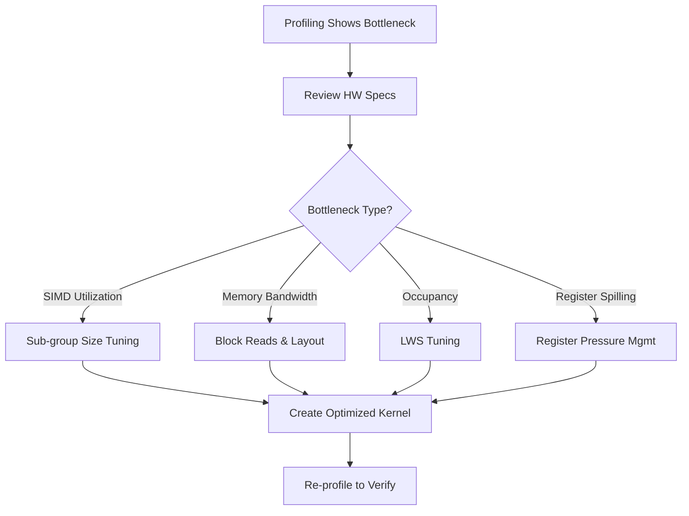

# Purpose

Apply hardware-aware optimizations to OpenCL kernels for Intel GPUs. This skill covers sub-group size selection, memory layout with block reads, local work size (LWS) tuning, and register pressure management — all based on hardware data from `collect-gpu-hardware-spec`.

# When to Use

Use this skill as **Step 5 (mandatory)** of the `intel-gpu-kernel` workflow to create an optimized kernel and produce a Performance Comparison Report. The optimizations here are guided by profiling data from `gpu-kernel-device-timing` and hardware specifications from `collect-gpu-hardware-spec`.



# Procedure

1. **Step 1: Review Hardware Baseline** — Ensure `collect-gpu-hardware-spec` data is available
2. **Step 2: Identify Bottleneck** — Use profiling data to determine optimization target
3. **Step 3: Apply Optimization** — Choose and implement the appropriate technique
4. **Step 4: Create Optimized Kernel** — Write `<op_name>_opt.cl` with hardware-specific tuning
5. **Step 5: Re-profile** — Verify performance improvement

---

# Prerequisites Check

Verify you have hardware analysis data and profiling results:

**Windows (PowerShell):**
```powershell
# Verify clinfo is available for hardware data
clinfo | Select-String "Device Name"

# Verify Release build exists for profiling
Test-Path ".\build\bin\intel64\Release\ov_gpu_unit_tests.exe"
```

**Ubuntu:**
```bash
# Verify clinfo is available for hardware data
clinfo | grep "Device Name"

# Verify Release build exists for profiling
test -f ./build/bin/intel64/Release/ov_gpu_unit_tests && echo "OK" || echo "MISSING"
```

- **If successful:** Proceed to "Quick Start - Main Steps"
- **If failed:** Run `collect-gpu-hardware-spec`, then run `build-openvino` with a Release configuration and tests enabled

---

# Quick Start

## Installation (Prerequisites Check failed)

1. Run `collect-gpu-hardware-spec` skill to collect hardware specs
2. Run `build-openvino` with a Release configuration and tests enabled
3. Run `gpu-kernel-device-timing` skill to identify bottlenecks

---

## Main Steps (Prerequisites Check passed)

### Step 1: Prepare Profiling Test Case

Before applying any optimization, prepare a dedicated test case for performance measurement. Unit tests typically do not have enough iterations for reliable profiling.

**Recommended approach:**
- Use `benchmark_app` with a model that exercises the target kernel
- Or create a dedicated performance test with sufficient iterations (e.g., 100+ runs)
- Record baseline DeviceTotalTime using `gpu-kernel-device-timing` skill

### Step 2–3: Identify Bottleneck & Apply Optimization

### A. Dynamic Sub-group Size Selection

Sub-group size directly affects SIMD width and performance.

**Selection rules based on `Max sub-group size` from clinfo:**

| Max Sub-group Size | Recommended SIMD | Notes |
|---|---|---|
| 16 or 32 | 16 | Use 16 as default for all architectures to keep codebase simple and portable |
| 8 | 8 | Rare; fallback only for legacy hardware |

**Implementation:**
```c
// In OpenCL kernel — set sub-group size based on hardware
__attribute__((intel_reqd_sub_group_size(SIMD_SIZE)))
__kernel void my_kernel(...) {
    // SIMD_SIZE is defined via JitConstants based on clinfo data
    ...
}
```

**In kernel selector (JitConstants):**
```cpp
// Define SIMD_SIZE based on hardware detection
jit.AddConstant(MakeJitConstant("SIMD_SIZE", GetSimdSize(params)));
```

### B. Memory Layout & Block Reads (fsv16)

Maximize memory bandwidth using Intel sub-group block reads.

**Rules:**
- Use `intel_sub_group_block_read` — reads `4 bytes × SIMD_SIZE` in one operation
- Requires pointers aligned to at least 16 bytes
- Align to 128 bytes (cache line) when possible for optimal prefetching

**Implementation:**
```c
// Block read pattern — much faster than scalar global memory access
uint raw = intel_sub_group_block_read((__global uint*)(input + offset));
float value = as_float(raw);

// For fp16 data:
ushort raw_h = intel_sub_group_block_read_us((__global ushort*)(input + offset));
half value_h = as_half(raw_h);
```

**Alignment requirements:**

| Minimum Alignment | Optimal Alignment |
|---|---|
| 16 bytes | 128 bytes (cache line) |

### C. Local Work Size (LWS) Tuning

Optimize work-group size for maximum GPU occupancy.

**Rules:**
1. LWS must be a multiple of `SIMD_SIZE`
2. `Ideal LWS = min(Max work group size, SLM_Constraint)`
3. General preference: LWS of 256 works well across most Intel GPU architectures

**Implementation in kernel selector:**
```cpp
// Set LWS based on hardware
CommonDispatchData dispatchData;
dispatchData.gws = { global_x, global_y, global_z };
dispatchData.lws = { lws_x, 1, 1 };  // lws_x = multiple of SIMD_SIZE
```

**SLM constraint calculation:**
```
Max LWS from SLM = SLM_size / per_workitem_SLM_usage
Actual LWS = min(Max_work_group_size, Max_LWS_from_SLM)
Actual LWS = round_down_to_multiple(Actual_LWS, SIMD_SIZE)
```

### D. Register Pressure Management

Manage register usage to avoid spilling, especially on smaller GPUs.

**Warning signs:**
- Kernel has many local variables
- Complex control flow with deep nesting
- Multiple large arrays in private memory

**Strategies:**

| Strategy | When to Apply | Impact |
|---|---|---|
| Use `half` (fp16) precision | `cl_khr_fp16` supported, acceptable accuracy | Halves register usage |
| Reduce loop unrolling | High register pressure | Fewer registers, slightly slower |
| Split large kernels | Many variables in single kernel | Better register allocation |
| Use SLM instead of registers | Data reuse across work-items | Trades register for SLM |

**Implementation — fp16 precision:**
```c
// Use half precision to reduce register pressure
#ifdef cl_khr_fp16
#pragma OPENCL EXTENSION cl_khr_fp16 : enable
// Use half instead of float where acceptable
half value = convert_half(input_float);
#endif
```

### Step 4: Create Optimized Kernel

After applying optimizations, create the optimized kernel file:

**File:** `src/plugins/intel_gpu/src/graph/impls/ocl_v2/<op_name>_opt.cl`

The optimized kernel should:
- Include all hardware-specific optimizations identified above
- Be conditionally selected in the kernel selector based on hardware capabilities
- Coexist with the reference kernel (`<op_name>_ref.cl`) as a fallback

**Kernel selector update:**
```cpp
// In kernel selector — choose optimized kernel when hardware supports it
if (SupportsOptimizedKernel(params)) {
    implementations.push_back(std::make_unique<OpNameKernelOpt>());
}
implementations.push_back(std::make_unique<OpNameKernelRef>());  // Always fallback
```

### Step 5: Verify & Re-profile

After creating the optimized kernel:

1. **Verify correctness:** Invoke `run-gpu-tests` skill to run unit and functional tests, ensuring the optimized kernel produces correct results.

2. **Measure performance:** Invoke `gpu-kernel-device-timing` skill to collect Opt kernel timing.

3. **Produce Performance Comparison Report:**

```markdown
## Performance Comparison Report: <OpName>

| Kernel Variant       | DeviceTotalTime | Speedup vs Ref |
|----------------------|-----------------|----------------|
| Ref (`<op>_ref.cl`)  | X.XX ms         | 1.00× (baseline) |
| Opt (`<op>_opt.cl`)  | Y.YY ms         | X.XX / Y.YY = N.NN× |
| oneDNN (if applicable)| Z.ZZ ms        | X.XX / Z.ZZ = N.NN× |

- Test shape: [batch, channels, height, width]
- Hardware: Intel <GPU Name> (from collect-gpu-hardware-spec)
- Optimizations applied: <list applied techniques>
```

---

# Troubleshooting

- **No performance improvement**: Bottleneck may be elsewhere (host-side, memory transfer); re-analyze profiling data
- **Kernel compilation fails with sub-group**: Verify `SIMD_SIZE` matches hardware support from `clinfo`
- **Block read crashes**: Check pointer alignment — must be aligned to at least 16 bytes
- **Register spilling warnings**: Reduce variable count, use `half` precision, or split kernel
- **LWS rejected by driver**: Ensure LWS divides GWS evenly and does not exceed `Max work group size`

---

# References

- Related skills: `collect-gpu-hardware-spec`, `gpu-kernel-device-timing`, `run-gpu-tests`, `gpu-kernel-enabling`, `gpu-op-file-structure`
- Intel GPU optimization guide: https://www.intel.com/content/www/us/en/developer/articles/guide/opencl-developers-guide.html
- Sub-group functions: https://registry.khronos.org/OpenCL/extensions/intel/cl_intel_subgroups.html
