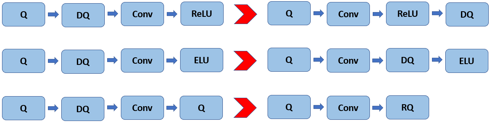

# Quantized networks compute and restrictions

One of the feature of Inference Engine is the support of quantized networks with different precisions: INT8, INT4, etc.
However, it is up to the plugin to define what exact precisions are supported by the particular HW.
All quantized networks which can be expressed in IR have a unified representation by means of *FakeQuantize* operation. 
For more details about low-precision model representation please refer to this [document](LowPrecisionModelRepresentation.md).

### Interpreting FakeQuantize at runtime
During the model load each plugin can interpret quantization rules expressed in *FakeQuantize* operations:
- Independently based on the definition of *FakeQuantize* operation.
- Using a special library of low-precision transformations (LPT) which applies common rules for generic operations,
such as Convolution, Fully-Connected, Eltwise, etc., and translates "fake-quantized" models into the models with low-precision operations. For more information about low-precision flow please refer to the following [document](https://docs.openvinotoolkit.org/latest/_docs_IE_DG_Int8Inference.html). 

Here we provide only a high-level overview of the interpretation rules of FakeQuantize. 
At runtime each FakeQuantize can be split into two independent operations: **Quantize** and **Dequantize**. 
The former one is aimed to transform the input data into the target precision while the latter transforms the resulting values back to the original range and precision. 
In practice *Dequantize* operations can be propagated forward through the linear operations, such as *Convolution* or *Fully-Connected*, 
and in some cases fused with the following *Quantize* operation for the next layer into the so-called *Requantize* operation (see Fig. 3).

Figure 3. Quantization operations propagation at runtime. Q, DQ, RQ stand for Quantize, Dequantize, and Requantize correspondingly.
 

From the calculation standpoint, the FakeQuantize formula also is split into two parts accordingly:  
`output = round((x - input_low) / (input_high - input_low) * (levels-1)) / (levels-1) * (output_high - output_low) + output_low`  
The first part of this fomula represetns *Quantize* operation:  
`q = round((x - input_low) / (input_high - input_low) * (levels-1))`  
The second is responsible for the dequantization:  
`r = q / (levels-1) * (output_high - output_low) + output_low`  
From the scale/zero-point notation standpoint the latter formula can be written as follows:  
`r = (output_high - output_low) / (levels-1) * (q + output_low / (output_high - output_low) * (levels-1))`  
Thus we can define:
- **Scale** as `(output_high - output_low) / (levels-1)`
- **Zero-point** as `-output_low / (output_high - output_low) * (levels-1)`

**Note**: During the quantization process the values `input_low`, `input_high`, `output_low`, `output_high` are selected so that to map a floating-point zero exactly to an integer value (zero-point) and vice versa.

## Quantization specifics and restrictions
In general, OpenVINO can represent and execute quantized models from different sources. However, the Post-training Optimization Toolkit (POT)
is considered the default way to get optimized models. Since the POT supports HW-aware quantization it means that specific rules can be implemented in it for 
the particular HW. However, it is reasonable to have compatibility with general-purpose HW such as CPU and GPU and support their quantization schemes.
Below we define these rules as follows:
- Support of mixed-precision models where some layers can be kept in the floating-point precision.
- Per-channel quantization of weights of Convolutional and Fully-Connected layers.
- Per-channel quantization of activations for channel-wise and element-wise operations, e.g. Depthwise Convolution, Eltwise Add/Mul, ScaleShift.
- Symmetric and asymmetric quantization of weights and activations with the support of per-channel scales and zero-points.
- Non-unified quantization parameters for Eltwise and Concat operations.  
- Non-quantized network output, i.e. there are no quantization parameters for it.

## Quantized model inference

!!! Need details from the runtime team.