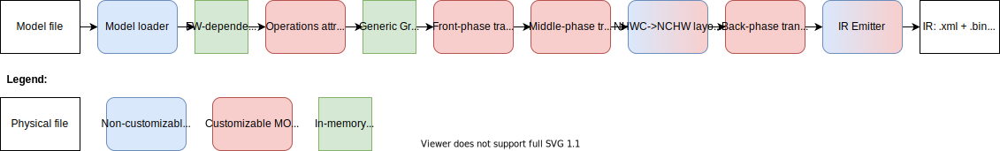
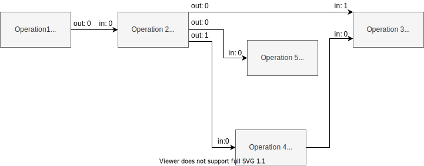
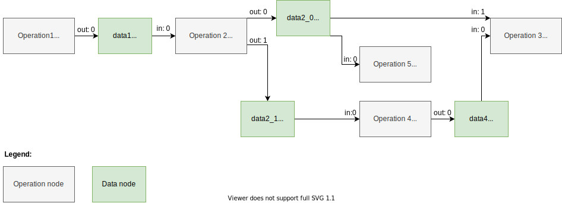

# Model Optimizer Customization {#openvino_docs_MO_DG_prepare_model_customize_model_optimizer_Customize_Model_Optimizer}
Model Optimizer extensibility mechanism allows to support new operations and custom transformations to generate
optimized IR. This mechanism is a core part of the Model Optimizer and whole Model Optimizer is developed using it,
so the Model Optimizer itself is a huge set of examples on how to add custom logic to support your model.

There are several cases when the customization is needed:

* The model contains operation(s) not known for the Model Optimizer, but these operation(s) could be expressed as a
combination of supported operations. In this case a custom transformation should be implemented to replace unsupported
operation(s) with supported ones.
* The model contains sub-graph of operations which can be replaced with a smaller number of operations to get the better
performance. This example corresponds to so called fusing transformations. For example, replace a sub-graph performing
the following calculation \f$x / (1.0 + e^{-(beta * x)})\f$ to a single operation of type Swish.
* The model contains custom framework operation (the operation which is not a part of official operation set of the
framework) which was developed using the framework extensibility mechanism. In this case the Model Optimizer should know
how to treat the operation and generate an IR for it.

It is necessary to figure out how the Model Optimizer represents a model in memory and convert it to IR before going
into details of the Model Optimizer extensibility mechanism.

> **NOTE**: All paths in this document are provided relatively to the Model Optimizer installation directory if not
> stated otherwise.

## Model Representation in Memory
The model can be represented as a directed graph where nodes are operations and edges correspond to data passing from a
producer operation (node) to a consumer operation (node).

Model Optimizer uses Python class `mo.graph.graph.Graph` instance to represent the computation graph in memory during
the model conversion. This class is inherited from `networkx.MultiDiGraph` class of the standard `networkx` Python
library and provides many convenient methods to traverse and modify the graph. Refer to the `mo/graph/graph.py` file for
the examples.

Model Optimizer keeps all necessary information about the operation in the node attributes. Model Optimizer uses class
`mo.graph.graph.Node` defined in the  `mo/graph/graph.py` file which is a wrapper on top of a `networkx` node attributes
dictionary and provides many convenient methods to work with the nodes. In particular, the node `my_node` attribute with
name `my_attr` can be obtained from the node with the following code `my_node.my_attr` which is equivalent to obtaining
attribute with name `'my_attr'` in the `graph.node['my_node']` dictionary. Refer to the `mo/graph/graph.py` for the
class implementation details.

An operation may have several inputs and outputs. For example, operation [Split](../../../ops/movement/Split_1.md) has
two inputs: data to split and axis to split along, and variable number of outputs depending on attribute `num_splits`.
Each input data to the operation is passed to a specific operation **input port**. Operation produces output data from
the **output port**. Ports are numbered from 0 for input and output independently. Model Optimizer has classes
`mo.graph.port.Port` and `mo.graph.connection.Connection` which are useful abstraction to perform graph modifications
like nodes connecting/re-connecting and graph traversing. These classes are widely used in the Model Optimizer code so
it is easy to find a lot of usage examples.

There is no dedicated class corresponding to an edge, so low-level graph manipulation is needed to get access to
edge attributes if needed. Meanwhile most manipulations with nodes connections should be done with help of
`mo.graph.connection.Connection` and `mo.graph.port.Port` classes. Thus, low-level graph manipulation is strongly not
recommended.

Further details and examples related to a model representation in memory are given in the sections below and provided in
the context for a better explanation.

## Model Conversion Pipeline
The model conversion pipeline can be represented with the following diagram:



Lets review each conversion step in details.

### Model Loading
Model Optimizer gets as input a trained model file. The model loader component of the Model Optimizer reads the model
file using Python bindings provided with the framework and builds in-memory representation of the computation graph.
There is a separate loader for each supported framework. These loaders are implemented in the
`extensions/load/<FRAMEWORK>/loader.py` files of the Model Optimizer.

The result of the model loading step is a `Graph` object which can be depicted like in the following example:



Model Optimizer loader saves a operation instance framework description (usually it is a Protobuf message) into a node
attribute usually named `pb`. It is important that this is a **framework-specific** description of the operation.
This means that the same operation Convolution which performs the same calculations may be represented differently in
various frameworks.

In the example above the Operation 2 has one input and two outputs. The tensor produced from the output port 0 is
consumed with the Operation 5 (input port 0) and Operation 3 (input port 1). The tensor produced from the output port 1
is consumed with the Operation 4 (input port 0).

Each edge has two attributes `in` and `out` containing input port number of the consumer node and output port
number of the producer node. These attribute describes the fact that nodes are operations getting some inputs and
producing some outputs. But the nodes themselves are "black boxes" from the Model Optimizer perspective because they
don't contain required information about operations they perform.

### Operations Attributes Extracting <a name="operations-attributes-extracting"></a>
The next step is to parse framework-dependent operation representation saved in a node attribute and update the node
attributes with operation specific attributes. There are two ways to do this.

1.  The extractor extension approach. This is recommended way to extract attributes for the operation and it is
explained in details in the [Operation Extractor](#extension-extractor) section.

2.  The legacy approach with built-in extractor. The file `mo/front/<FRAMEWORK>/extractor.py` (for example, the one for
Caffe) has a dictionary with extractors for specific operation types. The key in the dictionary is the type of the
operation to trigger the extractor for and the value is the function to perform attributes extracting. The function has
one parameter – node to extract the attributes from. This is a legacy and non-extensible approach so should be avoided.
It will be removed in the future versions of the Model Optimizer.

The result of the operations attributes extracting step can be depicted like in the following example:


The only difference in the graph from the previous step is that nodes contain dictionary with extracted attributes and
some operation-specific attributes needed for the Model Optimizer. But starting from this step the Model Optimizer does
not need the original representation of the operations/model and uses just Model Optimizer representation (there are
some very specific cases when the Model Optimizer still uses the `pb` attribute and they are slightly covered in this
document). Detailed list of common attributes and their meaning is provided below in the section corresponding to the
Model Optimizer operations.

### Front Phase
Due to legacy reasons the user must specify shapes for all inputs of the model. In contrast, other machine learning
frameworks allow generation of the model with undefined or partially defined input shapes. As an example, undefined
dimensions are marked with value `-1` in the TensorFlow* models or have some string names in the ONNX* models.

During the front phase the Model Optimizer knows shape of the model inputs and constants only and does not know shapes
(and even ranks) of the intermediate tensors. But information about shapes may not be needed to implement particular
transformation. For example, the transformation `extensions/front/TopKNormalize.py` removes attribute `k`  from the
`TopK` node and adds an input constant with the value `k`. The transformation is needed to convert the `TopK` operation
which comes from frameworks where the number of output elements is defined as attribute of the operation to the
OpenVINO&trade; [TopK](../../../ops/sort/TopK_3.md) operation semantic which requires this value to be a separate input.

It is important to mention that sometimes it seems like the transformation cannot be implemented during the front phase
because the actual values of inputs or shapes are needed. But in fact shapes or values manipulations can be implemented
using operations which are added to the graph. Consider the transformation
`extensions/front/onnx/flattenONNX_to_reshape.py` which replaces ONNX* operation
[Flatten](https://github.com/onnx/onnx/blob/master/docs/Operators.md#Flatten) with a sub-graph of operations performing
the following (for the case when `axis` is not equal to 0 and 1):

1. Calculate the shape of the `Flatten` input tensor using the [ShapeOf](../../../ops/shape/ShapeOf_3.md) operation.
2. Get the first `axis` elements from the output of `Shape` operation and calculate their product using the
[ReduceProd](../../../ops/reduction/ReduceProd_1.md) operation.
3. Concatenate output of `ReduceProd` and constant with value `-1` (refer to the
[Reshape](../../../ops/shape/Reshape_1.md) specification for the explanation of this value).
4. Use the concatenated value as the second input to the `Reshape` operation.

It is highly recommended to write shape-agnostic transformations to avoid model reshape-ability issue. Refer to
[Using Shape Inference](../../../IE_DG/ShapeInference.md) for more information related to reshaping of the model.

More information on how to develop front transformations and dedicated API description is provided in the
[Front Phase Transformations](#front-phase-transformations).

### Partial Inference <a name="partial-inference"></a>
Model Optimizer performs partial inference of the model during the model conversion. This procedure includes calculation
of output shapes of all operations in the model and constant folding (calculate values for constant sub-graphs).
Constant folding is needed for the shape inference because in some cases evaluation of constant sub-graph is needed to
calculate output shapes. For example, the output shape for the [Reshape](../../../ops/shape/Reshape_1.md) operation may
be calculated as a mathematical expression from [ShapeOf](../../../ops/shape/ShapeOf_3.md) operation.

> **NOTE**: Model Optimizer does not fold sub-graphs starting from [ShapeOf](../../../ops/shape/ShapeOf_3.md) operation
> by default because this leads to a model non-reshape-ability (the command line parameter `--static_shape` can override
> this behavior). Refer to [Using Shape Inference](../../../IE_DG/ShapeInference.md) for more information related to
> reshaping of the model.

Model Optimizer calculates output shapes for all operations in the model to write them to an Intermediate Representation
file.

> **NOTE**: This is a legacy requirement because starting from IR version 10 Inference Engine needs to know shapes of
> [Const](../../../ops/infrastructure/Constant_1.md) and [Parameter](../../../ops/infrastructure/Parameter_1.md)
> operations only. The nGraph component of the Inference Engine calculates output shapes for all operations in the model
> using shapes of [Parameter](../../../ops/infrastructure/Parameter_1.md) and
> [Const](../../../ops/infrastructure/Constant_1.md) operations.

Model Optimizer inserts "data" nodes to the computation graph. These data nodes correspond to tensors produced with
operations. Each data node contains two attributes: `shape` containing the shape of the tensor and `value` which
may contain the actual value of this tensor. The value for the `value` attribute is equal to `None` if this tensor value
cannot be calculated. This happens in two cases: when the tensor value depends on the values passed to the
[Parameter](../../../ops/infrastructure/Parameter_1.md) operations of the model or Model Optimizer does not have value
propagation implementation for the operation.

The graph before running partial inference can be depicted like in the following example:



The difference is not only in the data nodes, but also in the edge attributes. Note, that an `out` attribute is in edges
**from operation** nodes only, while an `in` attribute is in edges **from data** nodes only. This corresponds to the
fact that a tensor (data node) is produced from a specific output port of an operation and is consumed with a specific
input port of an operation. Also, a unique data node is created for each output port of an operation and may be used as
an input node for several operation nodes, like the data node "data2_0" which is consumed with the input port 1 of
the operation "Operation 3" and input port 0 of the operation "Operation 5".

Now consider how the Model Optimizer performs shape and value propagation. Model Optimizer performs topological sort of
the graph nodes. An error message is thrown if the graph contains a cycle. Then shape inference function is called for
each node in the graph in the topological order. Each node of the graph must have an attribute called `infer` with a
shape inference function, which is a function with one parameter – the instance of the `Node` class. The `infer`
attribute is usually set in the operation extractor or when a node is added in some transformation using the Model
Optimizer operation class inherited from `mo.pos.Op` class. Refer to the extensions section dedicated to extractors and
operations for more information about setting shape inference function.

The shape inference function should calculate the operation (node) output shape(s) based on input shape(s) and operation
(node) attribute(s) and update `shape` and optionally `value` attributes of the corresponding data node(s). A simplified
example of the shape infer function for the [Reshape](../../../ops/shape/Reshape_1.md) operation (the full version is
`mo/ops/reshape.py`):

```py
    @staticmethod
    def infer(node: Node):
        name = node.soft_get('name', node.id)

        input_shape = node.in_port(0).data.get_shape()  # get the input tensor shape
        new_shape = node.in_port(1).data.get_value()  # get the value defining the output tensor shape. This tensor may
                                                      # have special values like 0 and -1

        output_shape = ... # calculate output shape without special values like 0 and -1

        if node.in_port(0).data.get_value() is not None:  # if the input value is defined then calculate output value;
                                                          # shape will be updated automatically with the value shape
            node.out_port(0).data.set_value(node.in_port(0).data.get_value().reshape(output_shape))
        else:  # in the opposite case calculate the output shape only
            node.out_port(0).data.set_shape(output_shape)
```

Methods `in_port()` and `output_port()` of the `Node` class are used to get and set data node attributes. Refer to the
[Graph Traversal and Modification Using `Port`s and `Connection`s](#graph-ports-and-conneсtions) section on how to use
them.

> **NOTE**: Shape inference function should perform output shape calculation in the original model layout. For example,
> OpenVINO&trade; supports Convolution operations in NCHW layout only but TensorFlow\* supports NHWC layout as well.
> Model Optimizer shape inference function calculates output shapes for NHWC Convolutions in NHWC layout and only during
> the layout change phase the shape is converted to NCHW.

> **NOTE**: There is a legacy approach to modify data nodes attributes like `op_node.in_node(0).shape = some_value`.
> This approach is still used in the Model Optimizer code but is not recommended.

### Middle Phase
The phase called "middle" starts after the partial inference. At this phase the graph contains data nodes and output
shapes of all operations in the graph are calculated. Any transformation implemented at this stage must update `shape`
attribute for all newly added operations. It is highly recommended to use
[Graph Traversal and Modification Using `Port`s and `Connection`s](#graph-ports-and-conneсtions) because modification of
the graph causes automatic re-inference of affected nodes as well as creation of necessary data nodes.

More information on how to develop middle transformations and dedicated API description is provided in the
[Middle Phase Transformations](#middle-phase-transformations).

### NHWC to NCHW Layout Change
There are several middle transformations responsible for changing model layout from NHWC to NCHW. These transformations
are triggered by default for TensorFlow\* models only because it is the only framework with Convolution operations in
NHWC layout.

> **NOTE**: If a TensorFlow\* model is in NCHW layout then user should specify `--disable_nhwc_to_nchw` command line
> parameter to disable these transformations.

The layout change is a complex problem and detailed explanation of it is out of scope of this document. A very brief
explanation of this process is provided below:

1. Model Optimizer changes output shapes of most of operations producing 4D and 5D (four dimensional and five
dimensional) tensors as if they were in NHWC layout to NCHW layout: `nchw_shape = np.array(nhwc_shape)[0, 3, 1, 2]` for
4D and `nchw_shape = np.array(nhwc_shape)[0, 4, 1, 2, 3]` for 5D. This permutation does not happen for some operations
with specific conditions identified during the model conversion.
2. Model Optimizer inserts [Gather](../../../ops/movement/Gather_1.md) operations to the sub-graph relates to shapes
calculation to perform shape calculation in a correct layout.
3. Model Optimizer inserts [Transpose](../../../ops/movement/Transpose_1.md) operations to produce correct inference
results.

The list of main transformations responsible for the layout change are: `extensions/middle/ApplyPermutations.py`,
`extensions/middle/InsertLayoutPropagationTransposes.py`, `extensions/middle/MarkSubgraphsWithCorrectLayout.py`,
`extensions/middle/ApplyNHWCtoNCHWpermutation.py` and `extensions/middle/LayoutChangeForConstantShapePaths.py`.
Refer to the source code of these transformations for more details on how the layout change works.

### Back Phase
The back phase starts after the layout change to NCHW. This phase contains mostly the following transformations:

1. Transformations which should be working with a graph in the NCHW layout and thus cannot be implemented in the middle
phase.
2. Transformations which replace nodes corresponding to internal Model Optimizer operations with nodes corresponding to
[opset](@ref openvino_docs_ops_opset) operations.
3. Transformations which normalize operations inputs according to the specification.
4. Final optimization transformations.

The graph structure during the back phase is the same as as during the middle phase. There is no difference in writing
middle and back transformations.

### Intermediate Representation Emitting
The last phase of the model conversion is Intermediate Representation Emitting. Model Optimizer performs the following
most notable steps:

1. Iterates over all operation nodes in the graph and checks that all have attribute `type` set. This attribute defines
the operation type and used in the Inference Engine to instantiate proper operation from the
[opset](@ref openvino_docs_ops_opset) specified in the `version` attribute of the node. If some node does not have
attribute `type` or its values is `None` then the Model Optimizer exits with an error.
2. Performs type inference of all operations in the graph similar to the shape inference. The inferred data types are
saved to the node attributes in the IR.
3. Performs topological sort of the graph and changes `id` attribute of all operation nodes to be sequential integer
values starting from 0.
4. Saves all Constants values to the `.bin` file. Constants with the same values are shared between different
operations.
5. Generates `.xml` file defining the graph structure. The information about operation inputs and outputs are prepared
uniformly for all operations regardless of its type. The attributes to be dumped and how they are represented in the XML
file is defined with the `backend_attrs` or `supported_attrs`. For more information on how the operation attributes are
saved to XML refer to the [Custom Model Optimizer Operation](#extension-operation).

For more information about the Intermediate Representation Emitting process refer to the function `prepare_emit_ir` in
the `mo/pipeline/commom.py` file.

## Graph Traversal and Modification Using `Port`s and `Connection`s <a name="graph-ports-and-conneсtions"></a>

## Model Optimizer Extensions
Model Optimizer extensions allow to inject some logic to the model conversion pipeline without changing the Model
Optimizer core code. There are three types of the Model Optimizer extensions:

1. The Model Optimizer operation.
2. The framework operation extractor.
3. A model transformation which can be executed during front, middle or back phase of the model conversion.

An extension is just a plain text file with a Python code. The file should contain a class (or classes) inherited from
one of extension base classes. Extension files should be saved to a directory with the following structure:

```sh
./<MY_EXT>/
           ops/                  - custom operations
           front/                - framework independent front transformations
                 <FRAMEWORK_1>/  - front transformations for <FRAMEWORK_1> models only and extractors for <FRAMEWORK_1> operations
                 <FRAMEWORK_2>/  - front transformations for <FRAMEWORK_2> models only and extractors for <FRAMEWORK_2> operations
                 ...
           middle/               - middle transformations
           back/                 - back transformations
```

Model Optimizer uses the same layout internally to load built-in extensions. The only exception is that the directory
`mo/ops/` is also used as a source of the Model Optimizer operations due to historical reasons.

> **NOTE**: The name of a root directory with extensions should not be equal to "extensions" because it will result in a
> name collision with the built-in Model Optimizer extensions.

> **NOTE**: Model Optimizer itself is built using these extensions so there are huge number of examples on how to use
> them in the Model Optimizer code.

### Custom Model Optimizer Operation <a name="extension-operation"></a>
Model Optimizer defines a class `mo.ops.Op` (`Op` will be used later in the document to be short) which is a base class
for operations used in the Model Optimizer. The instance of the `Op` class serves the following purposes:

1. Stores operation attributes.
2. Stores the operation shape/value/type inference functions.
3. Defines operation attributes to be saved to an IR.
4. Contains convenient methods to create a graph node from the `Op` object instance and connect it with the existing
graph.
5. Used in the extractors to store parsed attributes and operation specific attributes in the dedicated graph node.

It is important to mention that there is no connection between the instance of the `Op` class and the `Node` object
created from it. The `Op` class is just a container of attributes describing the operation. Model Optimizer uses `Op`
class during model conversion to create nodes of the graph with attributes copied from the `Op` class instance. Graph
manipulations are performed with graph `Node`s and their attributes and does not involve `Op`s.

There are a number of common attributes used in the operations. Here is the list of these attributes with description.

* `id` — unique identifier of a node in the graph. Generated automatically equal to the number of nodes in the graph
plus 1 if not specified. **Mandatory**.
* `name` — name of the operation. Generated automatically equal to the `id` if not specified. **Mandatory**.
* `type` — type of the operation according to the [opset specification](@ref openvino_docs_ops_opset). For the internal
Model Optimizer operations this attribute should be equal to `None`. The model conversion fails if an operation with
`type` equal to `None` stays in the graph till the IR emitting phase. **Mandatory**.
* `version` — name of the operation set it belongs to. If not specified then the Model Optimizer sets it equal to
`experimental`. Refer to [nGraph Basic Concepts](@ref openvino_docs_nGraph_DG_basic_concepts) for more information about
opsets. **Mandatory**.
* `op` — Model Optimizer type of the operation. In many cases the value of `type` is equal to the value of `op`. But
when the Model Optimizer cannot instantiate opset operation during model loading it creates an instance of internal
operation. And the attribute `op` is used as a type of this internal operation. Later in the pipeline the node created
from an internal operation will be replaced during front, middle or back phase with node(s) created from an opset
operation(s).
* `infer` — the attribute defining a function calculating output tensor(s) shape and optionally value. May be set to
`None` for internal Model Optimizer operations used during the front phase only. Refer to the
[Partial Inference](#partial-inference) section for more information about the shape inference function.
* `type_infer` — the attribute defining a function calculating output tensor(s) data type. If the attribute is not
defined then the default function is used. The function checks if the node attribute `data_type` is set and then
propagates this type to the output tensor from the port 0, otherwise it propagates the data type of the tensor coming
into the input port 0 to the output tensor from the port 0.
* `in_ports_count` — default number of input ports to be created for the operation. Additional ports can be created or
redundant ports can be removed using dedicated `Node` class API methods.
* `out_ports_count` — default number of output ports to be created for the operation. Additional ports can be created or
redundant ports can be removed using dedicated `Node` class API methods.

Here is an example of the Model Optimizer class for the operation [`SoftMax`](../../../ops/activation/SoftMax_1.md) from
the file `mo/ops/softmax.py` with the in code explanations.

```py
class Softmax(Op):
    # the class attribute defining a name of the operation so the operation class can be obtained using the
    # "Op.get_op_class_by_name()" static method
    op = 'SoftMax'

    # the operation works as an extractor by default. This is a legacy behaviour not recommended for using currently,
    # thus "enabled" class attribute is set to False. The recommended approach is to use dedicated extractor extension
    enabled = False

    def __init__(self, graph: Graph, attrs: dict):
        super().__init__(graph, {  # the constructor of the base class Op is called with additional default attributes
            'type': __class__.op,  # the operation is from the opset so the type is set to 'SoftMax'
            'op': __class__.op,  # internal Model Optimizer operation has the same type
            'version': 'opset1',  # the operation corresponds to opset1
            'infer': Softmax.infer,  # shape inference function is defined below
            'axis': 1,  # default value for the "axis" attribute of the operation SoftMax
            'in_ports_count': 1,  # the operation has one input
            'out_ports_count': 1,  # the operation produces one output
        }, attrs)

    # the method returns list of operation specific attributes. This method is important for the case when implementing
    # extractor inherited from CaffePythonFrontExtractorOp class to extract attribute for Caffe Python operation.
    # But currently it is used interchangeably with the "backend_attrs()" method. If the "backend_attrs()" is not used
    # then the "supported_attrs()" is used instead. In this particular case the operation has just one attribute "axis"
    def supported_attrs(self):
        return ['axis']

    @staticmethod
    def infer(node: Node):
        "some code calculating output shape and values"
```

There is a dedicated method called `backend_attrs()` defining a list of attributes to be saved to the IR. Consider an
example from the `mo/ops/pooling.py` file:
```py
   def backend_attrs(self):
        return [
            ('strides', lambda node: ','.join(map(str, node['stride'][node.spatial_dims]))),
            ('kernel', lambda node: ','.join(map(str, node['window'][node.spatial_dims]))),

            ('pads_begin', lambda node: ','.join(map(str, get_backend_pad(node.pad, node.spatial_dims, 0)))),
            ('pads_end', lambda node: ','.join(map(str, get_backend_pad(node.pad, node.spatial_dims, 1)))),

            ('pool-method', 'pool_method'),
            ('exclude-pad', 'exclude_pad'),

            'rounding_type',
            'auto_pad',
        ]
```

The `backend_attrs` function returns a list of records which can be of one of the following formats:
1. A string defining the attribute to be saved to the IR. If the value of the attribute is `None` then the attribute is
not saved. Example of this case are `rounding_type` and `auto_pad`.
2. A tuple where the first element is a string defining the name of the attribute as it will appear in the IR and the
second element is a function to produce the value for this attribute. The function gets an instance of the `Node` as the
only parameter and returns a string with the value to be saved to the IR. Example of this case are `strides`, `kernel`,
`pads_begin` and `pads_end`.
3. A tuple where the first element is a string defining the name of the attribute as it will appear in the IR and the
second element is the name of tha `Node` attribute to get the value from. Example of this case are `pool-method` and
`exclude-pad`.

### Operation Extractor <a name="extension-extractor"></a>
Model Optimizer runs specific extractor for each operation in the model during the model loading. Refer to the
[operations-attributes-extracting](#operations-attributes-extracting) for more information about this process.

There are several types of Model Optimizer extractor extensions:
1. The generic one which is described in this section.
2. The special extractor for Caffe\* models with Python layers. This kind of extractor is described in the
[Extending the Model Optimizer with Caffe* Python Layers](@ref openvino_docs_MO_DG_prepare_model_customize_model_optimizer_Extending_Model_Optimizer_With_Caffe_Python_Layers).
3. The special extractor for MXNet\* models with custom operations. This kind of extractor is described in the
[Extending the Model Optimizer for Custom MXNet* Operations](@ref openvino_docs_MO_DG_prepare_model_customize_model_optimizer_Extending_MXNet_Model_Optimizer_with_New_Primitives).
4. The special extractor and fallback to Caffe\* for shape inference is described in the [Legacy Mode for Caffe* Custom
Layers](Legacy_Mode_for_Caffe_Custom_Layers.md).

This chapter is focused on the option #1 which provides a generic mechanism for the operation extractor applicable for
all frameworks. Model Optimizer provides class `mo.front.extractor.FrontExtractorOp` as a base class to implement the
extractor. It has a class method `extract` which gets the only parameter `Node` which corresponds to the graph node to
extract data from. The operation description in the original framework format is stored in the attribute `pb` of the
node. The extractor goal is to parse this attribute and save necessary attributes to the corresponding node of the
graph. Consider the extractor for the TensorFlow\* operation `Const` (refer to the file
`extensions/front/tf/const_ext.py`):

```py
from mo.front.extractor import FrontExtractorOp
from mo.front.tf.extractors.utils import tf_dtype_extractor, tf_tensor_shape, tf_tensor_content
from mo.ops.const import Const


class ConstExtractor(FrontExtractorOp):
    # the "op" class attribute defines a type of the operation in the framework (in this case it is a TensorFlow) for
    # which the extractor should be triggered
    op = 'Const'
    enabled = True  # the flag that indicates that this extractor is enabled

    @classmethod
    def extract(cls, node):  # the entry point of the extractor
        # node.pb attribute stores the TensorFlow representation of the operation which is a Protobuf message of the
        # specific format. In particular the message contains the attribute called "value" containing the description of
        # the constant. The string "pb.attr["value"].tensor" is just a Python binding for Protobuf message parsing
        pb_tensor = node.pb.attr["value"].tensor
        # get the shape of the tensor from the protobuf message using the helper function "tf_tensor_shape"
        shape = tf_tensor_shape(pb_tensor.tensor_shape)
        # create a dictionary with necessary attributes
        attrs = {
            'shape': shape,
            # get the tensor value using "tf_tensor_content" helper function
            'value': tf_tensor_content(pb_tensor.dtype, shape, pb_tensor),
            # get the tensor data type using "tf_dtype_extractor" helper function
            'data_type': tf_dtype_extractor(pb_tensor.dtype),
        }
        # update the node attributes using default attributes from the "Const" operation and attributes saved to the
        # "attrs" dictionary
        Const.update_node_stat(node, attrs)
        return cls.enabled
```

Consider another example with an extractor of ONNX\* operation `Constant` (refer to the file
`extensions/front/onnx/const_ext.py`):

```py
from onnx import numpy_helper
from onnx.numpy_helper import to_array

from mo.front.extractor import FrontExtractorOp
from mo.front.onnx.extractors.utils import onnx_attr
from mo.ops.const import Const


class ConstantExtractor(FrontExtractorOp):
    op = 'Constant'
    enabled = True

    @classmethod
    def extract(cls, node):
        # use helper method "onnx_attr" which parses the Protobuf representation of the operation saved in the "node"
        # gets the value of the attribute with name "value" as "TensorProto" type (specified with a keyword "t")
        pb_value = onnx_attr(node, 'value', 't')
        # use ONNX helper method "numpy_helper.to_array()" to convert "TensorProto" object to a numpy array
        value = numpy_helper.to_array(pb_value)

        attrs = {
            'data_type': value.dtype,
            'value': value,
        }
        # update the node attributes using default attributes from the "Const" operation and attributes saved to the
        # "attrs" dictionary
        Const.update_node_stat(node, attrs)
        return cls.enabled
```

The extractors for operations from different frameworks work similarly. The only difference is in the helper methods
used to parse operation attributes encoded with framework-specific representation.

Common practice is to use `update_node_stat()` method of the dedicated `Op` class to update node attributes. This method
does the following:

1. Sets values for common attribute like `op`, `type`, `infer`, `in_ports_count`, `out_ports_count`, `version` etc to
values specific to the dedicated operation (`Const` operation in this case).
2. Uses methods `supported_attrs()` and `backend_attrs()` defined in the `Op` class to update specific node attribute
`IE` which stores information about operation attributes to be saved to IR.
3. Optionally sets additional attributes provided to the `update_node_stat()` function as a second parameter. Usually
these attributes are parsed from the particular instance of the operation.

> **NOTE**: Model Optimizer uses numpy arrays to store values and numpy arrays of type `np.int64` to store shapes in the
> graph.

## Graph Transformation Extensions <a name="graph-transformations"></a>
Model Optimizer provides various base classes to implement [Front Phase Transformations](#front-phase-transformations),
[Middle Phase Transformations](#middle-phase-transformations) and [Back Phase Transformations](#back-phase-transformations).
All classes have the following common class attributes and methods:
1. Attribute `enabled` specifies whether the transformation is enabled or not. The value can be changed during runtime
to enable or disable execution of the transformation during a model conversion.
2. Attribute `id` specifies a unique transformation string identifier. This transformation identified can be used to
enable (disable) the transformation by setting environment variable `MO_ENABLED_TRANSFORMS` (`MO_DISABLED_TRANSFORMS`)
with a comma separated list of `id`s. The environment variables override the value of the `enabled` attribute of the
transformation.
3. Method `run_before()` returns a list of transformation classes which this transformation should be executed before.
4. Method `run_after()` returns a list of transformation classes which this transformation should be executed after.

> **NOTE**: Some of the transformation types have specific class attributes and methods which are explained in the
> dedicated sections of this document.

Model Optimizer builds a graph of dependencies between registered transformations and executes them in the topological
order. In order to execute the transformation during a proper model conversion phase the Model Optimizer defines several
anchor transformations which does nothing. All transformations are ordered with respect to these anchor transformations.
The diagram below shows anchor transformations, some of built-in transformations and dependencies between them:


User defined transformations are be executed after corresponding `Start` and before corresponding `Finish` anchor
transformations by default (if `run_before()` and `run_after()` methods have not been overridden).

> **NOTE**: The `PreMiddleStart` and `PostMiddleStart` anchors were introduced due to historical reasons to refactor
> the Model Optimizer pipeline which initially had a hardcoded order of transformations.

### Front Phase Transformations <a name="front-phase-transformations"></a>
There are several types of front phase transformations:

1. Pattern-defined transformation triggered for each sub-graph of the original graph isomorphic to the specified
pattern.
2. Transformation triggered for node with specific `op` attribute value.
3. Manually enabled transformation defined with a JSON configuration file (for TensorFlow\* and ONNX\* models only):
    1. Node name defined sub-graph transformation.
    2. Start/end node names defined sub-graph transformation.
    3. Generic graph transformation.

### Middle Phase Transformations <a name="middle-phase-transformations"></a>

### Back Phase Transformations <a name="back-phase-transformations"></a>

The detailed solutions for the examples above are given later, the next subsection shows what is common in all three examples.


Model Optimizer searches for each layer of the input model in the list of known layers before building the model's internal representation, optimizing the model, and producing the Intermediate Representation.

The list of known layers is different for each of supported frameworks. To see the layers supported by your framework, refer to the [corresponding section](../Supported_Frameworks_Layers.md).

Custom layers are layers that are not included into a list of known layers. If your topology contains any layers that are not in the list of known layers, the Model Optimizer classifies them as custom.

## Caffe\* Models with Custom Layers <a name="caffe-models-with-custom-layers"></a>

You have two options if your Caffe\* model has custom layers:

*   **Register the custom layers as extensions to the Model Optimizer**. For instructions, see [Extending Model Optimizer with New Primitives](Extending_Model_Optimizer_with_New_Primitives.md). When your custom layers are registered as extensions, the Model Optimizer generates a valid and optimized Intermediate Representation. You only need to write a small chunk of Python\* code that lets the Model Optimizer:

    *   Generate a valid Intermediate Representation according to the rules you specified
    *   Be independent from the availability of Caffe on your computer
	
*   **Register the custom layers as Custom and use the system Caffe to calculate the output shape of each Custom Layer**, which is required by the Intermediate Representation format. For this method, the Model Optimizer requires the Caffe Python interface on your system. When registering the custom layer in the `CustomLayersMapping.xml` file, you can specify if layer parameters should appear in Intermediate Representation or if they should be skipped. To read more about the expected format and general structure of this file, see [Legacy Mode for Caffe* Custom Layers](Legacy_Mode_for_Caffe_Custom_Layers.md). This approach has several limitations:

    *   If your layer output shape depends on dynamic parameters, input data or previous layers parameters, calculation of output shape of the layer via Caffe can be incorrect. In this case, you need to patch Caffe on your own.
	
    *   If the calculation of output shape of the layer via Caffe fails inside the framework, Model Optimizer is unable to produce any correct Intermediate Representation and you also need to investigate the issue in the implementation of layers in the Caffe and patch it.
	
    *   You are not able to produce Intermediate Representation on any machine that does not have Caffe installed. If you want to use Model Optimizer on multiple machines, your topology contains Custom Layers and you use `CustomLayersMapping.xml` to fallback on Caffe, you need to configure Caffe on each new machine. 
	
	For these reasons, it is best to use the Model Optimizer extensions for Custom Layers: you do not depend on the framework and fully control the workflow.

If your model contains Custom Layers, it is important to understand the internal workflow of Model Optimizer. Consider the following example.

**Example**:

The network has:

*   One input layer (#1)
*   One output Layer (#5)
*   Three internal layers (#2, 3, 4)

The custom and standard layer types are:

*   Layers #2 and #5 are implemented as Model Optimizer extensions.
*   Layers #1 and #4 are supported in Model Optimizer out-of-the box.
*   Layer #3 is neither in the list of supported layers nor in extensions, but is specified in CustomLayersMapping.xml.

> **NOTE**: If any of the layers are not in one of three categories described above, the Model Optimizer fails with an appropriate message and a link to the corresponding question in [Model Optimizer FAQ](../Model_Optimizer_FAQ.md).

The general process is as shown:


1.  The example model is fed to the Model Optimizer that **loads the model** with the special parser, built on top of `caffe.proto` file. In case of failure, Model Optimizer asks you to prepare the parser that can read the model. For more information, refer to Model Optimizer, <a href="MO_FAQ.html#FAQ1">FAQ #1</a>.

2.  Model Optimizer **extracts the attributes of all layers**. In particular, it goes through the list of layers and attempts to find the appropriate extractor. In order of priority, Model Optimizer checks if the layer is:
    
    *   Registered in `CustomLayersMapping.xml`
    *   Registered as a Model Optimizer extension
    *   Registered as a standard Model Optimizer layer
    
    When the Model Optimizer finds a satisfying condition from the list above, it extracts the attributes according to the following rules:
    
    *   For bullet #1 - either takes all parameters or no parameters, according to the content of `CustomLayersMapping.xml`
    *   For bullet #2 - takes only the parameters specified in the extension
    *   For bullet #3 - takes only the parameters specified in the standard extractor
	
3.  Model Optimizer **calculates the output shape of all layers**. The logic is the same as it is for the priorities. **Important:** the Model Optimizer always takes the first available option.

4.  Model Optimizer **optimizes the original model and produces the Intermediate Representation**.

