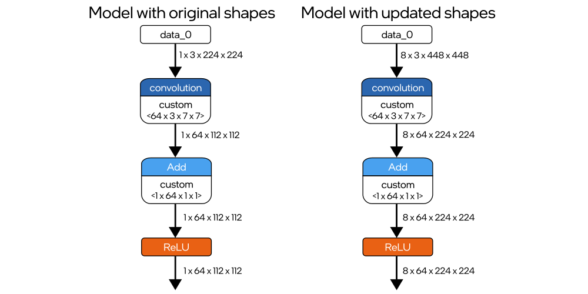

# Changing Input Shapes {#openvino_docs_OV_UG_ShapeInference}

@sphinxdirective

.. toctree::
   :maxdepth: 1
   :hidden:

   troubleshooting_reshape_errors

@endsphinxdirective

OpenVINO™ enables you to change model input shape during the application runtime. It may be useful when you want to feed the model an input that has different size than the model input shape. The following instructions are for cases where you need to change the model input shape repeatedly.

> **NOTE**:  If you need to do this only once, prepare a model with updated shapes via [Model Optimizer](@ref openvino_docs_MO_DG_Deep_Learning_Model_Optimizer_DevGuide). For more information, refer to the [Specifying --input_shape Command-line Parameter](@ref when_to_specify_input_shapes) article.

### The reshape method

The reshape method is used as `ov::Model::reshape` in C++ and [Model.reshape](api/ie_python_api/_autosummary/openvino.runtime.Model.html#openvino.runtime.Model.reshape) in Python. The method updates input shapes and propagates them down to the outputs of the model through all intermediate layers.
The code below is an example of how to set a new batch size with the `reshape` method:

@sphinxtabset

@sphinxtab{C++}

@snippet snippets/ShapeInference.cpp picture_snippet

@endsphinxtab

@sphinxtab{Python}

@snippet docs/snippets/ShapeInference.py picture_snippet

@endsphinxtab

@endsphinxtabset

The diagram below presents the results of using the method, where the size of model input is changed with an image input:

When using the `reshape` method, you may take one of the approaches:

@anchor usage_of_reshape_method

@sphinxdirective

#. You can pass a new shape to the method in order to change the input shape of the model with a single input. See the example of adjusting spatial dimensions to the input image:

   .. tab:: C++
   
      .. doxygensnippet:: docs/snippets/ShapeInference.cpp
         :language: cpp
         :fragment: spatial_reshape
   
   .. tab:: Python
   
      .. doxygensnippet:: docs/snippets/ShapeInference.py
         :language: python
         :fragment: simple_spatials_change

   To do the opposite - to resize input image to match the input shapes of the model, use the :doc:`pre-processing API <openvino_docs_OV_UG_Preprocessing_Overview>`.

#. You can express a reshape plan, specifying the input by the port, the index, and the tensor name:

   .. tab:: Port
   
      .. tab:: C++
   
         map<ov::Output<ov::Node>, ov::PartialShape specifies input by passing actual input port:
   
         .. doxygensnippet:: docs/snippets/ShapeInference.cpp
            :language: cpp
            :fragment: [obj_to_shape]
   
      .. tab:: Python
   
         `openvino.runtime.Output` dictionary key specifies input by passing actual input object.
         Dictionary values representing new shapes could be `PartialShape`:
   
         .. doxygensnippet:: docs/snippets/ShapeInference.py
            :language: python
            :fragment: [obj_to_shape]
   
   .. tab:: Index
   
      .. tab:: C++
   
         map<size_t, ov::PartialShape> specifies input by its index:
   
         .. doxygensnippet:: docs/snippets/ShapeInference.cpp
            :language: cpp
            :fragment: [idx_to_shape]
   
      .. tab:: Python
   
         `int` dictionary key specifies input by its index.
         Dictionary values representing new shapes could be `tuple`:
   
         .. doxygensnippet:: docs/snippets/ShapeInference.py
            :language: python
            :fragment: [idx_to_shape]
   
   .. tab:: Tensor Name
   
      .. tab:: C++
   
         map<string, ov::PartialShape> specifies input by its name:
   
         .. doxygensnippet:: docs/snippets/ShapeInference.cpp
            :language: cpp
            :fragment: [name_to_shape]
   
      .. tab:: Python
   
         `str` dictionary key specifies input by its name.
         Dictionary values representing new shapes could be `str`:
   
         .. doxygensnippet:: docs/snippets/ShapeInference.py
            :language: python
            :fragment: [name_to_shape]

@endsphinxdirective

You can find the usage scenarios of the `reshape` method in [Hello Reshape SSD Samples](@ref openvino_inference_engine_samples_hello_reshape_ssd_README).

> **NOTE**: In some cases, models may not be ready to be reshaped. Therefore, a new input shape cannot be set neither with [Model Optimizer](@ref openvino_docs_MO_DG_Deep_Learning_Model_Optimizer_DevGuide) nor the `reshape` method.

### The set_batch method

The meaning of the model batch may vary depending on the model design.
To change the batch dimension of the model, [set the layout](@ref declare_model_s_layout) and call the `set_batch` method.

@sphinxtabset

@sphinxtab{C++}

@snippet snippets/ShapeInference.cpp set_batch

@endsphinxtab

@sphinxtab{Python}

@snippet docs/snippets/ShapeInference.py set_batch

@endsphinxtab

@endsphinxtabset

The `set_batch` method is a high-level API of the reshape functionality, so all information about the `reshape` method implications are applicable for `set_batch` too, including the troubleshooting section.

Once you set the input shape of the model, call the `compile_model` method to get a `CompiledModel` object for inference with updated shapes.

There are other approaches to change model input shapes during the stage of [IR generation](@ref when_to_specify_input_shapes) or [model representation](@ref openvino_docs_OV_UG_Model_Representation) in OpenVINO Runtime.

@sphinxdirective

.. important::

   Shape-changing functionality could be used to turn dynamic model input into a static one and vice versa. Always set static shapes when the shape of data is NOT going to change from one inference to another. Setting static shapes can avoid memory and runtime overheads for dynamic shapes which may vary depending on hardware plugin and model used. For more information, refer to the :doc:`Dynamic Shapes <openvino_docs_OV_UG_DynamicShapes>`.

@endsphinxdirective

## Additional Resources

* [Extensibility documentation](@ref openvino_docs_Extensibility_UG_Intro) - describes a special mechanism in OpenVINO that allows adding support of shape inference for custom operations.
* `ov::Model::reshape` - in OpenVINO Runtime C++ API
* [Model.reshape](api/ie_python_api/_autosummary/openvino.runtime.Model.html#openvino.runtime.Model.reshape) - in OpenVINO Runtime Python API.
* [Dynamic Shapes](@ref openvino_docs_OV_UG_DynamicShapes)
* [OpenVINO samples](@ref openvino_docs_OV_UG_Samples_Overview)
* [Preprocessing API](@ref openvino_docs_OV_UG_Preprocessing_Overview)
