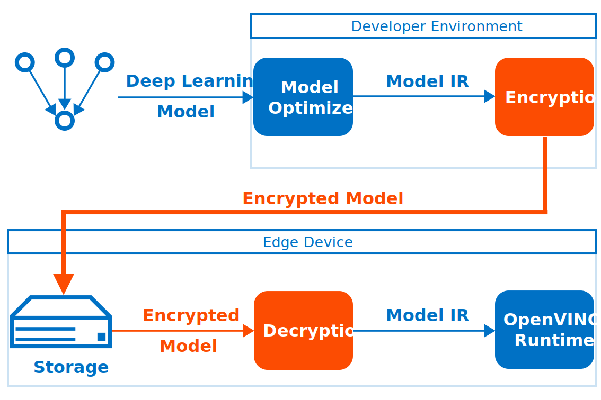

# Using Encrypted Models with OpenVINO  {#openvino_docs_OV_UG_protecting_model_guide}

Deploying deep-learning capabilities to edge devices can present security
challenges like ensuring inference integrity, or providing copyright
protection of your deep-learning models.

One possible solution is to use cryptography to protect models as they are
deployed and stored on edge devices. Model encryption, decryption and
authentication are not provided by OpenVINO but can be implemented with
third-party tools (i.e., OpenSSL). While implementing encryption, ensure that 
the latest versions of tools are used and follow cryptography best practices.

This guide presents how to use OpenVINO securely with protected models.

## Secure Model Deployment

After a model is optimized by the OpenVINO Model Optimizer, it's deployed
to target devices in the OpenVINO Intermediate Representation (OpenVINO IR) format. An optimized
model is stored on edge device and is executed by the OpenVINO Runtime.
TensorFlow, ONNX and PaddlePaddle models can be read natively by OpenVINO Runtime as well.

Encrypting and optimizing model before deploying it to the edge device can be
used to protect deep-learning models. The edge device should keep the stored model
protected all the time and have the model decrypted **in runtime only** for use
by the OpenVINO Runtime.

## Loading Encrypted Models

The OpenVINO Runtime requires model decryption before loading. Allocate
a temporary memory block for model decryption and use the 
`ov::Core::read_model` method to load the model from a memory buffer.
For more information, see the `ov::Core` Class Reference Documentation.

@snippet snippets/protecting_model_guide.cpp part0

Hardware-based protection such as Intel Software Guard Extensions
(Intel SGX) can be used to protect decryption operation secrets and
bind them to a device. For more information, see the [Intel Software Guard
Extensions](https://software.intel.com/en-us/sgx).

Use the `ov::Core::read_model` to set model representations and
weights respectively.

Currently there is no way to read external weights from memory for ONNX models.
The `ov::Core::read_model(const std::string& model, const Tensor& weights)` method
should be called with `weights` passed as an empty `ov::Tensor`.

@snippet snippets/protecting_model_guide.cpp part1

## Additional Resources

- Intel® Distribution of OpenVINO™ toolkit [home page](https://software.intel.com/en-us/openvino-toolkit).
- Model Optimizer [Developer Guide](../MO_DG/Deep_Learning_Model_Optimizer_DevGuide.md).
- [OpenVINO™ Runtime User Guide](openvino_intro.md).
- For more information on Sample Applications, see the [OpenVINO Samples Overview](Samples_Overview.md)
- For information on a set of pre-trained models, see the [Overview of OpenVINO™ Toolkit Pre-Trained Models](@ref omz_models_group_intel).
- For IoT Libraries and Code Samples, see the [Intel® IoT Developer Kit](https://github.com/intel-iot-devkit).
