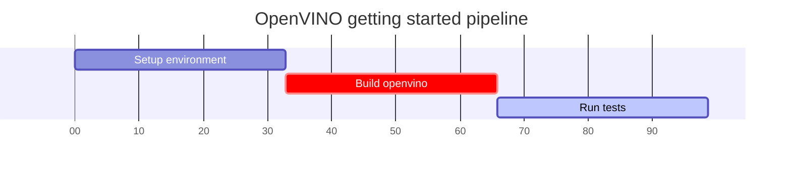

# How to build OpenVINO

The articles below provide the basic informations about the process of building OpenVINO.

* [Windows](build_windows.md)
* [Linux](build_linux.md)
* [Mac (Intel CPU)](build_mac_intel_cpu.md)
* [Mac (ARM)](build_mac_arm.md)
* [Android](build_android.md)
* [Raspbian Stretch](./build_raspbian.md)
* [Web Assembly](./build_webassembly.md)
* [Docker Image](https://github.com/openvinotoolkit/docker_ci/tree/master/dockerfiles/ubuntu18/build_custom)
* [Linux RISC-V](./build_riscv64.md)

> **NOTE**: For the details on how to build static OpenVINO, refer to [Building static OpenVINO libraries](static_libaries.md)

## See also

 * [OpenVINO README](../../README.md)
 * [OpenVINO Developer Documentation](index.md)
 * [OpenVINO Get Started](./get_started.md)

