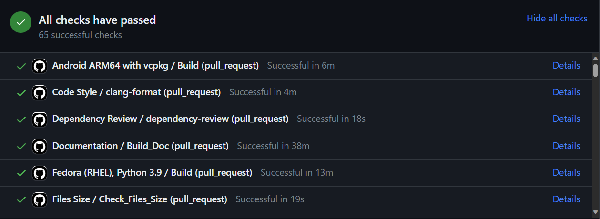
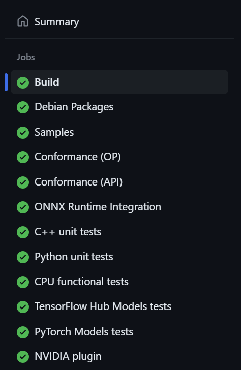
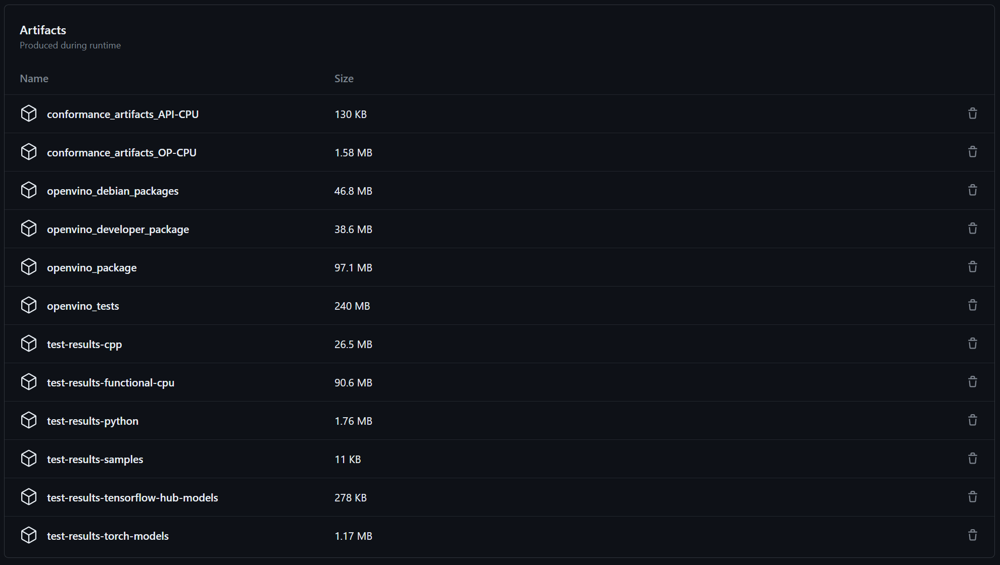

# Overview of the OpenVINO GitHub Actions CI

Welcome to the OpenVINO Developer guide on the GitHub Actions infrastructure. This document gives a brief overview of the GitHub Actions setup used in OpenVINO.

## Workflows

GitHub Actions workflows are configurable automated processes that will run one or more jobs via a series of steps. 

In short, workflows comprise:
* a series of commands that you would usually execute in a terminal one by one
* the information about the environment in which the commands should be executed

Refer to the [official GitHub Actions documentation](https://docs.github.com/en/actions/using-workflows/about-workflows) for more.

You can find all the workflows for this repository [here](../../../../.github/workflows).

Three main ones provide the most coverage for different operating systems:
* [Linux](../../../../.github/workflows/linux.yml)
* [Windows](../../../../.github/workflows/windows.yml)
* [macOS](../../../../.github/workflows/mac.yml)

Additionally, several supporting workflows build and test OpenVINO for other operating systems and processor architectures:
* [Android ARM64](../../../../.github/workflows/android_arm64.yml)
* [Fedora](../../../../.github/workflows/fedora.yml)
* [Linux Conditional Compilation](../../../../.github/workflows/linux_conditional_compilation.yml)
* [Linux RISC-V](../../../../.github/workflows/linux_riscv.yml)
* [Windows Conditional Compilation](../../../../.github/workflows/windows_conditional_compilation.yml)

### Reusing GitHub Actions

The listed workflows make use of the rich GitHub Actions official and community actions such as `actions/checkout`, `actions/upload-artifact` and others.
You can find more information about reusing actions and workflows [here](https://github.com/marketplace?type=actions) and [here](https://docs.github.com/en/actions/using-workflows/reusing-workflows).

### Workflows' Triggers and Schedule

Workflows have triggers for different [events](https://docs.github.com/en/actions/using-workflows/events-that-trigger-workflows) that tell them when to start.

The workflows in the OpenVINO repository have the following triggers:
* `on: push` - post-commit trigger. If a workflow has this trigger, it runs when a commit is pushed to the `master` or `release` branch (e.g., when a PR is merged)
* `on: pull_request` - pre-commit trigger. If a workflow has this trigger, it runs when a PR is created targeting the `master` or `release` branch and every time the PR is updated with new commits
* `on: schedule` - schedule trigger. If a workflow has this trigger, it runs on a specified interval (e.g., nightly)

**NOTE**: these triggers **are not** mutually exclusive, one workflow could use any combination of them.

You can find the triggers for each workflow at the beginning of the workflow file, in the `on` key.

Example for the [Linux workflow](../../../../.github/workflows/linux.yml):
```yaml
on:
  schedule:
    # at 00:00 on Wednesday and Saturday
    - cron: '0 0 * * 3,6'
  pull_request:
    paths:
      - '**'
      - '!**/docs/**'
      - '!docs/**'
      - 'docs/snippets/**'
      - '!**/**.md'
      - '!**.md'
  push:
    paths:
      - '**'
      - '!docs/**'
      - '!**/docs/**'
      - 'docs/snippets/**'
      - '!**/**.md'
      - '!**.md'
    branches:
      - master
      - 'releases/**'
```

This workflow runs:
* On a specified interval (`schedule`)
  * `'0 0 * * 3,6'` - `cron` syntax, see examples and configurator [here](https://crontab.guru/)
* On Pull Request update (`pull_request`) **if** the changed files conform to the path globs specified under the `paths` key
* On Push to the `master` and `releases/**` branches (`push`) **if** the changed files conform to the path globs specified under the `paths` key

**NOTE**: read more about the `paths` [here](https://docs.github.com/en/actions/using-workflows/workflow-syntax-for-github-actions#onpushpull_requestpull_request_targetpathspaths-ignore).

### Required Workflows

TODO

### Overview of the Workflows

This section provides the structural overview of the Linux, Windows and macOS workflows.

The structure for all of them is the same:
1. Clone OpenVINO repository and required resources
2. Install build dependencies
3. Build OpenVINO from source
4. Pack and upload the artefacts (built OpenVINO and tests)
5. Download and use the artefacts in the parallel jobs with different kinds of tests
6. Collect the test results and upload them as artefacts

**NOTE**: the supporting workflows may use the same structure or lack the last 3 steps and have tests present right after the `Build` step.

Overview of the [Linux workflow](../../../../.github/workflows/linux.yml). There are several jobs present:
```yaml
jobs:
  Build: ...
  Debian_Packages: ...
  Samples: ...
  Conformance: ...
  ONNX_Runtime: ...
  CXX_Unit_Tests: ...
  Python_Unit_Tests: ...
  CPU_Functional_Tests: ...
  TensorFlow_Hub_Models_Tests: ...
  PyTorch_Models_Tests: ...
  NVIDIA_Plugin: ...
```

The `Build` job executes the first 4 steps: 
* clones OpenVINO
* installs dependencies
* builds from source with `cmake`
* packs and uploads the artefacts using `actions/upload-artifact`

The other jobs are responsible for running different kinds of tests using the built artefacts. They:
* download and unpack the artefacts using `actions/download-artifact`
* install the needed dependencies
* run tests
* collect test results
* upload test results as [artefacts](#artefacts)

#### Single Job Overview

Each job has several keys that describe its environment. You can find the comprehensive overview of the syntax [here](https://docs.github.com/en/actions/using-workflows/workflow-syntax-for-github-actions).

This section describes the specifics of the OpenVINO CI environment. 

Overview of the [Linux workflow's](../../../../.github/workflows/linux.yml) `Python_Unit_Tests` job:
```yaml
  Python_Unit_Tests:
    name: Python unit tests
    needs: Build
    timeout-minutes: 40
    defaults:
      run:
        shell: bash
    runs-on: aks-linux-4-cores-16gb
    container:
      image: openvinogithubactions.azurecr.io/dockerhub/ubuntu:20.04
      volumes:
        - /mount/caches:/mount/caches
    env:
      OPENVINO_REPO: /__w/openvino/openvino/openvino
      INSTALL_DIR: /__w/openvino/openvino/install
      INSTALL_TEST_DIR: /__w/openvino/openvino/install/tests
      LAYER_TESTS_INSTALL_DIR: /__w/openvino/openvino/install/tests/layer_tests

    steps: ...
```

* All the test jobs have the `needs: Build` which means that they wait for the `Build` job to finish as they require artefacts from it
* The machine that is used for a job is specified using the `runs-on` key 
  * In this case `aks-linux-4-cores-16gb` is used. Read more [here](#machines) on what machines are available and how to choose one for a job
* Some jobs could run inside a Docker container. The image could be specified using the `image` key under the `container` key
  * In this case `openvinogithubactions.azurecr.io/dockerhub/ubuntu:20.04` is used. Read more [here](#docker-images) on what images are available and when to use one
* Some jobs could benefit from caches (Python dependencies, `cmake` build artefacts). 
  * Caches are stored on a mounted share. The share is mounted into the container using the `volumes` key under the `container` key. Read more [here](#caches) on how to utilize cache for a job
* A job must define `steps` - a series of commands that would be executed in the defined above environment
  * All the steps are executed in the shell specified by `shell` key under `defaults: run:` unless specified directly in a step

## Finding Results, Artefacts and Logs

### Results

To understand which jobs have successfully passed, which are running and which have failed, check the following:
* For Pull Requests:
  * If you open a Pull Request and navigate to the bottom of the page, you will see the list of jobs that ran or are running for the latest commit:
  
* For scheduled runs:
  * Navigate to the [OpenVINO Repository Actions](https://github.com/openvinotoolkit/openvino/actions)
  * Select the required workflow from the list on the left
  * Filter the runs by clicking on `Event` and selecting `schedule`
    * You can additionally filter the results per branch, actor and result

### Artefacts
To find artefacts for a pipeline, use the following steps:
1. Open a Pull Request and navigate to the bottom of the page, you will see the list of jobs that ran or are running for the latest commit: 
  
2. Click `Details` to see more information about a job
3. Click `Summary` above the list of the jobs: 
  
4. Scroll to the bottom of the page
5. You will find the artefacts produced by **all the jobs in this pipeline**:
  

### Logs
To find logs for a pipeline, use the following steps:
1. Open a Pull Request and navigate to the bottom of the page, you will see the list of jobs that ran or are running for the latest commit:
  
2. Click `Details` to see more information about a job
3. Click on the step to see the execution logs

## Custom Actions 

setup-python, smart-ci, etc.

## Machines

The machines that execute the commands from the workflows are referred to as _runners_ in GitHub Actions.

There are two types of runners available in this repository:

* [GitHub Actions Runners](https://docs.github.com/en/actions/using-github-hosted-runners/about-github-hosted-runners/about-github-hosted-runners) - runners provided and managed by GitHub
* [Self-hosted Runners](https://docs.github.com/en/actions/hosting-your-own-runners/managing-self-hosted-runners/about-self-hosted-runners) - runners created and managed by the OpenVINO CI team and linked to the OpenVINO repositories 

Read more about the available runners and how to choose one [here](./runners.md).

## Docker Images

## Caches

## Adding New Tests

## See also

* [GitHub Actions official documentation](https://docs.github.com/en/actions)
