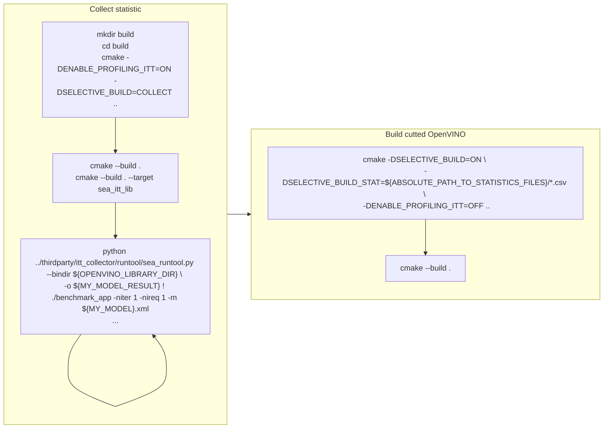

# OpenVINO Conditional Compilation

## Contents

- [Introduction](#introduction)
- [Building for different models](#building-for-different-models)
- [Building for devices with different ISA](#building-for-devices-with-different-isa)
- [Limitations](#limitations)

## Introduction

Conditional compilation can significantly reduce the size of OpenVINO™ binaries by excluding unnecessary components for inference of particular models. The components are:
* layers and graph transformations in OpenVINO Runtime and plugins,
* OpenVINO Runtime operations,
* jit kernels in a CPU plugin,
* arbitrary code that is not used for particular model inference.

However, conditional compilation has a significant drawback - the resulting OpenVINO runtime will properly infer only using the models and devices for which it was compiled. If just one model is used to collect statistics for compilation, only this particular model is guaranteed to work with the resulting OpenVINO runtime.

There are two conditional compilation build stages: `SELECTIVE_BUILD=COLLECT` and `SELECTIVE_BUILD=ON`.

`SELECTIVE_BUILD=COLLECT` enables analysis mode for annotated code regions. It can be used to collect statistics data using `itt`. Once this stage is completed, run an OpenVINO sample, such as benchmark_app, to generate actual statistic data. Then run `itt_collector tool` to dump the data into csv files. This stage can be enabled during the OpenVINO build with the options `-DSELECTIVE_BUILD=COLLECT -DENABLE_PROFILING_ITT=ON`.

`SELECTIVE_BUILD=ON` excludes all inactive annotated code regions from the compiled binaries using `csv files` generated by the `itt_collector tool`. It is done by a header file which generated from the `csv files`. This stage need build OpenVINO with option `-DSELECTIVE_BUILD=ON -DENABLE_PROFILING_ITT=OFF  -DSELECTIVE_BUILD_STAT=<cc_data.csv>`. Notice: `-DENABLE_PROFILING_ITT=OFF` is not must, if user wants to have ITT counters in final application, he can set it ON: `-DENABLE_PROFILING_ITT=ON`.

> **NOTE**:  If the above options are not enabled, conditional compilation will be OFF and the default behavior is kept, all OpenVINO features are enabled. You can ignore `SELECTIVE_BUILD` or set option `-DSELECTIVE_BUILD=OFF`.

### Setup environment

To take advantage of conditional compilation, install the following tools:
* [Python](https://www.python.org)

## Building for different models

Conditional compilation has two stages:
* Collecting information about code usage
* Building the result binaries without unused components or parts

To apply conditional compilation, follow the steps below:

1. Perform code usage analysis:
    1. Run the CMake tool with the following options: `-DENABLE_PROFILING_ITT=ON -DSELECTIVE_BUILD=COLLECT`.
    2. Select several models to be used in a specific application or target device.
    3. Use the `sea_itt_lib` target to build the ITT collector.
    4. Run the target application under the ITT collector for code usage analysis for each model. Statistics are generated in the `.csv` format.  
`python thirdparty/itt_collector/runtool/sea_runtool.py --bindir ${OPENVINO_LIBRARY_DIR} -o ${MY_MODEL_RESULT} ! ./benchmark_app -niter 1 -nireq 1 -m ${MY_MODEL}.xml`
2. Build the resulting binaries:
    1. Run the CMake tool with the following options: `-DSELECTIVE_BUILD=ON -DSELECTIVE_BUILD_STAT=${ABSOLUTE_PATH_TO_STATISTICS_FILES}/*.csv -DENABLE_PROFILING_ITT=OFF`
    2. `cmake --build <cmake_build_directory>`

The `-niter 1 -nireq 1` flags are highly recommended for benchmark_app. Otherwise, the trace files will be very large. 
If you are using an application other than benchmark_app, remember to limit the number of inference requests and iterations.

## Building for devices with different ISA

Building for devices with different ISA is quite similar to building for different models (see the previous chapter).
The differences are only in the code usage analysis step. The analysis step should be performed on target devices and all CSV files with statistics should be copied to the build machine. These files will be used for the final build.

## Limitations

* Currently, Ninja build system is not supported for the conditional compilation build.
* Currently, conditional compilation supports OpenVINO IR models only. To enable conditional compilation, the models from alternative frameworks (PyTorch, TensorFlow, ONNX, etc.) need to be converted to OpenVINO IR models first.

## See also
 * [OpenVINO™ README](../../README.md)
 * [Developer documentation](../../docs/dev/index.md)
 * [How to enable conditional compilation for new component](../../src/common/conditional_compilation/docs/develop_cc_for_new_component.md)
