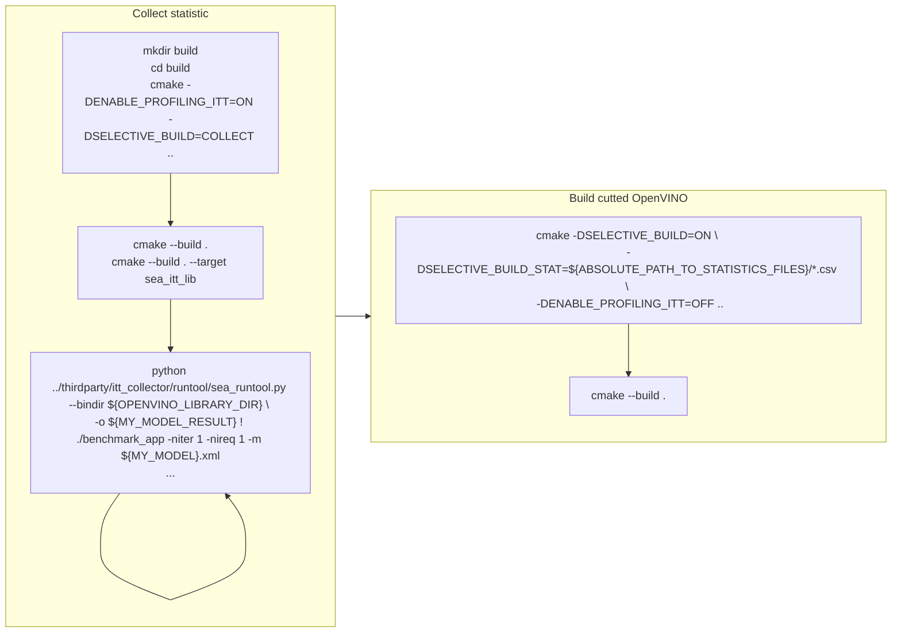

# OpenVINO Conditional Compilation

## Contents

- [Introduction](#introduction)
- [Building for different models](#building-for-different-models)
- [Building for devices with different ISA](#building-for-devices-with-different-isa)
- [Limitations](#limitations)

## Introduction

Conditional compilation can significantly reduce OpenVINO™ binaries size by excluding unnecessary components for particular models inference.
The following components can be excluded from the build:
* Openrations and graph transformations in OpenVINO and plugins
* jit kernels in a CPU plugin
* arbitrary code that is not used for particular model inference

However, conditional compilation has a significant drawback - **the resulting OpenVINO Runtime will work only with a limited set of models and devices.**

### Setup environment

To take advantage of conditional compilation, install the following tools:
* [Python](https://www.python.org)

## Building for different models

Conditional compilation has two stages:
* Collecting information about code usage
* Building the result binaries without unused components or parts

To apply conditional compilation, follow the steps below:

1. Perform code usage analysis:
    1. Run the CMake tool with the following options: `-DENABLE_PROFILING_ITT=ON -DSELECTIVE_BUILD=COLLECT`.
    2. Select several models to be used in a specific application or target device.
    3. Use the `sea_itt_lib` target to build the ITT collector.
    4. Run the target application under the ITT collector for code usage analysis for each model. Statistics are generated in the `.csv` format.  
`python thirdparty/itt_collector/runtool/sea_runtool.py --bindir ${OPENVINO_LIBRARY_DIR} -o ${MY_MODEL_RESULT} ! ./benchmark_app -niter 1 -nireq 1 -m ${MY_MODEL}.xml`
2. Build the resulting binaries:
    1. Run the CMake tool with the following options: `-DSELECTIVE_BUILD=ON -DSELECTIVE_BUILD_STAT=${ABSOLUTE_PATH_TO_STATISTICS_FILES}/*.csv -DENABLE_PROFILING_ITT=OFF`
    2. `cmake --build <cmake_build_directory>`

The `-niter 1 -nireq 1` flags are highly recommended for the benchmark_app. Otherwise, the trace files will be very large.
If you are using an application other than benchmark_app, remember to limit the number of inference requests and iterations.

## Building for devices with different ISA

Building for devices with different ISA is quite similar to building for different models (see the previous chapter).
The differences are only in the code usage analysis step. The analysis step should be performed on target devices and all CSV files with statistics should be copied to the build machine. These files will be used for the final build.

## Limitations

* Currently, Ninja build system is not supported for the conditional compilation build.

## See also
 * [OpenVINO™ README](../../README.md)
 * [Developer documentation](../../docs/dev/index.md)
