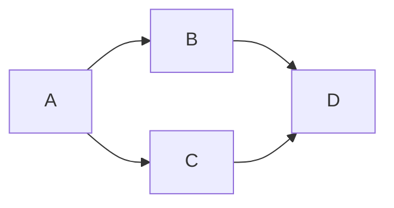

# Creating developer documentation

Developer documentation provides an overview of the component development and helps engineers understand the underlying technology.
This guide contains the requirements for writing developer documentation.


## The component structure

The OpenVINO component structure is fully defined in the [dedicated section of developer documentation](./index.md#openvino-component-structure).
This guide highlights the parts which are used for developer documentation. The structure is presented below:

```
openvino_component/
    docs/               // Contains detailed component documentation
    README.md           // Endtry point for the developer documentation
```

## ***README.md*** content

README.md provides an entry point to the component documentation. Here are the best practices for writing a good README.md:

- Include only the necessary information. Avoid overloading the document with excessive details. 
- Make sure your document has a clear structure, is easy to navigate and quickly look through.
- Provide links to additional documentation and resources.  
  
You can use the following template for a README.md file:
```md
# Component name

Short information about the component.
 * Responsibility
 * Supported features
 * Code style

## Key contacts

The section provides information about groups of developers who can help in case of questions, and also review and merge PRs.

## Components

The section contains basic information about the included components: API, sources, tests, etc.
Detailed information can be located in the `docs/` folder. This section can contain links to these pages.

## Architecture

Is an optional section which provides main ideas about the component architecture.
It can contain references to the pages with additional information.

## Tutorials

The section contains a list of component tutorials.
Example:
 * [How to support new operation](./docs/operation_support.md)
 * [How to implement new feature](./docs/new_feature.md)
 * [How to debug the component](./docs/debug_capabilities.md)
 * ...

## See also

The section contains a list of related pages.
Example:
 * [OpenVINO™ README](../../README.md)
 * [Developer documentation](../../docs/dev/index.md)
 * ...
```

## ***docs/*** folder content

Docs folder should contain pages with a detailed description of the component features and media content for the developer documentation. Make sure that the pages in this folder provide information directly related to the topic. It is better to provide information about additional topics in a separate file and make a reference to it.

## Media content
The developer documentation may include pictures, diagrams, and examples that illustrate the described features to make it easier to understand. 
It is recommended to use the `mermaid` framework for diagrams. Read the [Github Documentation](https://docs.github.com/en/get-started/writing-on-github/working-with-advanced-formatting/creating-diagrams) to get more information. The framework allows creating diagrams and pasting them to your documents. For example, the code:

````md

````

Generates the next diagram:


## See also
 * [OpenVINO™ README](../../README.md)
 * [Developer documentation](./index.md)
