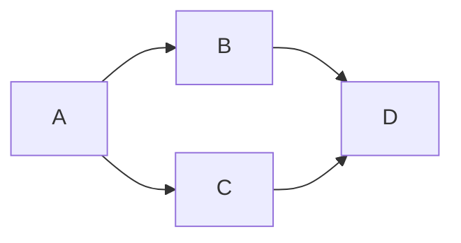

# How to develop developer documentation

The developer documentation is needed to provide basic information about component development.
This guide contains requirements which are applied for component developer documentation.


## The component structure

The OpenVINO component structure is fully defined in the [dedicated section of developer documentation](./index.md#openvino-component-structure),
this guide is more concentrated on parts which are used for developer documentation, the structure you can find below:

```
openvino_component/
    docs/               // Contains detailed component documentation
    README.md           // Endtry point for the developer documentation
```

## ***README.md*** content

README.md should provide an entry point to component documentation. 
First of all the readme shouldn't be overloaded by redundant information, has a strict user friendly structure and provide references to additional documentation.

The proposed template for Readme file is:
```md
# Name of component

Short information about the component.
 * Responsibility
 * Supported features
 * Code style

## Key persons

Section provides informations about groups of developers who can help in case of questions and also review and merge PRs.

## Components

Section contains common infromation about included components: API, sources, tests and etc.
Detailed information can be located in the `docs/` folder, this section can contain links to these pages.

## Architecture

Is an optional charpter which provide main ideas about the component architecture.
It can contains references to dedicated pages with additional information.

## Tutorials

Section contains a list of component tutorials.
Example:
 * [How to support new operation](./docs/operation_support.md)
 * [How to implement new feature](./docs/new_feature.md)
 * [How to debug the component](./docs/debug_capabilities.md)
 * ...

## See also

Section contains a list of related pages.
Example:
 * [OpenVINO™ README](../../README.md)
 * [Developer documentation](../../docs/dev/index.md)
 * ...
```

## ***docs/*** folder content

Docs folder should contain media content for the developer documentation and dedicated pages with detailed information about component features.
Pages in this folder also shouldn't be overloaded by information, each page should provide information only which is related with original topic. If we need to provide some additional information it should be a reference to the separate file which user can open and get all necessary information about this additional topic.

## Approaches for the documentation development

As already was said before the developer documentation should be clear and has a strong structure. Each page should provide only information which relates to the main topic, in case if we need to provide an additional information, it will be better to have a dedicated page.

In order to decrease the complexity the developer documentation and make it more user-friendly, it can contain a lot of different images, diagrams, examples which should illustrate described things.

For diagrams we are using `mermaid` framework to get more information about it please read [Github Documentation](https://docs.github.com/en/get-started/writing-on-github/working-with-advanced-formatting/creating-diagrams). The framework allows to create diagrams and past it in your documents, for example the code:

````md

````

Generates the next diagram:


## See also
 * [OpenVINO™ README](../../README.md)
 * [Developer documentation](./index.md)
