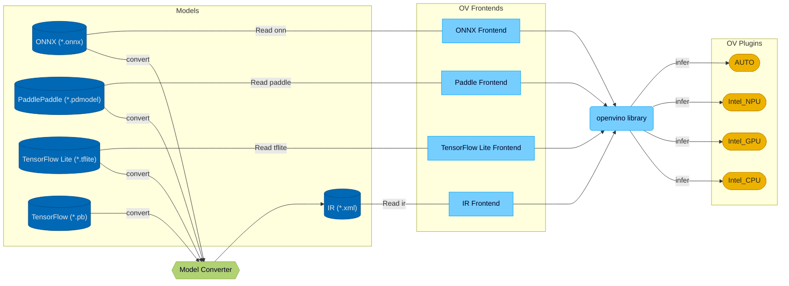

# OpenVINO™ Developer Documentation

Welcome to the OpenVINO™ Developer Documentation. This documentation helps deeper understand the OpenVINO architecture and gives detailed information on the concepts and ideas used inside.

The OpenVINO™ provides a functionality to load models from different frameworks and run them on different accelerators.



## [Get Started](./get_started.md)

 * [Build OpenVINO](./build.md)
 * How to:
     * [Add new operation](../../src/core/docs/operation_enabling_flow.md)
     * [Add new conditional compilation](../../src/common/conditional_compilation/docs/develop_cc_for_new_component.md)
     * [Add new transformation](#todo)
     * [Get code coverage report](./test_coverage.md)
     * [Add component developer documentation](./dev_doc_guide.md)
     * [Work with OpenVINO Public CI](./public_ci.md)
 * [OpenVINO contributing guidelines](../../CONTRIBUTING.md)
 * [OpenVINO debug capabilities](./debug_capabilities.md)

## OpenVINO Repository Structure

The repository is organized in such a way that the components contain all dependencies (for example, third-party, tests, documentation, and others).

The OpenVINO Repository includes the following components. Click on the component name to get more information:
<pre>
 <code>
 <a href="../../README.md">openvino/</a>                  // OpenVINO Repository
    .ci/                    // CI settings for Azure
    .github/                // Github actions and PR templates
    cmake/                  // Global CMake scripts
    docs/                   // OpenVINO documentation
    licensing/              // Licenses
    samples/                // OpenVINO samples
    scripts/                // Helper scripts
    <a href="../../src/README.md">src/</a>                    // Folder with core OpenVINO components
    tests/                  // Infrastructure tests which validate full pipelines
    thirdparty/             // Common third-party dependencies
    tools/                  // OpenVINO tools
 </code>
</pre>


### OpenVINO Components

OpenVINO Components include:

  * [OpenVINO™ Runtime](https://docs.openvino.ai/2024/openvino-workflow/running-inference.html) - is a set of C++ libraries with C and Python bindings providing a common API to deliver inference solutions on the platform of your choice.
    * [core](../../src/core) - provides the base API for model representation and modification.
    * [inference](../../src/inference) - provides an API to infer models on the device.
    * [transformations](../../src/common/transformations) - contains the set of common transformations which are used in OpenVINO plugins.
    * [low precision transformations](../../src/common/low_precision_transformations) - contains the set of transformations that are used in low precision models
    * [bindings](../../src/bindings) - contains all available OpenVINO bindings which are maintained by the OpenVINO team.
        * [c](../../src/bindings/c) - C API for OpenVINO™ Runtime
        * [python](../../src/bindings/python) - Python API for OpenVINO™ Runtime
* [Plugins](../../src/plugins) - contains OpenVINO plugins which are maintained in open-source by the OpenVINO team. For more information, take a look at the [list of supported devices](https://docs.openvino.ai/2024/about-openvino/compatibility-and-support/supported-devices.html).
* [Frontends](../../src/frontends) - contains available OpenVINO frontends that allow reading models from the native framework format.
* [OpenVINO Model Converter (OVC)](https://docs.openvino.ai/2024/openvino-workflow/model-preparation.html) - is a cross-platform command-line tool that facilitates the transition between training and deployment environments, and adjusts deep learning models for optimal execution on end-point target devices.
* [Samples](https://github.com/openvinotoolkit/openvino/tree/master/samples) - applications in C, C++ and Python languages that show basic OpenVINO use cases.

#### OpenVINO Component Structure

The OpenVINO component contains all dependencies (for example, third-party, tests, documentation, and others). An example component structure with comments and marks for optional folders is presented below.

```
ov_component/           // Component folder
    cmake/              // (optional) CMake scripts that are related only to this component
    dev_api/            // (optional) Developer API is used when the component provides API for internal developers
    docs/               // (optional) Contains detailed component documentation
    include/            // (optional) Public component API
    src/                // Sources of the component
    tests/              // Tests for the component
    thirdparty/         // (optional) Third-party dependencies
    CMakeLists.txt      // Main CMake script
    README.md           // (optional) Entry point for the developer documentation
```


## Features

 * [Conditional Compilation](./conditional_compilation.md)

## See Also

 * [OpenVINO Developer Documentation](./index.md)
 * [OpenVINO README](../../README.md)
