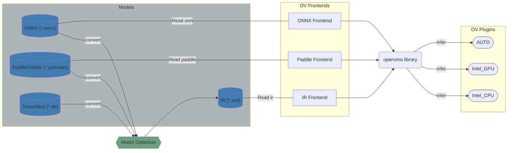

# OpenVINO™ Developer Documentation

Welcome to the OpenVINO™ Toolkit Developer Documentation. This documentation helps to deeper understand the ideology of OpenVINO, provides the complete information about ideas which are applied inside.

The OpenVINO™ Toolkit provides a functionality to load model from different frameworks and run it on different accelerators.



## [Get started](./get_started.md)

 * [Build OpenVINO](./build.md)
 * How to:
     * [Add new operation](../../src/core/docs/operation_enabling_flow.md)
     * [Add new transformation](#todo)
     * [Get code coverage report](./test_coverage.md) 
 * [OpenVINO contribution guideline](../../CONTRIBUTING.md)
 * [OpenVINO Debug Capabilities](./debug_capabilities.md)

## OpenVINO repository structure

The trend in the organization of structure repository is the idea that components should contain all dependencies inside (like thirdparty, testts, documentation and etc.). Below the abstract component structure is presented with comments and marks for optional folders.
```
ov_component/           // Component folder
    cmake/              // (optional) CMake scripts which are related only for this component
    dev_api/            // (optional) Developer API is used in case if component wants to provide some API for internal developers
    docs/               // (optional) Contains detailed component documentation
    include/            // (optional) Public component API
    src/                // Sources of the component
    tests/              // Tests on the component
    thirdparty/         // (optional) Third-party dependencies
    CMakeLists.txt      // Main CMake script
    README.md           // (optional) Endtry point for the developer documentation
```

The OpenVINO Repository compositions from next components, click on the component name to get more information about it:
<pre>
 <code>
 <a href="../../README.md">openvino/</a>                  // OpenVINO Repository
    .ci/                    // CI settings for Azure
    .github/                // Github actions and PR templates
    cmake/                  // Global CMake scripts
    docs/                   // OpenVINO documentation
    licensing/              // Licenses
    samples/                // OpenVINO samples
    scripts/                // Helper scripts
    <a href="../../src/README.md">src/</a>                    // Folder with core OpenVINO components
    tests/                  // Infrastructure tests, which validate full pipelines
    thirdparty/             // Common third-party dependencies
    tools/                  // OpenVINO tools
 </code>
</pre>

## Features

 * [Conditional Compilation](./conditional_compilation.md)

## See also
 * [OpenVINO™ README](../../README.md)
