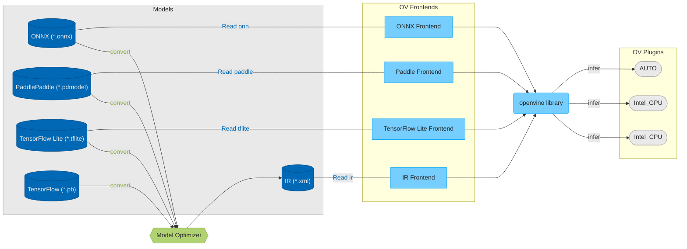

# OpenVINO™ Developer Documentation

Welcome to the OpenVINO™ Developer Documentation. This documentation helps deeper understand the OpenVINO architecture and gives detailed information on the concepts and ideas used inside.

The OpenVINO™ provides a functionality to load models from different frameworks and run them on different accelerators.



## [Get Started](./get_started.md)

 * [Build OpenVINO](./build.md)
 * How to:
     * [Add new operation](../../src/core/docs/operation_enabling_flow.md)
     * [Add new conditional compilation](../../src/common/conditional_compilation/docs/develop_cc_for_new_component.md)
     * [Add new transformation](#todo)
     * [Get code coverage report](./test_coverage.md) 
     * [Add component developer documentation](./dev_doc_guide.md)
 * [OpenVINO contributing guidelines](../../CONTRIBUTING.md)
 * [OpenVINO debug capabilities](./debug_capabilities.md)

## OpenVINO Repository Structure

The repository is organized in such a way that the components contain all dependencies (for example, third-party, tests, documentation, and others). 

The OpenVINO Repository includes the following components. Click on the component name to get more information:
<pre>
 <code>
 <a href="../../README.md">openvino/</a>                  // OpenVINO Repository
    .ci/                    // CI settings for Azure
    .github/                // Github actions and PR templates
    cmake/                  // Global CMake scripts
    docs/                   // OpenVINO documentation
    licensing/              // Licenses
    samples/                // OpenVINO samples
    scripts/                // Helper scripts
    <a href="../../src/README.md">src/</a>                    // Folder with core OpenVINO components
    tests/                  // Infrastructure tests which validate full pipelines
    thirdparty/             // Common third-party dependencies
    tools/                  // OpenVINO tools
 </code>
</pre>

### OpenVINO Component Structure

The OpenVINO component contains all dependencies (for example, third-party, tests, documentation, and others). An example component structure with comments and marks for optional folders is presented below.

```
ov_component/           // Component folder
    cmake/              // (optional) CMake scripts that are related only to this component 
    dev_api/            // (optional) Developer API is used when the component provides API for internal developers
    docs/               // (optional) Contains detailed component documentation
    include/            // (optional) Public component API
    src/                // Sources of the component
    tests/              // Tests for the component
    thirdparty/         // (optional) Third-party dependencies
    CMakeLists.txt      // Main CMake script
    README.md           // (optional) Entry point for the developer documentation
```


## Features

 * [Conditional Compilation](./conditional_compilation.md)

## See Also

 * [OpenVINO README](../../README.md)
