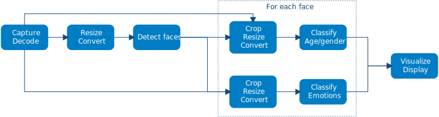

# Building a Face Analytics Pipeline {#openvino_docs_gapi_gapi_face_analytics_pipeline}

## Overview
In this tutorial you will learn:

* How to integrate Deep Learning inference in a G-API graph.
* How to run a G-API graph on a video stream and obtain data from it.

## Prerequisites
This sample requires:

* PC with GNU/Linux* or Microsoft Windows* (Apple macOS* is supported but was not tested)
* OpenCV 4.2 or higher built with [Intel® Distribution of OpenVINO™ Toolkit](https://software.intel.com/content/www/us/en/develop/tools/openvino-toolkit.html) (building with [Intel® TBB](https://www.threadingbuildingblocks.org/intel-tbb-tutorial)
* The following pre-trained models from the [Open Model Zoo](@ref omz_models_intel_index):
    * [face-detection-adas-0001](@ref omz_models_intel_face_detection_adas_0001_description_face_detection_adas_0001)
    * [age-gender-recognition-retail-0013](@ref omz_models_intel_age_gender_recognition_retail_0013_description_age_gender_recognition_retail_0013)
    * [emotions-recognition-retail-0003](@ref omz_models_intel_emotions_recognition_retail_0003_description_emotions_recognition_retail_0003)

To download the models from the Open Model Zoo, use the [Model Downloader](@ref omz_tools_downloader_README) tool.

## Introduction: Why G-API
Many computer vision algorithms run on a video stream rather than on individual images. Stream processing usually consists of multiple steps – like decode, preprocessing, detection, tracking, classification (on detected objects), and visualization – forming a *video processing pipeline*. Moreover, many these steps of such pipeline can run in parallel – modern platforms have different hardware blocks on the same chip like decoders and GPUs, and extra accelerators can be plugged in as extensions, like Intel® Movidius™ Neural Compute Stick for deep learning offload.

Given all this manifold of options and a variety in video analytics algorithms, managing such pipelines effectively quickly becomes a problem. For sure it can be done manually, but this approach doesn't scale: if a change is required in the algorithm (e.g. a new pipeline step is added), or if it is ported on a new platform with different capabilities, the whole pipeline needs to be re-optimized.

Starting with version 4.2, OpenCV offers a solution to this problem. OpenCV G-API now can manage Deep Learning inference (a cornerstone of any modern analytics pipeline) with a traditional Computer Vision as well as video capturing/decoding, all in a single pipeline. G-API takes care of pipelining itself – so if the algorithm or platform changes, the execution model adapts to it automatically.

## Pipeline Overview
Our sample application is based on [Interactive Face Detection](omz_demos_interactive_face_detection_demo_README) demo from Open Model Zoo. A simplified pipeline consists of the following steps:

1. Image acquisition and decode
2. Detection with preprocessing
3. Classification with preprocessing for every detected object with two networks
4. Visualization



## Construct a pipeline {#gapi_ifd_constructing}

Constructing a G-API graph for a video streaming case does not differ much from a [regular usage](https://docs.opencv.org/4.5.0/d0/d1e/gapi.html#gapi_example) of G-API -- it is still about defining graph *data* (with cv::GMat, `cv::GScalar`, and `cv::GArray`) and *operations* over it. Inference also becomes an operation in the graph, but is defined in a little bit different way.

### Declare Deep Learning topologies {#gapi_ifd_declaring_nets}

In contrast with traditional CV functions (see [core](https://docs.opencv.org/4.5.0/df/d1f/group__gapi__core.html) and [imgproc](https://docs.opencv.org/4.5.0/d2/d00/group__gapi__imgproc.html)) where G-API declares distinct operations for every function, inference in G-API is a single generic operation `cv::gapi::infer<>`. As usual, it is just an interface and it can be implemented in a number of ways under the hood. In OpenCV 4.2, only OpenVINO™ Inference Engine-based backend is available, and OpenCV's own DNN module-based backend is to come.

`cv::gapi::infer<>` is _parametrized_ by the details of a topology we are going to execute. Like operations, topologies in G-API are strongly typed and are defined with a special macro `G_API_NET()`:

```cpp
// Face detector: takes one Mat, returns another Mat
G_API_NET(Faces, <cv::GMat(cv::GMat)>, "face-detector");
// Age/Gender recognition - takes one Mat, returns two:
// one for Age and one for Gender. In G-API, multiple-return-value operations
// are defined using std::tuple<>.
using AGInfo = std::tuple<cv::GMat, cv::GMat>;
G_API_NET(AgeGender, <AGInfo(cv::GMat)>,   "age-gender-recoginition");
// Emotion recognition - takes one Mat, returns another.
G_API_NET(Emotions, <cv::GMat(cv::GMat)>, "emotions-recognition");
```

Similar to how operations are defined with `G_API_OP()`, network description requires three parameters:
1. A type name. Every defined topology is declared as a distinct C++ type which is used further in the program -- see below.
2. A `std::function<>`-like API signature. G-API traits networks as regular "functions" which take and return data. Here network `Faces` (a detector) takes a `cv::GMat` and returns a `cv::GMat`, while network `AgeGender` is known to provide two outputs (age and gender blobs, respectively) -- so its has a `std::tuple<>` as a return type.
3. A topology name -- can be any non-empty string, G-API is using these names to distinguish networks inside. Names should be unique in the scope of a single graph.


########################################################


## Configure the Pipeline {#gapi_ifd_configuration}

G-API strictly separates construction from configuration -- with the idea to keep algorithm code itself platform-neutral. In the above listings we only declared our operations and expressed the overall data flow, but didn't even mention that we use OpenVINO™. We only described *what* we do, but not *how* we do it. Keeping these two aspects clearly separated is the design goal for G-API.

Platform-specific details arise when the pipeline is *compiled* -- i.e. is turned from a declarative to an executable form. The way *how* to run stuff is specified via compilation arguments, and new inference/streaming features are no exception from this rule. 

G-API is built on backends which implement interfaces (see [Architecture](https://docs.opencv.org/4.5.0/de/d4d/gapi_hld.html) and [Kernels](kernel_api) for details) -- thus `cv::gapi::infer<>` is a function which can be implemented by different backends. In OpenCV 4.2, only OpenVINO™ Inference Engine backend for inference is available. Every inference backend in G-API has to provide a special parameterizable structure to express *backend-specific* neural network parameters -- and in this case, it is `cv::gapi::ie::Params`:


####################################################