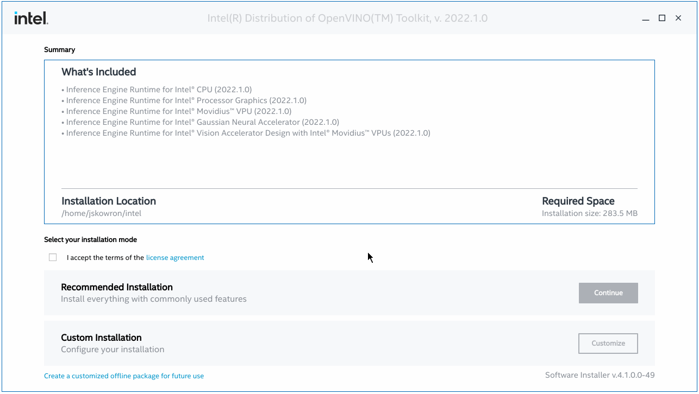

# Install and Configure Intel® Distribution of OpenVINO™ Toolkit for Linux {#openvino_docs_install_guides_installing_openvino_linux}

> **NOTE**: Since the OpenVINO™ 2022.1 release, the following development tools: Model Optimizer, Post-Training Optimization Tool, Model Downloader and other Open Model Zoo tools, Accuracy Checker, and Annotation Converter are not part of the installer. These tools are now only available on [pypi.org](https://pypi.org/project/openvino-dev/).

## System Requirements

@sphinxdirective
.. tab:: Operating Systems

  * Ubuntu 18.04 long-term support (LTS), 64-bit
  * Ubuntu 20.04 long-term support (LTS), 64-bit

  .. note::
     Since the OpenVINO™ 2022.1 release, CentOS 7.6, 64-bit is not longer supported.

.. tab:: Hardware

  Optimized for these processors:

  * 6th to 12th generation Intel® Core™ processors and Intel® Xeon® processors 
  * 3rd generation Intel® Xeon® Scalable processor (formerly code named Cooper Lake)
  * Intel® Xeon® Scalable processor (formerly Skylake and Cascade Lake)
  * Intel Atom® processor with support for Intel® Streaming SIMD Extensions 4.1 (Intel® SSE4.1)
  * Intel Pentium® processor N4200/5, N3350/5, or N3450/5 with Intel® HD Graphics
  * Intel® Iris® Xe MAX Graphics
  * Intel® Neural Compute Stick 2
  * Intel® Vision Accelerator Design with Intel® Movidius™ VPUs

.. tab:: Processor Notes

  Processor graphics are not included in all processors. 
  See `Product Specifications`_ for information about your processor.
  
  .. _Product Specifications: https://ark.intel.com/

.. tab:: Software

  * `CMake 3.13 or higher, 64-bit <https://cmake.org/download/>`_
  * GCC 7.5.0 (for Ubuntu 18.04) or GCC 9.3.0 (for Ubuntu 20.04)
  * `Python 3.6 - 3.9, 64-bit <https://www.python.org/downloads/windows/>`_

@endsphinxdirective

## Overview

This guide provides step-by-step instructions on how to install the Intel® Distribution of OpenVINO™ toolkit. Links are provided for each type of compatible hardware including downloads, initialization and configuration steps. The following steps will be covered:

1. <a href="#install-openvino">Install the Intel® Distribution of OpenVINO™ Toolkit</a>
2. <a href="#install-external-dependencies">Install External Software Dependencies</a>
3. <a href="#set-the-environment-variables">Configure the Environment</a>
4. <a href="#model-optimizer">Download additional components (Optional)</a>
5. <a href="#optional-steps">Configure Inference on non-CPU Devices (Optional)</a>
6. <a href="#get-started">What's next?</a>

@sphinxdirective

.. important::
   Before you start your journey with installation of the Intel® Distribution of OpenVINO™, we encourage you to check our :ref:`code samples <code samples>` in C, C++, Python and :ref:`notebook tutorials <notebook tutorials>` that we prepared for you, so you could see all the amazing things that you can achieve with our tool.

@endsphinxdirective

## <a name="install-openvino"></a>Step 1: Install the Intel® Distribution of OpenVINO™ Toolkit

1. Select and download the Intel® Distribution of OpenVINO™ toolkit installer file from [Intel® Distribution of OpenVINO™ toolkit for Linux](https://software.intel.com/en-us/openvino-toolkit/choose-download).
2. Open a command prompt terminal window. You can use the keyboard shortcut: Ctrl+Alt+T
3. Change directories to where you downloaded the Intel Distribution of OpenVINO™ toolkit for Linux file.<br>
   If you downloaded the starter script to the current user's `Downloads` directory:
   ```sh
   cd ~/Downloads/
   ```
   You should find there a bootstrapper script `l_openvino_toolkit_p_<version>.sh`.
4. Add executable rights for the current user:
   ```sh
   chmod +x l_openvino_toolkit_p_<version>.sh
   ```
5. If you want to use graphical user interface (GUI) installation wizard, run the script without any parameters:
   ```sh
   ./l_openvino_toolkit_p_<version>.sh
   ```
   <br>You should see the following dialog box open up:

   @sphinxdirective
   
   .. image:: _static/images/openvino-install.png
      :width: 400px
      :align: center
   
   @endsphinxdirective

   Otherwise, you can add parameters `-a` for additional arguments and `--cli` to run installation in command line (CLI):
   ```sh
   ./l_openvino_toolkit_p_<version>.sh -a --cli
   ```
   > **NOTE**: To get additional information on all parameters that can be used, use the help option: `--help`. Among others, you can find there `-s` option which offers silent mode, which together with `--eula approve` allows you to run whole installation with default values without any user inference.
   
6. Follow the instructions on your screen. During the installation you will be asked to accept the license agreement. Your acceptance is required to continue. Check the installation process on the image below:<br>

   
   Click on the image to see the details.
   <br>
   <br>By default, the Intel® Distribution of OpenVINO™ is installed to the following directory, referred to as `<INSTALL_DIR>` elsewhere in the documentation:
   * For root or administrator: `/opt/intel/openvino_<version>/`
   * For regular users: `/home/<USER>/intel/openvino_<version>/`

   <br>For simplicity, a symbolic link to the latest installation is also created: `/opt/intel/openvino_2022/` or `/home/<USER>/intel/openvino_2022/`.

To check **Release Notes** please visit: [Release Notes](https://software.intel.com/en-us/articles/OpenVINO-RelNotes).

The core components are now installed. Continue to the next section to install additional dependencies.

## <a name="install-external-dependencies"></a>Step 2: Install External Software Dependencies

This script enables you to install Linux platform development tools and components to work with the product.

1. Go to the `install_dependencies` directory:
   ```sh
   cd <INSTALL_DIR>/install_dependencies
   ```
2. Run a script to download and install the external software dependencies:
   ```sh
   sudo -E ./install_openvino_dependencies.sh
   ```
   
   Once the dependencies are installed, continue to the next section to set your environment variables.

## <a name="set-the-environment-variables"></a>Step 3: Configure the Environment

You must update several environment variables before you can compile and run OpenVINO™ applications. Set environment variables as follows:

```sh
source <INSTALL_DIR>/setupvars.sh
```  

If you have more than one OpenVINO™ version on your machine, you can easily switch its version by sourcing `setupvars.sh` of your choice.

> **NOTE**: You can also run this script every time when you start new terminal session. Open `~/.bashrc` in your favorite editor, and add `source <INSTALL_DIR>/setupvars.sh`. Next time when you open a terminal, you will see `[setupvars.sh] OpenVINO™ environment initialized`. Changing `.bashrc` is not recommended when you have many OpenVINO™ versions on your machine and want to switch among them, as each may require different setup.

The environment variables are set. Next, you can download some additional tools.

## <a name="model-optimizer">Step 4 (Optional): Download Additional Components

> **NOTE**: Since the OpenVINO™ 2022.1 release, the following development tools: Model Optimizer, Post-Training Optimization Tool, Model Downloader and other Open Model Zoo tools, Accuracy Checker, and Annotation Converter are not part of the installer. The OpenVINO™ Development Tools can only be installed via PyPI now. See [Install OpenVINO™ Development Tools](installing-model-dev-tools.md) for detailed steps.

@sphinxdirective

.. dropdown:: OpenCV

   OpenCV is necessary to run demos from Open Model Zoo (OMZ). Some OpenVINO samples can also extend their capabilities when compiled with OpenCV as a dependency. The Intel® Distribution of OpenVINO™ provides a script to install OpenCV: ``<INSTALL_DIR>/extras/scripts/download_opencv.sh``.

   .. note::
      Make sure you have 2 prerequisites installed: ``curl`` and ``tar``.

   Depending on how you have installed the Intel® Distribution of OpenVINO™, the script should be run either as root or regular user. After the execution of the script, you will find OpenCV extracted to ``<INSTALL_DIR>/extras/opencv``.

@endsphinxdirective

## <a name="optional-steps"></a>Step 5 (Optional): Configure Inference on Non-CPU Devices

@sphinxdirective
.. tab:: GNA

   To enable the toolkit components to use Intel® Gaussian & Neural Accelerator (GNA) on your system, follow the steps in :ref:`GNA Setup Guide <gna guide>`.
   
.. tab:: GPU

   To enable the toolkit components to use processor graphics (GPU) on your system, follow the steps in :ref:`GPU Setup Guide <gpu guide>`.

.. tab:: NCS 2

   To perform inference on Intel® Neural Compute Stick 2 powered by the Intel® Movidius™ Myriad™ X VPU, follow the steps on :ref:`NCS2 Setup Guide <ncs guide>`.
   <!--For more details, see the `Get Started page for Intel® Neural Compute Stick 2 <https://software.intel.com/en-us/neural-compute-stick/get-started>`.-->

.. tab:: VPU

   To install and configure your Intel® Vision Accelerator Design with Intel® Movidius™ VPUs, see the :ref:`VPU Configuration Guide <vpu guide>`.
   After configuration is done, you are ready to run the verification scripts with the HDDL Plugin for your Intel® Vision Accelerator Design with Intel® Movidius™ VPUs. 

   .. warning::
      While working with either HDDL or NCS, choose one of them as they cannot run simultaneously on the same machine.

@endsphinxdirective

## <a name="get-started"></a>Step 6: What's Next?

Now you are ready to try out the toolkit.

Developing in Python:
   * [Start with TensorFlow models with OpenVINO™](https://docs.openvino.ai/latest/notebooks/101-tensorflow-to-openvino-with-output.html)
   * [Start with ONNX and PyTorch models with OpenVINO™](https://docs.openvino.ai/latest/notebooks/102-pytorch-onnx-to-openvino-with-output.html)
   * [Start with PaddlePaddle models with OpenVINO™](https://docs.openvino.ai/latest/notebooks/103-paddle-onnx-to-openvino-classification-with-output.html)

Developing in C++:
   * [Image Classification Async C++ Sample](@ref openvino_inference_engine_samples_classification_sample_async_README)
   * [Hello Classification C++ Sample](@ref openvino_inference_engine_samples_hello_classification_README)
   * [Hello Reshape SSD C++ Sample](@ref openvino_inference_engine_samples_hello_reshape_ssd_README)

## <a name="uninstall"></a>Uninstalling the Intel® Distribution of OpenVINO™ Toolkit

To uninstall the toolkit, follow the steps on the [Uninstalling page](uninstalling-openvino.md).

@sphinxdirective

.. dropdown:: Troubleshooting

   PRC developers might encounter pip errors during Intel® Distribution of OpenVINO™ installation. To resolve the issues, try one of the following options:
   
   * Add the download source using the ``-i`` parameter with the Python ``pip`` command. For example: 

   .. code-block:: sh

      pip install openvino-dev -i https://mirrors.aliyun.com/pypi/simple/

   Use the ``--trusted-host`` parameter if the URL above is ``http`` instead of ``https``.
   
   * If you run into incompatibility issues between components after installing new Intel® Distribution of OpenVINO™ version, try running ``requirements.txt`` with the following command:

   .. code-block:: sh

      pip install -r <INSTALL_DIR>/tools/requirements.txt

@endsphinxdirective

@sphinxdirective

.. dropdown:: Additional Resources
      
   * Converting models for use with OpenVINO™: :ref:`Model Optimizer Developer Guide <deep learning model optimizer>`
   * Writing your own OpenVINO™ applications: :ref:`OpenVINO™ Runtime User Guide <deep learning openvino runtime>`
   * Sample applications: :ref:`OpenVINO™ Toolkit Samples Overview <code samples>`
   * Pre-trained deep learning models: :ref:`Overview of OpenVINO™ Toolkit Pre-Trained Models <model zoo>`
   * IoT libraries and code samples in the GitHUB repository: `Intel® IoT Developer Kit`_ 

<!---
   To learn more about converting models from specific frameworks, go to:  
   * :ref:`Convert Your Caffe Model <convert model caffe>`
   * :ref:`Convert Your TensorFlow Model <convert model tf>`
   * :ref:`Convert Your Appache MXNet Model <convert model mxnet>`
   * :ref:`Convert Your Kaldi Model <convert model kaldi>`
   * :ref:`Convert Your ONNX Model <convert model onnx>`
--->   
   .. _Intel® IoT Developer Kit: https://github.com/intel-iot-devkit

@endsphinxdirective
