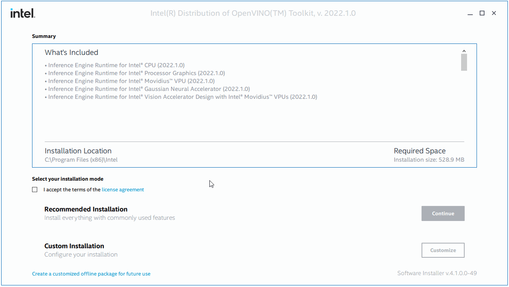

# Install and Configure Intel® Distribution of OpenVINO™ toolkit for Windows 10 {#openvino_docs_install_guides_installing_openvino_windows}

> **NOTE**: Since the OpenVINO™ 2022.1 release, the following development tools: Model Optimizer, Post-Training Optimization Tool, Model Downloader and other Open Model Zoo tools, Accuracy Checker, and Annotation Converter are not part of the installer. These tools are now only available on [pypi.org](https://pypi.org/project/openvino-dev/).

## System Requirements

@sphinxdirective
.. tab:: Operating Systems

  Microsoft Windows 10, 64-bit

.. tab:: Hardware

  Optimized for these processors:

  * 6th to 12th generation Intel® Core™ processors and Intel® Xeon® processors 
  * 3rd generation Intel® Xeon® Scalable processor (formerly code named Cooper Lake)
  * Intel® Xeon® Scalable processor (formerly Skylake and Cascade Lake)
  * Intel Atom® processor with support for Intel® Streaming SIMD Extensions 4.1 (Intel® SSE4.1)
  * Intel Pentium® processor N4200/5, N3350/5, or N3450/5 with Intel® HD Graphics
  * Intel® Iris® Xe MAX Graphics
  * Intel® Neural Compute Stick 2
  * Intel® Vision Accelerator Design with Intel® Movidius™ VPUs
  
.. tab:: Processor Notes

  Processor graphics are not included in all processors. 
  See `Product Specifications`_ for information about your processor.
  
  .. _Product Specifications: https://ark.intel.com/

.. tab:: Software

  * `Microsoft Visual Studio 2019 with MSBuild <http://visualstudio.microsoft.com/downloads/>`_
  * `CMake 3.14 or higher, 64-bit <https://cmake.org/download/>`_
  * `Python 3.6 - 3.9, 64-bit <https://www.python.org/downloads/windows/>`_
  
  .. note::
    You can choose to download Community version. Use `Microsoft Visual Studio installation guide <https://docs.microsoft.com/en-us/visualstudio/install/install-visual-studio?view=vs-2019>`_ to walk you through the installation. During installation in the **Workloads** tab, choose **Desktop development with C++**.

  .. note::
    You can either use `cmake<version>.msi` which is the installation wizard or `cmake<version>.zip` where you have to go into the `bin` folder and then manually add the path to environmental variables.
  
  .. important::
    As part of this installation, make sure you click the option **Add Python 3.x to PATH** to `add Python <https://docs.python.org/3/using/windows.html#installation-steps>`_ to your `PATH` environment variable.

@endsphinxdirective

## Overview

This guide provides step-by-step instructions on how to install the Intel® Distribution of OpenVINO™ toolkit. Links are provided for each type of compatible hardware including downloads, initialization and configuration steps. The following steps will be covered:

1. <a href="#install-openvino">Install the Intel® Distribution of OpenVINO™ Toolkit</a>
2. <a href="#set-the-environment-variables">Configure the Environment</a>
3. <a href="#model-optimizer">Download additional components (Optional)</a>
4. <a href="#optional-steps">Configure Inference on non-CPU Devices (Optional)</a>  
5. <a href="#get-started">What's next?</a>

## <a name="install-openvino"></a>Step 1: Install the Intel® Distribution of OpenVINO™ toolkit Core Components

1. Download the Intel® Distribution of OpenVINO™ toolkit package file from [Intel® Distribution of OpenVINO™ toolkit for Windows*](https://software.intel.com/en-us/openvino-toolkit/choose-download).
   Select the Intel® Distribution of OpenVINO™ toolkit for Windows package from the dropdown menu.
   
2. Go to the `Downloads` folder and double-click `w_openvino_toolkit_p_<version>.exe`. In the opened window, you can select the folder where installer files will be placed. The directory will be referred to as <INSTALL_DIR> elsewhere in the documentation. Once the files are extracted, you should see the following dialog box open up:

   @sphinxdirective
   
   .. image:: _static/images/openvino-install.png
     :width: 400px
     :align: center
   
   @endsphinxdirective
   
3. Follow the instructions on your screen. During the installation you will be asked to accept the license agreement. The acceptance is required to continue. Check out the installation process in the image below:<br>
   
   Click on the image to see the details.

The core components are now installed. Continue to the next section to configure environment.

## <a name="set-the-environment-variables">Step 2: Configure the Environment

> **NOTE**: If you installed the Intel® Distribution of OpenVINO™ to a non-default install directory, replace `C:\Program Files (x86)\Intel` with that directory in this guide's instructions.

You must update several environment variables before you can compile and run OpenVINO™ applications. Open the Command Prompt, and run the `setupvars.bat` batch file to temporarily set your environment variables:

```sh
"<INSTALL_DIR>\setupvars.bat"
```

**Optional**: OpenVINO™ toolkit environment variables are removed when you close the command prompt window. You can permanently set the environment variables manually.

> **NOTE**: If you see an error indicating Python is not installed when you know you installed it, your computer might not be able to find the program. Check your system environment variables, and add Python if necessary.

The environment variables are set. Next, you can download some additional tools.

## <a name="model-optimizer">Step 3 (Optional): Download additional components

> **NOTE**: Since the OpenVINO™ 2022.1 release, the following development tools: Model Optimizer, Post-Training Optimization Tool, Model Downloader and other Open Model Zoo tools, Accuracy Checker, and Annotation Converter are not part of the installer. The OpenVINO™ Model Development Tools can only be installed via PyPI now. See [Install OpenVINO™ Model Development Tools](@ref installing_model_dev_tools) for detailed steps.

## <a name="optional-steps"></a>Step 4 (Optional): Configure Inference on non-CPU Devices

@sphinxdirective
.. tab:: GPU

   Only do this if you want to enable the toolkit components to use processor graphics (GPU) on your system, follow the steps in :ref:`GPU Setup Guide <gpu guide windows>`.

.. tab:: VPU

   To install and configure your Intel® Vision Accelerator Design with Intel® Movidius™ VPUs, see the :ref:`VPUs Configuration Guide <vpu guide windows>`.

@endsphinxdirective

## <a name="get-started"></a>Step 5: What's next?

Now you are ready to try out the toolkit.

Developing in Python:
   * [Start with tensorflow models with OpenVINO™](https://docs.openvino.ai/latest/notebooks/101-tensorflow-to-openvino-with-output.html)
   * [Start with ONNX and PyTorch models with OpenVINO™](https://docs.openvino.ai/latest/notebooks/102-pytorch-onnx-to-openvino-with-output.html)
   * [Start with PaddlePaddle models with OpenVINO™](https://docs.openvino.ai/latest/notebooks/103-paddle-onnx-to-openvino-classification-with-output.html)

Developing in C++:
   * [Image Classification Async C++ Sample](@ref openvino_inference_engine_samples_classification_sample_async_README)
   * [Hello Classification C++ Sample](@ref openvino_inference_engine_samples_hello_classification_README)
   * [Hello Reshape SSD C++ Sample](@ref openvino_inference_engine_samples_hello_reshape_ssd_README)
    
## <a name="uninstall"></a>Uninstall the Intel® Distribution of OpenVINO™ Toolkit

To uninstall the toolkit, follow the steps on the [Uninstalling page](uninstalling-openvino.md).

## Additional Resources
@sphinxdirective
.. raw:: html

   <div class="collapsible-section">

@endsphinxdirective

- Convert models for use with OpenVINO™: [Model Optimizer Developer Guide](../MO_DG/Deep_Learning_Model_Optimizer_DevGuide.md)
- Write your own OpenVINO™ applications: [Inference Engine Developer Guide](../OV_Runtime_UG/Deep_Learning_Inference_Engine_DevGuide.md)
- Information on sample applications: [Inference Engine Samples Overview](../OV_Runtime_UG/Samples_Overview.md)
- Information on a supplied set of models: [Overview of OpenVINO™ Toolkit Pre-Trained Models](../model_zoo.md)
- IoT libraries and code samples: [Intel® IoT Developer Kit](https://github.com/intel-iot-devkit)

To learn more about converting models from specific frameworks, go to:

- [Convert Your Caffe Model](../MO_DG/prepare_model/convert_model/Convert_Model_From_Caffe.md)
- [Convert Your TensorFlow Model](../MO_DG/prepare_model/convert_model/Convert_Model_From_TensorFlow.md)
- [Convert Your MXNet Model](../MO_DG/prepare_model/convert_model/Convert_Model_From_MxNet.md)
- [Convert Your Kaldi Model](../MO_DG/prepare_model/convert_model/Convert_Model_From_Kaldi.md)
- [Convert Your ONNX Model](../MO_DG/prepare_model/convert_model/Convert_Model_From_ONNX.md)

@sphinxdirective
.. raw:: html

   </div>

@endsphinxdirective
