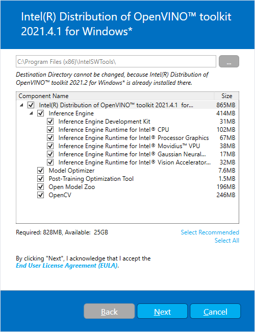
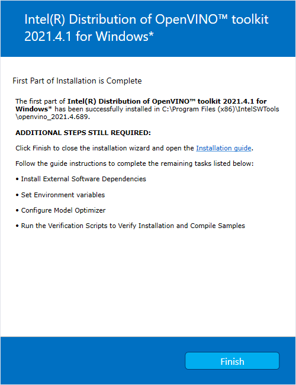

# Install Intel® Distribution of OpenVINO™ toolkit for Windows* 10 {#openvino_docs_install_guides_installing_openvino_windows}

> **NOTES**:
> - This guide applies to Microsoft Windows\* 10 64-bit. For Linux* OS information and instructions, see the [Installation Guide for Linux](installing-openvino-linux.md).
> - [Intel® System Studio](https://software.intel.com/en-us/system-studio) is an all-in-one, cross-platform tool suite, purpose-built to simplify system bring-up and improve system and IoT device application performance on Intel® platforms. If you are using the Intel® Distribution of OpenVINO™ with Intel® System Studio, go to [Get Started with Intel® System Studio](https://software.intel.com/en-us/articles/get-started-with-openvino-and-intel-system-studio-2019).

## Introduction

> **IMPORTANT**:
> - All steps in this guide are required, unless otherwise stated.<br>
> - In addition to the download package, you must install dependencies and complete configuration steps.

Your installation is complete when these are all completed:

1. Install the <a href="#Install-Core-Components">Intel® Distribution of OpenVINO™ toolkit core components</a>

2. Install the dependencies:

   - [Microsoft Visual Studio* with C++ **2019 or 2017** with MSBuild](http://visualstudio.microsoft.com/downloads/)  
   - [CMake **3.10 or higher** 64-bit](https://cmake.org/download/)
   > **NOTE**: If you want to use Microsoft Visual Studio 2019, you are required to install CMake 3.14.
   - [Python **3.6** - **3.8** 64-bit](https://www.python.org/downloads/windows/)
   > **IMPORTANT**: As part of this installation, make sure you click the option to add the application to your `PATH` environment variable.

3. <a href="#set-the-environment-variables">Set Environment Variables</a>         

4. <a href="#Configure_MO">Configure the Model Optimizer</a>

5. Run two <a href="#Using-Demo-Scripts">Verification Scripts to Verify Installation</a>

6. Optional: 

    - <a href="#Install-GPU">Install the Intel® Graphics Driver for Windows*</a>

    - <a href="#hddl-myriad">Install the drivers and software for the Intel® Vision Accelerator Design with Intel® Movidius™ VPUs</a>

    - <a href="#Update-Path">Update Windows* environment variables</a>

### About the Intel® Distribution of OpenVINO™ toolkit

OpenVINO™ toolkit is a comprehensive toolkit for quickly developing applications and solutions that solve a variety of tasks including emulation of human vision, automatic speech recognition, natural language processing, recommendation systems, and many others. Based on latest generations of artificial neural networks, including Convolutional Neural Networks (CNNs), recurrent and attention-based networks, the toolkit extends computer vision and non-vision workloads across Intel® hardware, maximizing performance. It accelerates applications with high-performance, AI and deep learning inference deployed from edge to cloud.

For more information, see the online [Intel® Distribution of OpenVINO™ toolkit Overview](https://software.intel.com/en-us/OpenVINO-toolkit) page.

The Intel® Distribution of OpenVINO™ toolkit for Windows\* 10 OS:

- Enables CNN-based deep learning inference on the edge
- Supports heterogeneous execution across Intel® CPU, Intel® Processor Graphics (GPU), Intel® Neural Compute Stick 2, and Intel® Vision Accelerator Design with Intel® Movidius™ VPUs
- Speeds time-to-market through an easy-to-use library of computer vision functions and pre-optimized kernels
- Includes optimized calls for computer vision standards including OpenCV\* and OpenCL™

#### <a name="InstallPackageContents"></a>Included in the Installation Package

The following components are installed by default:  

| Component                                                                                          | Description                                                                                                                                                                                                                                   |
|:---------------------------------------------------------------------------------------------------|:----------------------------------------------------------------------------------------------------------------------------------------------------------------------------------------------------------------------------------------------|
|[Model Optimizer](../MO_DG/Deep_Learning_Model_Optimizer_DevGuide.md) |This tool imports, converts, and optimizes models that were trained in popular frameworks to a format usable by Intel tools, especially the Inference Engine.<br><strong>NOTE</strong>: Popular frameworks include such frameworks as Caffe\*, TensorFlow\*, MXNet\*, and ONNX\*.         |
|[Inference Engine](../IE_DG/inference_engine_intro.md)               |This is the engine that runs the deep learning model. It includes a set of libraries for an easy inference integration into your applications.                                                                                                 |
|[OpenCV\*](https://docs.opencv.org/master/)                                                         |OpenCV* community version compiled for Intel® hardware                                                                                                                                                                                         |
|[Inference Engine Samples](../IE_DG/Samples_Overview.md)                             |A set of simple console applications demonstrating how to use Intel's Deep Learning Inference Engine in your applications.  |
| [Demos](@ref omz_demos_README)                                   | A set of console applications that demonstrate how you can use the Inference Engine in your applications to solve specific use-cases  |
| Additional Tools                                   | A set of tools to work with your models including [Accuracy Checker utility](@ref omz_tools_accuracy_checker_README), [Post-Training Optimization Tool Guide](@ref pot_README), [Model Downloader](@ref omz_tools_downloader_README) and other  |
| [Documentation for Pre-Trained Models ](@ref omz_models_intel_index)                                   | Documentation for the pre-trained models available in the [Open Model Zoo repo](https://github.com/opencv/open_model_zoo)  |

### Could Be Optionally Installed

Instead of installing the toolkit on your system, you can work with OpenVINO™ components inside the web-based graphical environment of the [OpenVINO™ Deep Learning Workbench](@ref openvino_docs_get_started_get_started_dl_workbench) after a [fast installation from Docker](@ref workbench_docs_Workbench_DG_Docker_Container). <br>
DL Workbench enables you to visualize, fine-tune, and compare performance of deep learning models on various Intel® architecture configurations using sophisticated
OpenVINO™ toolkit components: [Model Downloader](@ref omz_tools_downloader_README), [Intel® Open Model Zoo](@ref omz_models_intel_index), 
[Model Optimizer](../MO_DG/Deep_Learning_Model_Optimizer_DevGuide.md), [Post-Training Optimization tool](@ref pot_README),
[Accuracy Checker](@ref omz_tools_accuracy_checker_README), and [Benchmark Tool](@ref openvino_inference_engine_samples_benchmark_app_README).

### System Requirements

**Hardware**

* 6th to 11th generation Intel® Core™ processors and Intel® Xeon® processors 
* Intel® Xeon® processor E family (formerly code named Sandy Bridge, Ivy Bridge, Haswell, and Broadwell)
* 3rd generation Intel® Xeon® Scalable processor (formerly code named Cooper Lake)
* Intel® Xeon® Scalable processor (formerly Skylake and Cascade Lake)
* Intel Atom® processor with support for Intel® Streaming SIMD Extensions 4.1 (Intel® SSE4.1)
* Intel Pentium® processor N4200/5, N3350/5, or N3450/5 with Intel® HD Graphics
* Intel® Neural Compute Stick 2
* Intel® Vision Accelerator Design with Intel® Movidius™ VPUs

> **NOTE**: With OpenVINO™ 2020.4 release, Intel® Movidius™ Neural Compute Stick is no longer supported.

**Processor Notes:**

- Processor graphics are not included in all processors. See [Processors specifications](https://ark.intel.com/#@Processors) for information about your processor.
- A chipset that supports processor graphics is required if you're using an Intel Xeon processor. See [Chipset specifications](https://ark.intel.com/#@Chipsets) for information about your chipset.

**Operating System**

- Microsoft Windows\* 10 64-bit

**Software**
- [Microsoft Visual Studio* with C++ **2019 or 2017** with MSBuild](http://visualstudio.microsoft.com/downloads/)
- [CMake **3.10 or higher** 64-bit](https://cmake.org/download/)
   > **NOTE**: If you want to use Microsoft Visual Studio 2019, you are required to install CMake 3.14.
- [Python **3.6** - **3.8** 64-bit](https://www.python.org/downloads/windows/)

## Installation Steps

### <a name="Install-Core-Components"></a>Install the Intel® Distribution of OpenVINO™ toolkit Core Components

1. If you have not downloaded the Intel® Distribution of OpenVINO™ toolkit, [download the latest version](http://software.intel.com/en-us/openvino-toolkit/choose-download/free-download-windows). By default, the file is saved to the `Downloads` directory as `w_openvino_toolkit_p_<version>.exe`.

2. Go to the `Downloads` folder and double-click `w_openvino_toolkit_p_<version>.exe`. A window opens to let you choose your installation directory and components. The default installation directory is `C:\Program Files (x86)\Intel\openvino_<version>`, for simplicity, a shortcut to the latest installation is also created: `C:\Program Files (x86)\Intel\openvino_2021`. If you choose a different installation directory, the installer will create the directory for you:

   

3. Click **Next**.

4. You are asked if you want to provide consent to gather information. Choose the option of your choice. Click **Next**.

5. If you are missing external dependencies, you will see a warning screen. Write down the dependencies you are missing. **You need to take no other action at this time**. After installing the Intel® Distribution of OpenVINO™ toolkit core components, install the missing dependencies.
The screen example below indicates you are missing two dependencies:

   

6. Click **Next**.

7. When the first part of installation is complete, the final screen informs you that the core components have been installed and additional steps still required:

    

8. Click **Finish** to close the installation wizard. A new browser window opens to the next section of the installation guide to set the environment variables. You are in the same document. The new window opens in case you ran the installation without first opening this installation guide. 

9. If the installation indicated you must install dependencies, install them first. If there are no missing dependencies, you can go ahead and <a href="#set-the-environment-variables">set the environment variables</a>.  

### Set the Environment Variables <a name="set-the-environment-variables"></a>

> **NOTE**: If you installed the Intel® Distribution of OpenVINO™ to the non-default install directory, replace `C:\Program Files (x86)\Intel` with the directory in which you installed the software.

You must update several environment variables before you can compile and run OpenVINO™ applications. Open the Command Prompt, and run the `setupvars.bat` batch file to temporarily set your environment variables:
```sh
cd C:\Program Files (x86)\Intel\openvino_2021\bin\
```

```sh
setupvars.bat
```

<strong>(Optional)</strong>: OpenVINO toolkit environment variables are removed when you close the Command Prompt window. As an option, you can permanently set the environment variables manually.

The environment variables are set. Continue to the next section to configure the Model Optimizer.

## Configure the Model Optimizer <a name="Configure_MO"></a>

> **IMPORTANT**: These steps are required. You must configure the Model Optimizer for at least one framework. The Model Optimizer will fail if you do not complete the steps in this section.

> **NOTE**: If you see an error indicating Python is not installed when you know you installed it, your computer might not be able to find the program. For the instructions to add Python to your system environment variables, see <a href="#Update-Path">Update Your Windows Environment Variables</a>.

The Model Optimizer is a key component of the Intel® Distribution of OpenVINO™ toolkit. You cannot do inference on your trained model without running the model through the Model Optimizer. When you run a pre-trained model through the Model Optimizer, your output is an Intermediate Representation (IR) of the network. The IR is a pair of files that describe the whole model:

- `.xml`: Describes the network topology
- `.bin`: Contains the weights and biases binary data

The Inference Engine reads, loads, and infers the IR files, using a common API across the CPU, GPU, or VPU hardware.  

The Model Optimizer is a Python*-based command line tool (`mo.py`), which is located in `C:\Program Files (x86)\Intel\openvino_2021\deployment_tools\model_optimizer`. Use this tool on models trained with popular deep learning frameworks such as Caffe\*, TensorFlow\*, MXNet\*, and ONNX\* to convert them to an optimized IR format that the Inference Engine can use.

This section explains how to use scripts to configure the Model Optimizer either for all of the supported frameworks at the same time or for individual frameworks. If you want to manually configure the Model Optimizer instead of using scripts, see the **Using Manual Configuration Process** section on the [Configuring the Model Optimizer](../MO_DG/prepare_model/Config_Model_Optimizer.md) page.

For more information about the Model Optimizer, see the [Model Optimizer Developer Guide](../MO_DG/Deep_Learning_Model_Optimizer_DevGuide.md).


### Model Optimizer Configuration Steps

You can configure the Model Optimizer either for all supported frameworks at once or for one framework at a time. Choose the option that best suits your needs. If you see error messages, make sure you installed all dependencies.

> **IMPORTANT**: The Internet access is required to execute the following steps successfully. If you have access to the Internet through the proxy server only, please make sure that it is configured in your environment.

> **NOTE**:
> In the steps below:
> - If you you want to use the Model Optimizer from another installed versions of Intel® Distribution of OpenVINO™ toolkit installed, replace `openvino_2021` with `openvino_<version>`, where `<version>` is the required version.
> - If you installed the Intel® Distribution of OpenVINO™ toolkit to the non-default installation directory, replace `C:\Program Files (x86)\Intel` with the directory where you installed the software.

These steps use a command prompt to make sure you see error messages.

#### Option 1: Configure the Model Optimizer for all supported frameworks at the same time:

1. Open a command prompt. To do so, type `cmd` in your **Search Windows** box and then press **Enter**.
Type commands in the opened window:

   

2. Go to the Model Optimizer prerequisites directory.<br>
```sh
cd C:\Program Files (x86)\Intel\openvino_2021\deployment_tools\model_optimizer\install_prerequisites
```

3. Run the following batch file to configure the Model Optimizer for Caffe\*, TensorFlow\* 1.x, MXNet\*, Kaldi\*, and ONNX\*:<br>
```sh
install_prerequisites.bat
```

#### Option 2: Configure the Model Optimizer for each framework separately:

1. Go to the Model Optimizer prerequisites directory:<br>
```sh
cd C:\Program Files (x86)\Intel\openvino_2021\deployment_tools\model_optimizer\install_prerequisites
```

2. Run the batch file for the framework you will use with the Model Optimizer. You can use more than one:

   * For **Caffe**:<br>
   ```sh
   install_prerequisites_caffe.bat
   ```

   * For **TensorFlow 1.x**:<br>
   ```sh
   install_prerequisites_tf.bat
   ```

   * For **TensorFlow 2.x**:<br>
   ```sh
   install_prerequisites_tf2.bat
   ```

   * For **MXNet**:<br>
   ```sh
   install_prerequisites_mxnet.bat
   ```

   * For **ONNX**:
   ```sh
   install_prerequisites_onnx.bat
   ```

   * For **Kaldi**:
   ```sh
   install_prerequisites_kaldi.bat
   ```

The Model Optimizer is configured for one or more frameworks. Success is indicated by a screen similar to this:


You are ready to use two short demos to see the results of running the Intel Distribution of OpenVINO toolkit and to verify your installation was successful. The demo scripts are required since they perform additional configuration steps. Continue to the next section.

If you want to use a GPU or VPU, or update your Windows* environment variables, read through the <a href="#optional-steps">Optional Steps</a> section.


## <a name="Using-Demo-Scripts"></a>Use Verification Scripts to Verify Your Installation

> **IMPORTANT**: This section is required. In addition to confirming your installation was successful, demo scripts perform other steps, such as setting up your computer to use the Inference Engine samples.

> **NOTE**:
> The paths in this section assume you used the default installation directory. If you used a directory other than `C:\Program Files (x86)\Intel`, update the directory with the location where you installed the software.   
To verify the installation and compile two samples, run the verification applications provided with the product on the CPU:

1. Open a command prompt window.

2. Go to the Inference Engine demo directory:<br>
   ```sh
   cd C:\Program Files (x86)\Intel\openvino_2021\deployment_tools\demo\
   ```

3. Run the verification scripts by following the instructions in the next section.


### <a name="run-the-image-classification-verification-script"></a>Run the Image Classification Verification Script

To run the script, start the `demo_squeezenet_download_convert_run.bat` file:
```sh
demo_squeezenet_download_convert_run.bat
```

This script downloads a SqueezeNet model, uses the Model Optimizer to convert the model to the `.&zwj;bin` and `.&zwj;xml` Intermediate Representation (IR) files. The Inference Engine requires this model conversion so it can use the IR as input and achieve optimum performance on Intel hardware.<br>
This verification script builds the [Image Classification Sample Async](../../inference-engine/samples/classification_sample_async/README.md) application and run it with the `car.png` image in the demo directory. For a brief description of the Intermediate Representation, see <a href="#Configure_MO">Configuring the Model Optimizer</a>.

When the verification script completes, you will have the label and confidence for the top-10 categories:


This demo is complete. Leave the console open and continue to the next section to run the Inference Pipeline demo.


### Run the Inference Pipeline Verification Script

To run the script, start the `demo_security_barrier_camera.bat` file while still in the console:
```sh
demo_security_barrier_camera.bat
```

This script downloads three pre-trained model IRs, builds the [Security Barrier Camera Demo](@ref omz_demos_security_barrier_camera_demo_README) application, and runs it with the downloaded models and the `car_1.bmp` image from the `demo` directory to show an inference pipeline. The verification script uses vehicle recognition in which vehicle attributes build on each other to narrow in on a specific attribute.

First, an object is identified as a vehicle. This identification is used as input to the next model, which identifies specific vehicle attributes, including the license plate. Finally, the attributes identified as the license plate are used as input to the third model, which recognizes specific characters in the license plate.

When the demo completes, you have two windows open:

   * A console window that displays information about the tasks performed by the demo
   * An image viewer window that displays a resulting frame with detections rendered as bounding boxes, similar to the following:

   

Close the image viewer window to end the demo.

To learn more about the verification scripts, see `README.txt` in `C:\Program Files (x86)\Intel\openvino_2021\deployment_tools\demo`.

For detailed description of the OpenVINO™ pre-trained object detection and object recognition models, see the [Overview of OpenVINO™ toolkit Pre-Trained Models](@ref omz_models_intel_index) page.

In this section, you saw a preview of the Intel® Distribution of OpenVINO™ toolkit capabilities.

Congratulations. You have completed all the required installation, configuration, and build steps to work with your trained models using CPU. 

If you want to use Intel® Processor graphics (GPU), Intel® Neural Compute Stick 2 or Intel® Vision Accelerator Design with Intel® Movidius™ VPUs, or add CMake* and Python* to your Windows* environment variables, read through the next section for additional steps.

If you want to continue and run the Image Classification Sample Application on one of the supported hardware device, see the [Run the Image Classification Sample Application](#run-the-image-classification-sample-application) section.

## <a name="optional-steps"></a>Optional Steps

Use the optional steps below if you want to:
* Infer models on <a href="#Install-GPU">Intel® Processor Graphics</a>
* Infer models on <a href="#usb-myriad">Intel® Vision Accelerator Design with Intel® Movidius™ VPUs</a>
* <a href="#Update-Path">Add CMake* or Python* to your Windows* environment variables</a>.  

###  <a name="Install-GPU"></a>Optional: Additional Installation Steps for Intel® Processor Graphics (GPU)

> **NOTE**: These steps are required only if you want to use a GPU.

If your applications offload computation to Intel® Integrated Graphics, you must have the Intel Graphics Driver for Windows version 15.65 or higher. To see if you have this driver installed:

1. Type **device manager** in your **Search Windows** box. The **Device Manager** opens.

2. Click the drop-down arrow to view the **Display adapters**. You see the adapter that is installed in your computer:

   

3. Right-click the adapter name and select **Properties**.

4. Click the **Driver** tab to see the driver version. Make sure the version number is 15.65 or higher.

   

5. If your device driver version is lower than 15.65, [download and install a higher version](http://downloadcenter.intel.com/product/80939/Graphics-Drivers).

You are done updating your device driver and are ready to use your GPU.


### <a name="hddl-myriad"></a> Optional: Additional Installation Steps for the Intel® Vision Accelerator Design with Intel® Movidius™ VPUs

> **NOTE**: These steps are required only if you want to use Intel® Vision Accelerator Design with Intel® Movidius™ VPUs.

To perform inference on Intel® Vision Accelerator Design with Intel® Movidius™ VPUs, the following additional installation steps are required:

  1. Download and install <a href="https://www.microsoft.com/en-us/download/details.aspx?id=48145">Visual C++ Redistributable for Visual Studio 2017</a>
  2. Check with a support engineer if your Intel® Vision Accelerator Design with Intel® Movidius™ VPUs card requires SMBUS connection to PCIe slot (most unlikely). Install the SMBUS driver only if confirmed (by default, it's not required):
      1. Go to the `<INSTALL_DIR>\deployment_tools\inference-engine\external\hddl\SMBusDriver` directory, where `<INSTALL_DIR>` is the directory in which the Intel Distribution of OpenVINO toolkit is installed.
      2. Right click on the `hddlsmbus.inf` file and choose **Install** from the pop up menu.

You are done installing your device driver and are ready to use your Intel® Vision Accelerator Design with Intel® Movidius™ VPUs.

See also: 

* For advanced configuration steps for your IEI Mustang-V100-MX8 accelerator, see [Intel® Movidius™ VPUs Setup Guide for Use with Intel® Distribution of OpenVINO™ toolkit](movidius-setup-guide.md).

* After you've configurated your Intel® Vision Accelerator Design with Intel® Movidius™ VPUs, see [Intel® Movidius™ VPUs Programming Guide for Use with Intel® Distribution of OpenVINO™ toolkit](movidius-programming-guide.md) to learn how to distribute a model across all 8 VPUs to maximize performance.

After configuration is done, you are ready to run the verification scripts with the HDDL Plugin for your Intel® Vision Accelerator Design with Intel® Movidius™ VPUs.

1. Open a command prompt window.

2. Go to the Inference Engine demo directory:
   ```sh
   cd C:\Program Files (x86)\Intel\openvino_2021\deployment_tools\demo\
   ```
3. Run the Image Classification verification script. If you have access to the Internet through the proxy server only, please make sure that it is configured in your environment.
   ```sh
   demo_squeezenet_download_convert_run.bat -d HDDL
   ```
4. Run the Inference Pipeline verification script:
   ```sh
   demo_security_barrier_camera.bat -d HDDL
   ```

### <a name="Update-Path"></a>Optional: Update Your Windows Environment Variables

> **NOTE**: These steps are only required under special circumstances, such as if you forgot to check the box during the CMake\* or Python\* installation to add the application to your Windows `PATH` environment variable.

Use these steps to update your Windows `PATH` if a command you execute returns an error message stating that an application cannot be found. This might happen if you do not add CMake or Python to your `PATH` environment variable during the installation.

1. In your **Search Windows** box, type **Edit the system environment variables** and press **Enter**. A window similar to the following displays:
   

2. At the bottom of the screen, click **Environment Variables**.

3. Under **System variables**, click **Path** and then **Edit**:
   

4. In the opened window, click **Browse**. A browse window opens:
   

5. If you need to add CMake to the `PATH`, browse to the directory in which you installed CMake. The default directory is `C:\Program Files\CMake`.

6. If you need to add Python to the `PATH`, browse to the directory in which you installed Python. The default directory is `C:\Users\<USER_ID>\AppData\Local\Programs\Python\Python36\Python`.

7. Click **OK** repeatedly to close each screen.

Your `PATH` environment variable is updated.

## <a name="run-the-image-classification-sample-application"></a>Run the Image Classification Sample Application

> **IMPORTANT**: This section requires that you have [Run the Verification Scripts to Verify Installation](#run-the-demos). This script builds the Image Classification sample application and downloads and converts the required Caffe* Squeezenet model to an IR. 

In this section you will run the Image Classification sample application, with the Caffe* Squeezenet1.1 model on three types of Intel® hardware: CPU, GPU and VPUs. 

Image Classification sample application binary file was automatically built and the FP16 model IR files are created when you [Ran the Image Classification Verification Script](#run-the-image-classification-verification-script). 

The Image Classification sample application binary file located in the `C:\Users\<username>\Documents\Intel\OpenVINO\inference_engine_samples_build\intel64\Release\` directory. 
The Caffe* Squeezenet model IR files (`.bin` and `.xml`) are located in the  in the `C:\Users\<username>\Documents\Intel\OpenVINO\openvino_models\ir\public\squeezenet1.1\FP16\` directory.

> **NOTE**: If you installed the Intel® Distribution of OpenVINO™ toolkit to the non-default installation directory, replace `C:\Program Files (x86)\Intel` with the directory where you installed the software.

To run the sample application:

1. Set up environment variables:
```sh
cd C:\Program Files (x86)\Intel\openvino_2021\bin\setupvars.bat
```
2. Go to the samples build directory:
```sh
cd C:\Users\<username>\Documents\Intel\OpenVINO\inference_engine_samples_build\intel64\Release
``` 
3. Run the sample executable with specifying the `car.png` file from the `demo` directory as an input image, the IR of your FP16 model and a plugin for a hardware device to perform inference on. 
> **NOTE**: Running the sample application on hardware other than CPU requires performing [additional hardware configuration steps](#optional-steps).

   - For CPU:    
   ```sh
   classification_sample_async.exe -i "C:\Program Files (x86)\Intel\openvino_2021\deployment_tools\demo\car.png" -m "C:\Users\<username>\Documents\Intel\OpenVINO\openvino_models\ir\public\squeezenet1.1\FP16\squeezenet1.1.xml" -d CPU
   ```
   
   - For GPU:
   ```sh
   classification_sample_async.exe -i "C:\Program Files (x86)\Intel\openvino_2021\deployment_tools\demo\car.png" -m "C:\Users\<username>\Documents\Intel\OpenVINO\openvino_models\ir\public\squeezenet1.1\FP16\squeezenet1.1.xml" -d GPU
   ```
   
   - For VPU (Intel® Neural Compute Stick 2):
   ```sh
   classification_sample_async.exe -i "C:\Program Files (x86)\Intel\openvino_2021\deployment_tools\demo\car.png" -m "C:\Users\<username>\Documents\Intel\OpenVINO\openvino_models\ir\public\squeezenet1.1\FP16\squeezenet1.1.xml" -d MYRIAD
   ```
   
   - For VPU (Intel® Vision Accelerator Design with Intel® Movidius™ VPUs):
   ```sh
   classification_sample_async.exe -i "C:\Program Files (x86)\Intel\openvino_2021\deployment_tools\demo\car.png" -m "C:\Users\<username>\Documents\Intel\OpenVINO\openvino_models\ir\public\squeezenet1.1\FP16\squeezenet1.1.xml" -d HDDL
   ```

For information on Sample Applications, see the [Inference Engine Samples Overview](../IE_DG/Samples_Overview.md).

Congratulations, you have finished the installation of the Intel® Distribution of OpenVINO™ toolkit for Windows*. To learn more about how the Intel® Distribution of OpenVINO™ toolkit works, the Hello World tutorial and other resources are provided below.


## <a name="Summary"></a>Summary

In this document, you installed the Intel® Distribution of OpenVINO™ toolkit and its dependencies. You also configured the Model Optimizer for one or more frameworks. After the software was installed and configured, you ran two verification scripts. You might have also installed drivers that will let you use a GPU or VPU to infer your models and run the Image Classification Sample application.

You are now ready to learn more about converting models trained with popular deep learning frameworks to the Inference Engine format, following the links below, or you can move on to running the [sample applications](../IE_DG/Samples_Overview.md).

To learn more about converting deep learning models, go to:

- [Convert Your Caffe* Model](../MO_DG/prepare_model/convert_model/Convert_Model_From_Caffe.md)
- [Convert Your TensorFlow* Model](../MO_DG/prepare_model/convert_model/Convert_Model_From_TensorFlow.md)
- [Convert Your MXNet* Model](../MO_DG/prepare_model/convert_model/Convert_Model_From_MxNet.md)
- [Convert Your ONNX* Model](../MO_DG/prepare_model/convert_model/Convert_Model_From_ONNX.md)

## Additional Resources

- [Intel Distribution of OpenVINO Toolkit home page](https://software.intel.com/en-us/openvino-toolkit)
- [Intel Distribution of OpenVINO Toolkit documentation](https://software.intel.com/en-us/openvino-toolkit/documentation/featured)
- [OpenVINO™ Release Notes](https://software.intel.com/en-us/articles/OpenVINO-RelNotes)
- [Introduction to Inference Engine](inference_engine_intro.md)
- [Inference Engine Developer Guide](../IE_DG/Deep_Learning_Inference_Engine_DevGuide.md)
- [Model Optimizer Developer Guide](../MO_DG/Deep_Learning_Model_Optimizer_DevGuide.md)
- [Inference Engine Samples Overview](../IE_DG/Samples_Overview.md)
- [Overview of OpenVINO™ Toolkit Pre-Trained Models](@ref omz_models_intel_index)
- Intel Distribution of OpenVINO Toolkit Hello World Activities, see the [Inference Tutorials for Face Detection and Car Detection Exercises](https://github.com/intel-iot-devkit/inference-tutorials-generic/tree/openvino_toolkit_r3_0)
- [Intel® Neural Compute Stick 2 Get Started](https://software.intel.com/en-us/neural-compute-stick/get-started)


[myriad_driver]: ../img/myriad_driver.png
