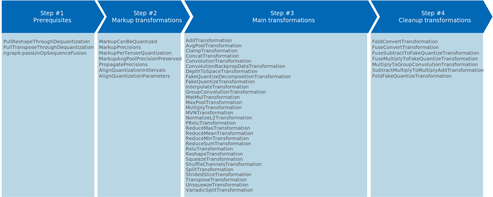
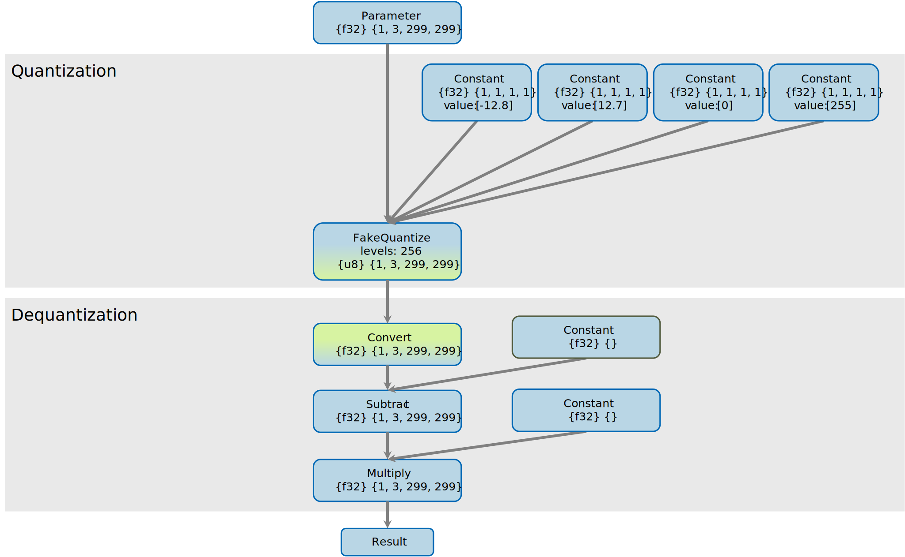

# OpenVINO™ Low Precision Transformations {#openvino_docs_IE_DG_lpt}

## Table of Contents

1. [Introduction](#introduction)  
2. [Input model requirements](#input-model-requirements)  
3. [Low precision tools](#low-precision-tools)  
4. [Quantization approaches](#quantization-approaches)  
   4.1. [FakeQuantize operation](#fakequantize-operation)  
   4.2. [Quantize and dequantization operations](#quantize-and-dequantization-operations)  
5. [Low precision transformations pipeline](#low-precision-transformations-pipeline)  
      5.1. [Step #1. Prerequisites](#step-1-prerequisites)  
      5.2. [Step #2. Markup](#step-2-markup)  
      5.3. [Step #3. Main transformations: FakeQuantize decomposition and dequantization operations handling](#step-3-main-transformations-fakequantize-decomposition-and-dequantization-operations-handling)  
      5.4. [Step #4. Cleanup result model](#step-4-cleanup-result-model)  
6. [Low precision transformations in plugin transformation pipeline](#low-precision-transformations-in-plugin-transformation-pipeline)  
      [Step #1. Common optimizations](#step-1-common-optimizations)  
      [Step #2. Low precision transformations execution](#step-2-low-precision-transformations-execution)  
      [Step #3. Plugin specific transformations](#step-3-plugin-specific-transformations)
7. [Result model overview](#result-model-overview)
8. [Mixed precision](#mixed-precision)
9. [Customization](#customization)

## Introduction
The goal of `Low Precision Transformations` (LPT transformations) is transform quantized model from original precisions (FP16 or FP32) to low precision (INT8: `signed int8` or `unsigned int8`) model to prepare model for low precision inference in OpenVINO™ plugin. It achieved by two main principles:
1. `FakeQuantize` operation decomposition to two parts:  
    - part #1: quantize operation - new `FakeQuantize` operation with output quantization intervals in low precision range (signed int8: [-128, 127] or [-127, 127], unsigned int8: [0, 255] or [0, 256]) and with low precision output (`signed int8` or `unsigned int8`), 
    - part #2: dequantization operations with low precision input and original precision output.
2. Dequantization operation propagation through original models operations to avoid dequantization operations before original model operations, thus the quantize operations with low precision output remains before original model operations. 

As result, operation input tensor precisions will be changed from original to low precision and operations can be inferred by OpenVINO™ plugin in low precision.

How quantize a model in details you can explore in [Low precision tools](#low-precision-tools) section below. For more information about model quantization, refer to **Brief History of Lower Precision in Deep Learning** section in [this whitepaper](https://software.intel.com/en-us/articles/lower-numerical-precision-deep-learning-inference-and-training).

## Input model requirements

LPT transformations decompose `FakeQuantize` operations if `level` parameter is set to 255 or 256. LPT transformations propagate dequantization operations through follow operations:
* Add
* Avg
* Clamp
* Concat
* Convolution
* ConvolutionBackpropData
* DepthToSpace
* FakeQuantize
* GroupConvolution
* Interpolate
* MatMul
* MaxPool
* Multiply
* MVN
* NormalizeL2
* PRelu
* ReduceMax
* ReduceMean
* ReduceMin
* ReduceSum
* Relu
* Reshape
* Split
* Squeeze
* StridedSlice
* Transpose
* Unsqueeze
* VariadicSplit

If operation is not supported by LPT then dequantization operation will be not propagated, input tensor precisions will be not changed to low precision and operation will be executed in original precision. 

For example, if you would like to infer `Convolution` operation in low precision then your model can look as on picture below:


> There are several supported quantization approaches on activations and on weights. All supported approaches are described in [Quantization approaches](#quantization-approaches) section below. In demonstrated model [FakeQuantize operation quantization](#fakequantize-operation) approach is used.

### Low precision tools
There are two tools to quantize a model:
1. [Post-Training Optimization Toolkit](@ref pot_README.html) (POT)
2. [Neural Network Compression Framework](https://github.com/openvinotoolkit/nncf) (NNCF)

Additionally, low precision transformations can handle ONNX quantized model.

## Quantization approaches
LPT transformations support two quantization approaches:
1. `FakeQuantize` operation,
2. Quantize and dequantization operations

Let's explore both approaches in details on `Convolution` operation.
### FakeQuantize operation  
In this case `FakeQuantize` operation is used on activations and quantized constant on weights. Original input model:  


### Quantize and dequantization operations  
In this case `FakeQuantize` operation and `Convert` are used as quantize operation and return quantized low precision tensor. After quantize operation on activations there are `Convert` and dequantization operations to compensate decomposition. Original input model:


In both cases result is the same. In LPT result model you can see, that:
1. if neccessary, `FakeQuantize` operations on activations were decomposed to two part: 
   - new `FakeQuantize`operation with updated output intervals in low precision range and low precision output,
   - dequantization operations on activations;  
2. if neccessary, existing `FakeQuantize` decomposition can be rework to get more optimal precision;  
3. dequantization operations were propagated through `Convolution`.  

LPT result model:  


### Low precision transformations pipeline
LPT transformation pipeline has several steps. For each transformation inside one step pattern matcher is unique per transformation, but each operation can be assigned to several transformations.



<details>
<summary>Click to explore all LPT transformations by steps in one table</summary>

| Step #1: Prerequisites             | Step #2: Markup transformations | Step #3: Main transformations           | Step #4: Cleanup transformations            |
|------------------------------------|---------------------------------|-----------------------------------------|---------------------------------------------|
| PullReshapeThroughDequantization   | MarkupCanBeQuantized            | AddTransformation                       | FoldConvertTransformation                   |
| PullTransposeThroughDequantization | MarkupPrecisions                | AvgPoolTransformation                   | FuseConvertTransformation                   |
| ngraph::pass::LinOpSequenceFusion  | MarkupPerTensorQuantization     | ClampTransformation                     | FuseSubtractToFakeQuantizeTransformation    |
|                                    | MarkupAvgPoolPrecisionPreserved | ConcatTransformation                    | FuseMultiplyToFakeQuantizeTransformation    |
|                                    | PropagatePrecisions             | ConvolutionTransformation               | MultiplyToGroupConvolutionTransformation    |
|                                    | AlignQuantizationInttervals     | ConvolutionBackpropDataTransformation   | SubtractMultiplyToMultiplyAddTransformation |
|                                    | AlignQuantizationParamters      | DepthToSpaceTransformation              | FoldFakeQuantizeTransformation              |
|                                    |                                 | FakeQuantizeDecompositionTransformation |                                             |
|                                    |                                 | FakeQuantizeTransformation              |                                             |
|                                    |                                 | InterpolateTransformation               |                                             |
|                                    |                                 | GroupConvolutionTransformation          |                                             |
|                                    |                                 | MatMulTransformation                    |                                             |
|                                    |                                 | MaxPoolTransformation                   |                                             |
|                                    |                                 | MultiplyTransformation                  |                                             |
|                                    |                                 | MVNTransformation                       |                                             |
|                                    |                                 | NormalizeL2Transformation               |                                             |
|                                    |                                 | PReluTransformation                     |                                             |
|                                    |                                 | ReduceMaxTransformation                 |                                             |
|                                    |                                 | ReduceMeanTransformation                |                                             |
|                                    |                                 | ReduceMinTransformation                 |                                             |
|                                    |                                 | ReduceSumTransformation                 |                                             |
|                                    |                                 | ReluTransformation                      |                                             |
|                                    |                                 | ReshapeTransformation                   |                                             |
|                                    |                                 | SqueezeTransformation                   |                                             |
|                                    |                                 | ShuffleChannelsTransformation           |                                             |
|                                    |                                 | SplitTransformation                     |                                             |
|                                    |                                 | StridedSliceTransformation              |                                             |
|                                    |                                 | TransposeTransformation                 |                                             |
|                                    |                                 | UnsqueezeTransformation                 |                                             |
|                                    |                                 | VariadicSplitTransformation             |                                             |

</details>

Inside each step LPT transformations handle input model operation by operation, applying transformation matching pattern for each transformation from the step to an operation, and execute transformation if pattern is matched. Decomposition transformation decomposes `FakeQuantize` to quantize and dequantization operations. Dequantization operations from previous transformation result is used for the current one and so on, until the end of the model is achieved.

As result, usually all operations are inferred by plugin in low precision. If plugin doesn't support an operation inference in low precision, then corresponding LPT transformation can be disabled, and input tensor precisions for the operation will be not changed. In this case the operation is inferred in the original precision. 

Low precision transformations pipeline includes four steps:
* Step #1: Prerequisites.
* Step #2: Markup transformations.
* Step #3: Main transformations: `FakeQuantize` decomposition and dequantization operations handling.
* Step #4: Cleanup transformations: cleanup result model.

### Step #1. Prerequisites
This step fuses and propagates some operations in the model before run the next step. The step is required for OpenVINO plugins. Transformations:
* PullReshapeThroughDequantization
* PullTransposeThroughDequantization
* ngraph::pass::LinOpSequenceFusion

The model on this step is changed.  

### Step #2. Markup
This step create runtime attributes for operations. Attributes will be used in next step. Transformations:
* MarkupCanBeQuantized
* MarkupPrecisions
* MarkupPerTensorQuantization
* MarkupAvgPoolPrecisionPreserved
* PropagatePrecisions
* AlignQuantizationInttervals
* AlignQuantizationParamters

The model on this step is changed: only new attributes are added to some operations.


### Step #3. Main transformations, FakeQuantize decomposition and dequantization operations handling
This step has the most transformations. Transformations:
* AddTransformation
* AvgPoolTransformation
* ClampTransformation
* ConcatTransformation
* ConvolutionTransformation
* ConvolutionBackpropDataTransformation
* DepthToSpaceTransformation
* FakeQuantizeDecompositionTransformation
* FakeQuantizeTransformation
* InterpolateTransformation
* GroupConvolutionTransformation
* MatMulTransformation
* MaxPoolTransformation
* MultiplyTransformation
* MVNTransformation
* NormalizeL2Transformation
* PReluTransformation
* ReduceMaxTransformation
* ReduceMeanTransformation
* ReduceMinTransformation
* ReduceSumTransformation
* ReluTransformation
* ReshapeTransformation
* SqueezeTransformation
* ShuffleChannelsTransformation
* SplitTransformation
* StridedSliceTransformation
* TransposeTransformation
* UnsqueezeTransformation
* VariadicSplitTransformation

Transformations from this step can be separated in two groups: decompostion transformation and dequantization operations handling.

#### Decomposition transformations
Decomposition transformations decompose `FakeQuantize` operation to quantize (`FakeQuantize` with low precision output) and dequantization operations (revers operations to quantize, with low precision input and original precision output). For dequantization operations LPT uses three operations: `Convert`, `Subtract` and `Multiply`. Element-wise operations `Subtract` and `Multiply` have constants on the second branches. If dequantization operations are not handled at the end of LPT pipeline, then they will be fused back to the `FakeQuantize`.


Original `FakeQuantize`:  
  


`FakeQuantize` after decomposition to quantization and dequantization operations:   
  


#### Dequantization operations handling transformations

In this step LPT transformations fuse or move dequantization operations through existing model operations as more as possible.

Original `Convolution` operation in FP32 with dequantization operations before:  


`Convolution` operation in INT8 after decomposition and dequantization operations handling:   


### Step #4: Cleanup result model
LPT cleanup transformations is final stage in LPT pipeline. In this step LPT transformations clean up the result model to avoid not handled dequantization operations: fuse dequantization operations if possible (fuse at least `Convert` operations if not) to other model operations to cleanup result model. 

`FakeQuantize` operation with not handled dequantization operations:  


`FakeQuantize` operation with fused dequantization operations:  


## Low precision transformations in plugin transformation pipeline
Typical transformation pipeline described below.

### Step #1. Common optimizations
This step is optional for LPT but typically is presented in OpenVINO™ plugins. The step doesn't use any LPT transformation. Firstly, the step disables dequantization operations constant folding on constant subgraph on weights to prevent the lost of dequantization info on the next plugin transformations. After that, it optimizes nGraph function and convert operations to operation set 1. Typically, usage of this step is the simplest way to meet LPT requirements for the input quantized model. If plugin can guarantee that LPT input requirements are met, then this step can be skipped.

@snippet snippets/lpt_mkldnn_plugin.cpp lpt_common

### Step #2. Low precision transformations execution  
This step is mandatory. The step configure and run LPT transformations.

@snippet snippets/lpt_mkldnn_plugin.cpp lpt_execution

### Step #3. Plugin specific transformations  
This step is optional. The step modifies nGraph function to device specific operation set.

@snippet snippets/lpt_mkldnn_plugin.cpp lpt_device

## Result model overview

Let's explore quantized [TensorFlow* implementation of ResNet-50](https://github.com/openvinotoolkit/open_model_zoo/tree/master/models/public/resnet-50-tf) model. Use [Model Downloader](@ref omz_tools_downloader) tool to download the `fp16` model from [OpenVINO™ Toolkit - Open Model Zoo repository](https://github.com/openvinotoolkit/open_model_zoo):
```sh
./downloader.py --name resnet-50-tf --precisions FP16-INT8
```
After that you should quantize model by the [Model Quantizer](@ref omz_tools_downloader) tool.
```sh
./quantizer.py --model_dir public/resnet-50-tf --dataset_dir <DATASET_DIR> --precisions=FP16-INT8
```

### Inference

The simplest way to infer the model and collect performance counters is [C++ Benchmark Application](../../inference-engine/samples/benchmark_app/README.md). 
```sh
./benchmark_app -m resnet-50-tf.xml -d CPU -niter 1 -api sync -report_type average_counters  -report_folder pc_report_dir
```
If you infer the model with the OpenVINO™ CPU plugin and collect performance counters, all operations (except last not quantized SoftMax) are executed in INT8 precision.  

### Results analysis

Result model depends on different factors:
* The original model quantization possibility and quantization quality. For some models, some operations are not possible to be quantized by POT and NNCF tools. In this case `FakeQuantize` operations are absent before these operations and they will be inferred in original precision.
* LPT customization and plugin supported operations. If plugin doesn't support INT8 inference for some operation then corresponding LPT transformation should be disabled and the operation will be inferred in original precision.


Information about layer precision is stored in the performance counters that are
available from the Inference Engine API. For example, the part of performance counters table for quantized [TensorFlow* implementation of ResNet-50](https://github.com/openvinotoolkit/open_model_zoo/tree/master/models/public/resnet-50-tf) model inference on CPU Plugin looks as follows:


| layerName                                                 | execStatus | layerType    | execType             | realTime (ms) | cpuTime (ms) |
| --------------------------------------------------------- | ---------- | ------------ | -------------------- | ------------- | ------------ |
| resnet\_model/batch\_normalization\_15/FusedBatchNorm/Add | EXECUTED   | Convolution  | jit\_avx512\_1x1\_I8 | 0.377         | 0.377        |
| resnet\_model/conv2d\_16/Conv2D/fq\_input\_0              | NOT\_RUN   | FakeQuantize | undef                | 0             | 0            |
| resnet\_model/batch\_normalization\_16/FusedBatchNorm/Add | EXECUTED   | Convolution  | jit\_avx512\_I8      | 0.499         | 0.499        |
| resnet\_model/conv2d\_17/Conv2D/fq\_input\_0              | NOT\_RUN   | FakeQuantize | undef                | 0             | 0            |
| resnet\_model/batch\_normalization\_17/FusedBatchNorm/Add | EXECUTED   | Convolution  | jit\_avx512\_1x1\_I8 | 0.399         | 0.399        |
| resnet\_model/add\_4/fq\_input\_0                         | NOT\_RUN   | FakeQuantize | undef                | 0             | 0            |
| resnet\_model/add\_4                                      | NOT\_RUN   | Eltwise      | undef                | 0             | 0            |
| resnet\_model/add\_5/fq\_input\_1                         | NOT\_RUN   | FakeQuantize | undef                | 0             | 0            |


> The `exeStatus` column of the table includes possible values:
> - `EXECUTED` - layer was executed by standalone primitive,
> - `NOT_RUN` - layer was not executed by standalone primitive or was fused with another operation and executed in another layer primitive.  
>
> The `execType` column of the table includes inference primitives with specific suffixes. The layers have the following marks:
> * Suffix `I8` for layers that had 8-bit data type input and were computed in 8-bit precision
> * Suffix `FP32` for layers computed in 32-bit precision 

As result all operations (except not quantized `SoftMax` at the end of the model) in OpenVINO™ CPU plugin are inferred in low precision. Note, please, in the result model there are `FakeQuantize` operations in FP32 but the plugin responsibility is fuse these operations with previous operations. OpenVINO™ CPU plugin achieves maximum optimized inference for all operations by fusing INT8 `Convolution` with FP32 output with `FakeQuantize` operation with FP32 input and INT8 output. In this case OpenVINO™ CPU plugin uses INT8 and FP32 vectorized instructions but reports about one INT8 kernel usage for inference, which is the most optimized for this case.

## Mixed precision
If LPT input model operation output has `fp16` precision then dequantization computations still occurs in `fp32` precision. This approach is used to avoid accuracy loss in `fp16` arithmetic computations. Note, the latest dequantization operation output has `fp16` precision.

## Customization
Low Precision Transformations can be customizable. Build-in customization options:
* operation precision restrictions,
* operation per tensor quantization restrictions,
* update precisions,
* dequantization precision.


### Operation precision restrictions
This option defines precisions which allowed for the operation input ports. The option value is passed as input argument for `LowPrecision` constructor. For example:

@snippet snippets/lpt_mkldnn_plugin.cpp lpt_supported_precisions

In provided example in result model `Convolution` operation inputs must have specific precisions: `u8` (unsigned int8) precision on input 0 (on activations) and `i8` (signed int8) precision on input 1 (on weights).

### Operation per tensor quantization restrictions
This option defines if operation supports per-tensor quantization only. The option value is passed as input argument for `LowPrecision` constructor. For example:

@snippet snippets/lpt_mkldnn_plugin.cpp per_tensor_quantization

In provided example in result model `Convolution` operations must have per-tensor quantization on input 0 (on acivations).

### Update precisions
This option defines if each LPT transformation updates precision or not. The option value is boolean and is passed as `updatePrecisions` member of `LayerTransformation::Params` which is input argument for `LowPrecision` constructor. All transformations are affected. If `true` then low precision transformations update precisions to low precision and doesn't if `false`. Typically this option is used for plugin debugging.

### Typical customization use cases

Plugin specific customization can be implemented via nGraph transformation callbacks. For exmample: asymmetric quantization support can be easilly customizable via `LayerTransformation::isAsymmetricQuantization` and `WeightableLayerTransformation::isAsymmetricOnWeights` methods usage in callbacks. For example:

@snippet snippets/lpt_mkldnn_plugin.cpp asymmetric_quantization
