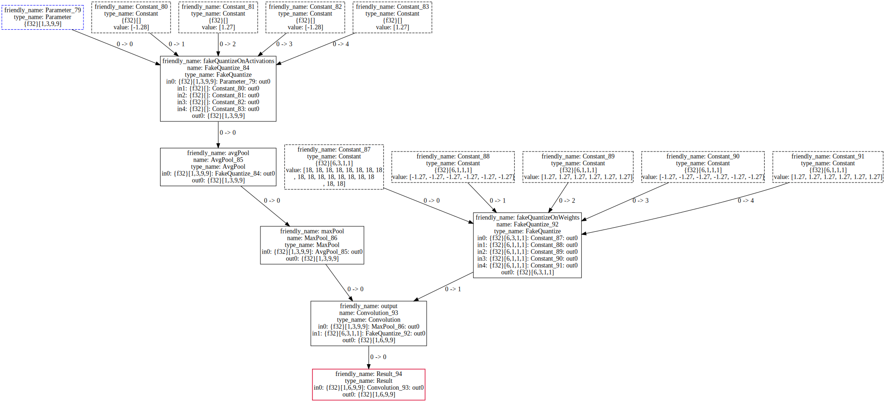

# OpenVINO™ Low Precision Transformations: FakeQuantizeDecompositionTransformation
## Introdaction
`FakeQuantizeDecompositionTransformation` decomposes `FakeQuantize` operation on quantize (`FakeQuantize` with low precision output) and dequantization operations (`Convert`, `Subtract` and `Multiply`). `FakeQuantize` result output precision depends on:
1. Next operation supported input precision. Customizable parameter `precisionsOnActivations` is used for identifying supported input precision.
2. Operation output intervals.

## Pipeline
### Original model
Note, please:
1. `FakeQuantize` operation output intervals are signed, default precision should be `signed int8`.  
2.  There is not `FakeQuantize` between `AvgPool` and `Convolution`
3. `Convolution` weights are quantized.

### Markup precisions

### Markup AvgPool precisions (CPU/GPU specific)

### Propagate precisions

### Transformations
