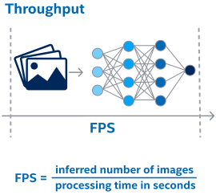

# Deployment Optimization Guide {#openvino_docs_deployment_optimization_guide_dldt_optimization_guide}

@sphinxdirective

.. toctree::
   :maxdepth: 1
   :hidden:
   
   openvino_docs_deployment_optimization_guide_dldt_optimization_guide_additional

@endsphinxdirective

To optimize your performance results during runtime step it is possible to experiment with: 

* Preprocess 

* Throughput mode  

* Async API 

* Lowering inference precision 

* Device optimization 

* Combination of devices 

## Preprocess

### Letting the Inference Engine Accelerate Image Pre-processing/Conversion <a name="image-preprocessing"></a>

In many cases, a network expects a pre-processed image, so make sure you do not perform unnecessary steps in your code:
- Model Optimizer can efficiently bake the mean and normalization (scale) values into the model (for example, weights of the first convolution). See <a href="#mo-knobs-related-to-performance">Model Optimizer Knobs Related to Performance</a>.
- If regular 8-bit per channel images are your native media (for instance, decoded frames), do not convert to the `FP32` on your side, as this is something that plugins can accelerate. Use the `InferenceEngine::Precision::U8` as your input format:<br>

@snippet snippets/dldt_optimization_guide1.cpp part1

Note that in many cases, you can directly share the (input) data with the Inference Engine.

## Throughput Mode

One way to increase computational efficiency is batching, which combines many (potentially tens) of input images to achieve optimal throughput. Internally, the execution resources are split/pinned into execution *streams*. Using this feature gains much better performance for the networks that originally are not scaled well with a number of threads (for example, lightweight topologies). This is especially pronounced for the many-core server machines. 



Run the Benchmark App and play with number of infer requests running in parallel, next section. Try different values of the -nstreams argument from 1 to a number of CPU cores and find one that provides the best performance. 

The throughput mode relaxes the requirement to saturate the CPU by using a large batch: running multiple independent inference requests in parallel often gives much better performance, than using a batch only. This allows you to simplify the app-logic, as you don't need to combine multiple inputs into a batch to achieve good CPU performance. Instead, it is possible to keep a separate infer request per camera or another source of input and process the requests in parallel using Async API. 

## Inference Engine Async API 

Inference Engine Async API can improve overall frame rate of the application. While accelerator is busy with the inference, the application can continue doing things on the host rather than wait for the inference to complete.

In the example below, inference is applied to the results of the video decoding. So it is possible to keep two parallel infer requests, and while the current is processed, the input frame for the next is being captured. This essentially hides the latency of capturing, so that the overall frame rate is rather determined only by the slowest part of the pipeline (decoding IR inference) and not by the sum of the stages.

You can compare the pseudo-codes for the regular and async-based approaches:

-	In the regular way, the frame is captured with OpenCV and then immediately processed:<br>

@snippet snippets/dldt_optimization_guide8.cpp part8


-	In the "true" async mode, the `NEXT` request is populated in the main (application) thread, while the `CURRENT` request is processed:<br>

@snippet snippets/dldt_optimization_guide9.cpp part9


The technique can be generalized to any available parallel slack. For example, you can do inference and simultaneously encode the resulting or previous frames or run further inference, like emotion detection on top of the face detection results.

There are important performance caveats though: for example, the tasks that run in parallel should try to avoid oversubscribing the shared compute resources. If the inference is performed on the HDDL and the CPU is essentially idle, it makes sense to do things on the CPU in parallel. However, multiple infer requests can oversubscribe that. Notice that heterogeneous execution can implicitly use the CPU, refer to <a href="#heterogeneity">Heterogeneity</a>.

Also, if the inference is performed on the graphics processing unit (GPU), it can take little gain to do the encoding, for instance, of the resulting video, on the same GPU in parallel, because the device is already busy.

Refer to the [Object Detection С++ Demo](@ref omz_demos_object_detection_demo_cpp), [Object Detection Python Demo](@ref omz_demos_object_detection_demo_python)(latency-oriented Async API showcase) and [Benchmark App Sample](../../samples/cpp/benchmark_app/README.md) (which has both latency and throughput-oriented modes) for complete examples of the Async API in action.

### Request-Based API and “GetBlob” Idiom <a name="new-request-based-api"></a>

Infer Request based API offers two types of request: Sync and Async. The Sync is considered below. The Async splits (synchronous) `Infer` into `StartAsync` and `Wait` (see <a href="#ie-async-api">Inference Engine Async API</a>).

More importantly, an infer request encapsulates the reference to the “executable” network and actual inputs/outputs. Now, when you load the network to the plugin, you get a reference to the executable network (you may consider that as a queue). Actual infer requests are created by the executable network:

```sh

@snippet snippets/dldt_optimization_guide6.cpp part6
```

`GetBlob` is a recommend way to communicate with the network, as it internally allocates the data with right padding/alignment for the device. For example, the GPU inputs/outputs blobs are mapped to the host (which is fast) if the `GetBlob` is used. But if you called the `SetBlob`, the copy (from/to the blob you have set) into the internal GPU plugin structures will happen.

### Performance Aspects of Running Multiple Requests Simultaneously <a name="running-multiple-requests-simultaneously"></a>

If your application simultaneously executes multiple infer requests:

- For the CPU, the best solution, you can use the <a href="#cpu-streams">CPU "throughput" mode</a>.
- If latency is of more concern, you can try the `EXCLUSIVE_ASYNC_REQUESTS` [configuration option](../OV_Runtime_UG/supported_plugins/CPU.md) that limits the number of the simultaneously executed requests for all (executable) networks that share the specific device to just one:

@snippet snippets/dldt_optimization_guide7.cpp part7

For more information on the executable networks notation, see <a href="#new-request-based-api">Request-Based API and “GetBlob” Idiom</a>.

- The heterogeneous device uses the `EXCLUSIVE_ASYNC_REQUESTS` by default.

- `KEY_EXCLUSIVE_ASYNC_REQUESTS` option affects only device queues of the individual application.

- For GPU, the actual work is serialized by a plugin and/or a driver anyway.

- Finally, for <a href="#myriad">any VPU flavor</a>, using multiple requests is a must for achieving good throughput. 

In the Inference Engine, there is no notion of requests priorities. It is left to the user side (for example, not queuing the low priority infer request, until another higher priority is waiting). Notice that it would require additional logic to synchronize between executable networks (queues) in your application code.

## Automatic Lowering of the Inference Precision 

Inference precision directly affects the performance. 

Model Optimizer can produce an IR with different precision. For example, an FP16 IR initially targets VPU and GPU devices, while, for example, for the CPU, an FP16 IR is    typically up-scaled to the regular FP32 automatically upon loading. But notice that further device-specific inference precision settings are available, 
for example, [8-bit integer](../OV_Runtime_UG/Int8Inference.md) or [bfloat16](../OV_Runtime_UG/Bfloat16Inference.md), which is specific to the CPU inference, below.
Note that for the [MULTI device](../OV_Runtime_UG/supported_plugins/MULTI.md) plugin that supports automatic inference on multiple devices in parallel, you can use an FP16 IR (no need for FP32).
You can find more information, including preferred data types for specific devices, in the
[Supported Devices](../OV_Runtime_UG/supported_plugins/Supported_Devices.md) document.


By default, plugins enable the optimizations that allow lower precision if the acceptable range of accuracy is preserved.
For example, for the CPU that supports the AVX512_BF16 instructions, an FP16/FP32 model is converted to a [bfloat16](../OV_Runtime_UG/Bfloat16Inference.md) IR to accelerate inference.

To compare the associated speedup, run the example command below to disable this feature on the CPU device with the AVX512_BF16 support and get regular FP32 execution:

```sh
$ benchmark_app -m <model.xml> -enforcebf16=false
 ```

Notice that for quantized (e.g. INT8) models the bfloat16 calculations (of the layers that remain in FP32) is disabled by default.
Refer to the [CPU Plugin documentation](../OV_Runtime_UG/supported_plugins/CPU.md) for more details.

Similarly, the GPU device automatically executes FP16 for the layers that remain in FP16 in the quantized models (assuming that the FP16 model was quantized).
Refer to the ENABLE_FP16_FOR_QUANTIZED_MODELS key in the [GPU Plugin documentation](../OV_Runtime_UG/supported_plugins/GPU.md).

## Device Optimizations

The Inference Engine supports several target devices (CPU, GPU, Intel&reg; Movidius&trade; Myriad&trade; 2 VPU, Intel&reg; Movidius&trade; Myriad&trade; X VPU, Intel® Vision Accelerator Design with Intel® Movidius™ Vision Processing Units (VPU)), and each of them has a corresponding plugin. If you want to optimize a specific device, you must keep in mind the following tips to increase the performance.

### CPU Checklist <a name="cpu-checklist"></a>

CPU plugin completely relies on the Intel&reg; Math Kernel Library for Deep Neural Networks (Intel&reg; MKL-DNN) for major primitives acceleration, for example, Convolutions or FullyConnected.

The only hint you can get from that is how the major primitives are accelerated (and you cannot change this). For example, on the Core machines, you should see variations of the `jit_avx2` when inspecting the <a href="#performance-counters">internal inference performance counters</a> (and additional '_int8' postfix for [int8 inference](../OV_Runtime_UG/Int8Inference.md)). If you are an advanced user, you can further trace the CPU execution with (see <a href="#vtune-examples">Intel&reg; VTune&trade;</a>).

Internally, the Inference Engine has a threading abstraction level, which allows for compiling the [open source version](https://github.com/opencv/dldt) with either Intel&reg; Threading Building Blocks (Intel&reg; TBB) which is now default, or OpenMP* as an alternative parallelism solution. When using inference on the CPU, this is particularly important to align threading model with the rest of your application (and any third-party libraries that you use) to avoid oversubscription. For more information, see <a href="#note-on-app-level-threading">Note on the App-Level Threading</a> section.

 Since R1 2019, the OpenVINO&trade; toolkit comes pre-compiled with Intel TBB,
 so any  OpenMP* API or environment settings (like `OMP_NUM_THREADS`) has no effect.
 Certain tweaks (like number of threads used for inference on the CPU) are still possible via  [CPU configuration options](../OV_Runtime_UG/supported_plugins/CPU.md).
 Finally, the OpenVINO CPU inference is NUMA-aware, please refer to the <a href="#note-on-numa">Tips for inference on NUMA systems</a> section.

Other general recommendations:
-	Usually, batching improves CPU performance. However, the need to gather frames in the batch might complicate the application logic. Instead, you can keep a separate infer request per camera or other source of input and process the requests in parallel. For more information, see the next section.
-	If your application simultaneously performs inference of multiple models on the same CPU, make sure you do not oversubscribe the machine. See <a href="#running-multiple-requests-simultaneously">Performance Aspects of Running Multiple Requests Simultaneously</a> for more information.
-	Notice that the heterogeneous execution might implicitly load the CPU. For details, refer to the <a href="#heterogeneity">Heterogeneity</a> section.
- 	Consider [8-bit integer inference on the CPU](../OV_Runtime_UG/Int8Inference.md).

#### Throughput Mode for CPU <a name="cpu-streams"></a>
Unlike most accelerators, CPU is perceived as an inherently latency-oriented device.
In fact, the OpenVINO does support the "throughput" mode for the CPU, which allows the Inference Engine to efficiently run multiple inference requests on the CPU simultaneously, greatly improving the overall throughput.

Internally, the execution resources are split/pinned into execution "streams".
This feature usually provides much better performance for the networks than batching. This is especially true for the many-core server machines:


Compared with the batching, the parallelism is somewhat transposed (i.e. performed over inputs, and much less within CNN ops):


Try the [Benchmark App](../../samples/cpp/benchmark_app/README.md) sample and play with number of streams running in parallel. The rule of thumb is tying up to a number of CPU cores on your machine.
For example, on an 8-core CPU, compare the `-nstreams 1` (which is a legacy, latency-oriented scenario) to the 2, 4, and 8 streams.

In addition, you can play with the batch size to find the throughput sweet spot.

If your application is hard or impossible to change in accordance with the multiple-requests logic, consider the "multiple-instance" trick to improve the throughput:  
-   For multi-socket execution, it is recommended to set   [`KEY_CPU_THREADS_NUM`](../OV_Runtime_UG/supported_plugins/CPU.md) to the number of cores per socket, and run as many instances of the application as you have sockets.
-   Similarly, for extremely lightweight networks (running faster than 1ms) and/or many-core machines (16+ cores), try limiting the number of CPU inference  threads to just `#&zwj;phys` cores and further, while trying to saturate the machine with running multiple instances of the application.

### GPU Checklist <a name="gpu-checklist"></a>

Inference Engine relies on the [Compute Library for Deep Neural Networks (clDNN)](https://01.org/cldnn) for Convolutional Neural Networks acceleration on Intel&reg; GPUs. Internally, clDNN uses OpenCL&trade; to implement the kernels. Thus, many general tips apply:

-	Prefer `FP16` over `FP32`, as the Model Optimizer can generate both variants and the `FP32` is default.
- 	Try to group individual infer jobs by using batches.
-	Notice that using the GPU introduces one-time overhead (order of few seconds) of compiling the OpenCL kernels. The compilation happens upon loading the network to the GPU plugin and does not affect the inference time.
-	If your application is simultaneously using the inference on the CPU or otherwise loads the host heavily, make sure that the OpenCL driver threads do not starve. You can use [CPU configuration options](../OV_Runtime_UG/supported_plugins/CPU.md) to limit number of inference threads for the CPU plugin.
-	In the GPU-only scenario, a GPU driver might occupy a CPU core with spin-looped polling for completion. If the _CPU_ utilization is a concern, consider the `KEY_CLDND_PLUGIN_THROTTLE` configuration option.

> **NOTE**: See the [Benchmark App Sample](../../samples/cpp/benchmark_app/README.md) code for a usage example. 
Notice that while disabling the polling, this option might reduce the GPU performance, so usually this option is used with multiple [GPU streams](../OV_Runtime_UG/supported_plugins/GPU.md). 


### Intel&reg; Movidius&trade; Myriad&trade; X Visual Processing Unit and Intel&reg; Vision Accelerator Design with Intel&reg; Movidius&trade; VPUs  <a name="myriad"></a>

Since Intel&reg; Movidius&trade; Myriad&trade; X Visual Processing Unit (Intel&reg; Movidius&trade; Myriad&trade; 2 VPU) communicates with the host over USB, minimum four infer requests in flight are recommended to hide the data transfer costs. See <a href="#new-request-based-api">Request-Based API and “GetBlob” Idiom</a> and [Benchmark App Sample](../../samples/cpp/benchmark_app/README.md) for more information.

Intel&reg; Vision Accelerator Design with Intel&reg; Movidius&trade; VPUs requires to keep at least 32 inference requests in flight to fully saturate the device.  

## Heterogeneity <a name="heterogeneity"></a>

Heterogeneous execution (constituted by the dedicated Inference Engine [“Hetero” plugin](../OV_Runtime_UG/supported_plugins/HETERO.md)) enables to schedule a network inference to the multiple devices.

### Typical Heterogeneous Scenarios of Concern <a name="heterogeneous-scenarios-of-concern"></a>

The primary points for executing a network in heterogeneous mode are as follows:

-	Calculate the heaviest pieces of the network with an accelerator while falling back to the CPU for the layers that are not supported by the accelerator.<br>
	This is particularly useful when certain custom (user) kernels are implemented only for the CPU (and much harder or even impossible to implement for the accelerator).

-	Use all available compute devices more efficiently, for example, by running branches of the network on the different devices.

### Heterogeneous Flow <a name="heterogeneous-flow"></a>

The execution through heterogeneous plugin has three distinct steps:

1.	**Applying affinity setting for the layers**, that is, binding them to the devices.

	-	This can be done automatically using *fallback priorities*, or on the *per-layer* basis.

	-	The affinity setting is made before loading the network to the (heterogeneous) plugin, so this is always a **static** setup with respect to execution.

2.	**Loading a network to the heterogeneous plugin**, which internally splits the network into subgraphs.<br>
	You can check the decisions the plugin makes, see <a href="#analyzing-heterogeneous-execution">Analysing the Heterogeneous Execution</a>.

3.	**Executing the infer requests**. From user’s side, this looks identical to a single-device case, while internally, the subgraphs are executed by actual plugins/devices.

Performance benefits of the heterogeneous execution depend heavily on the communications granularity between devices. If transmitting/converting data from one part device to another takes more time than the execution, the heterogeneous approach makes little or no sense. Using Intel&reg; VTune&trade; helps to visualize the execution flow on a timeline (see <a href="#vtune-examples">Intel&reg; VTune&trade; Examples</a>).

Similarly, if there are too much subgraphs, the synchronization and data transfers might eat the entire performance. In some cases, you can define the (coarser) affinity manually to avoid sending data back and forth many times during one inference.

The general affinity “rule of thumb” is to keep computationally-intensive kernels on the accelerator, and "glue" or helper  kernels on the CPU. Notice that this includes the granularity considerations. For example, running some custom activation (that comes after every accelerator-equipped convolution) on the CPU might result in performance degradation due to too much data type and/or layout conversions, even though the activation itself can be extremely fast. In this case, it might make sense to consider implementing the kernel for the accelerator (see <a href="#optimizing-custom-kernels">Optimizing Custom Kernels</a>). The conversions typically manifest themselves as outstanding (comparing to CPU-only execution) 'Reorder' entries (see <a href="#performance-counters">Internal Inference Performance Counters</a>).

For general details on the heterogeneous plugin, refer to the [corresponding section in the Inference Engine Developer Guide](../OV_Runtime_UG/supported_plugins/HETERO.md).

### Trying the Heterogeneous Plugin with Inference Engine Samples <a name="heterogeneous-plugin-with-samples"></a>

Every Inference Engine sample supports the `-d` (device) option.

For example, here is a command to run an [Classification Sample Async](../../samples/cpp/classification_sample_async/README.md):

```sh
./classification_sample_async -m <path_to_model>/Model.xml -i <path_to_pictures>/picture.jpg -d HETERO:GPU,CPU
```

where:

-	`HETERO` stands for Heterogeneous plugin.
-	`GPU,CPU` points to fallback policy with first priority on GPU and further fallback to CPU.

You can point more than two devices: `-d HETERO:HDDL,GPU,CPU`.

### General Tips on GPU/CPU Execution <a name="tips-on-gpu-cpu-execution"></a>

The following tips are provided to give general guidance on optimizing execution on GPU/CPU devices.

-	Generally, GPU performance is better on heavy kernels (like Convolutions) and large inputs. So if the network inference time is already too small (~1ms of execution time), using the GPU would unlikely give a boost.

-	A typical strategy to start with is to test the CPU-only and GPU-only scenarios first (with samples this is plain `-d CPU` or `-d GPU`). If there are specific kernels that are not supported by the GPU, the best option to try is the `HETERO:GPU,CPU` that automatically applies default splitting (based on the plugins layers support). Then, you can play with the manual affinity settings (for example, to further minimize the number of subgraphs).  

-	The general affinity “rule of thumb” is to keep computationally-intensive kernels on the accelerator, and "glue" (or helper) kernels on the CPU. Notice that this includes the granularity considerations. For example, running some (custom) activation on the CPU would result in too many conversions.

-	It is advised to do <a href="#analyzing-hetero-execution">performance analysis</a> to determine “hotspot” kernels, which should be the first candidates for offloading. At the same time, it is often more efficient to offload some reasonably sized sequence of kernels, rather than individual kernels, to minimize scheduling and other run-time overheads.

-	Notice that GPU can be busy with other tasks (like rendering). Similarly, the CPU can be in charge for the general OS routines and other application threads (see <a href="#note-on-app-level-threading">Note on the App-Level Threading</a>). Also, a high interrupt rate due to many subgraphs can raise the frequency of the one device and drag the frequency of another down.

-	Device performance can be affected by dynamic frequency scaling. For example, running long kernels on both devices simultaneously might eventually result in one or both devices stopping use of the Intel&reg; Turbo Boost Technology. This might result in overall performance decrease, even comparing to single-device scenario.

-	Mixing the `FP16` (GPU) and `FP32` (CPU) execution results in conversions and, thus, performance issues. If you are seeing a lot of heavy outstanding (compared to the CPU-only execution) Reorders, consider implementing actual GPU kernels. Refer to <a href="#performance-counters">Internal Inference Performance Counters</a> for more information.

### Analyzing Heterogeneous Execution <a name="analyzing-heterogeneous-execution"></a>

There is a dedicated configuration option that enables dumping the visualization of the subgraphs created by the heterogeneous plugin, please see code example in the [HETERO plugin documentation](../OV_Runtime_UG/supported_plugins/HETERO.md)

After enabling the configuration key, the heterogeneous plugin generates two files:

-	`hetero_affinity.dot` - per-layer affinities. This file is generated only if default fallback policy was executed (as otherwise you have set the affinities by yourself, so you know them).
-	`hetero_subgraphs.dot` - affinities per sub-graph. This file is written to the disk during execution of `Core::LoadNetwork` for the heterogeneous flow.

You can use GraphViz\* utility or `.dot` converters (for example, to `.png` or `.pdf`), like xdot\*, available on Linux\* OS with `sudo apt-get install xdot`. 

You can also use performance data (in the [Benchmark App](../../samples/cpp/benchmark_app/README.md), it is an option `-pc`) to get performance data on each subgraph. Again, refer to the [HETERO plugin documentation](../OV_Runtime_UG/supported_plugins/HETERO.md) and to <a href="#performance-counters">Internal Inference Performance Counters</a> for a general counters information.

## Multi-Device Execution <a name="multi-device-optimizations"></a>
OpenVINO&trade; toolkit supports automatic multi-device execution, please see [MULTI-Device plugin description](../OV_Runtime_UG/supported_plugins/MULTI.md).
In the next chapter you can find the device-specific tips, while this section covers few recommendations 
for the multi-device execution:
-	MULTI usually performs best when the fastest device is specified first in the list of the devices. 
    This is particularly important when the parallelism is not sufficient 
    (e.g. the number of request in the flight is not enough to saturate all devices).
- It is highly recommended to query the optimal number of inference requests directly from the instance of the ExecutionNetwork 
  (resulted from the LoadNetwork call with the specific multi-device configuration as a parameter). 
Please refer to the code of the [Benchmark App](../../samples/cpp/benchmark_app/README.md) sample for details.    
-   Notice that for example CPU+GPU execution performs better with certain knobs 
    which you can find in the code of the same [Benchmark App](../../samples/cpp/benchmark_app/README.md) sample.
    One specific example is disabling GPU driver polling, which in turn requires multiple GPU streams (which is already a default for the GPU) to amortize slower 
    inference completion from the device to the host.
-	Multi-device logic always attempts to save on the (e.g. inputs) data copies between device-agnostic, user-facing inference requests 
    and device-specific 'worker' requests that are being actually scheduled behind the scene. 
    To facilitate the copy savings, it is recommended to start the requests in the order that they were created 
    (with ExecutableNetwork's CreateInferRequest).
  
Refer to [Deployment Optimization Guide Additional Configurations](dldt_deployment_optimization_guide_additional.md) to read more about performance during deployment step and learn about threading, working with multi-socket CPUs and Basic Interoperability with Other APIs.
