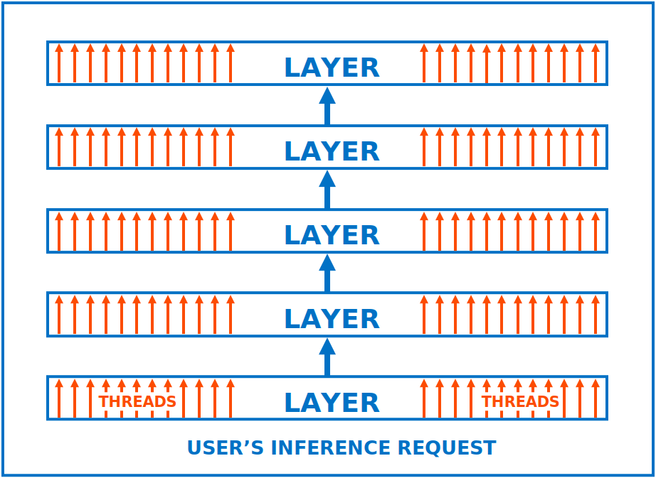
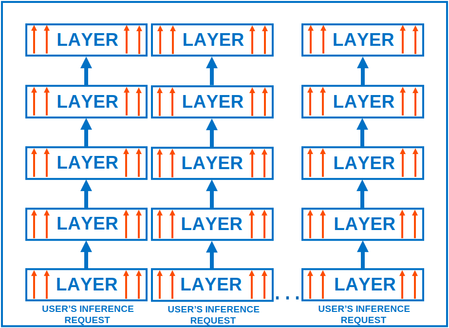
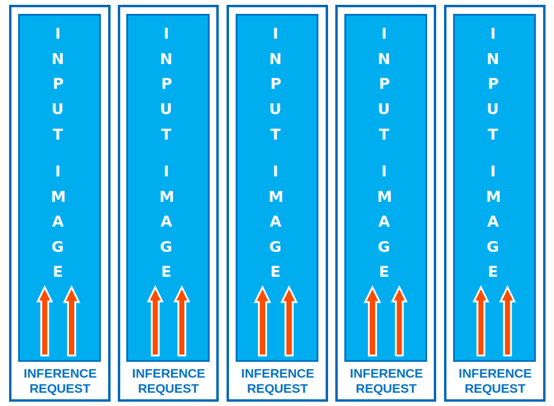
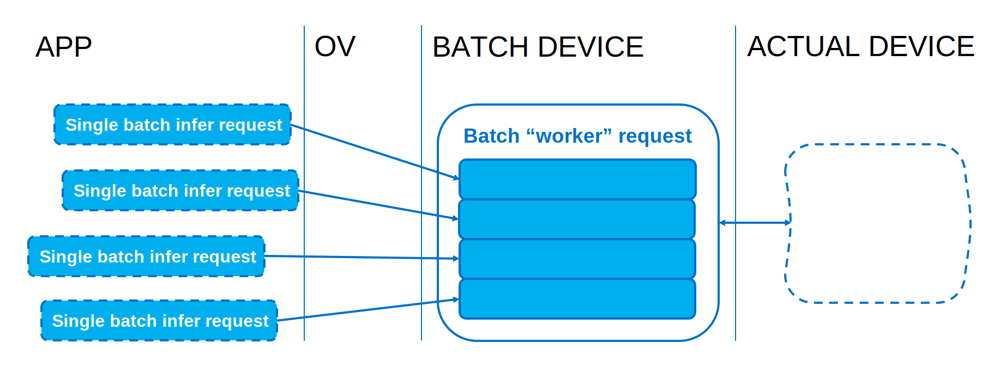

# Further Low-Level Implementation Details {#openvino_docs_deployment_optimization_guide_internals}
## Throughput on the CPU: Internals
As explained in the [throughput-related section](./dldt_deployment_optimization_tput.md), the OpenVINO streams are means of running multiple requests in parallel.
In order to best serve multiple inference requests executed simultaneously, the inference threads are grouped/pinned to the particular CPU cores, constituting the "CPU" streams.
This provides much better performance for the networks than batching, especially for the multiple-core systems:

| **Conventional Approach** | **Streams** |
| --- | --- |
| Every CNN op is internally parallelized over a full number of CPU cores and it is detrimental for non-scalable ops.  A lot of synchronization between many threads results in overhead.  Batching is an only option to improve efficiency. | CPU cores are evenly distributed between execution streams (each 1-4 threads).  Less threads per stream mean less synchronization, better locality, and finer granularity. |
|  |  |
| | Requests are executed in parallel with a small number of threads. ||
| | **Layer-wise, the streams imply much less synchronization.** ||

Compared to the batching, the parallelism is somewhat transposed (performed over inputs with much less synchronization within CNN ops):

| **Large Batch Approach** | **Streams** |
| --- | --- |
| All threads process all inputs at once.  All layers are assumed to be parallelized well.  "Fat" requests are executed one by one. | CPU cores are evenly distributed between execution streams.   "Parallelize the outermost loop" rule of thumb is applied.  Individual requests are executed in parallel. |
|  |  |
| | **Inputs-wise the streams are the "transposed" batch.** |

Keep in mind that [high-level performance hints](../OV_Runtime_UG/performance_hints.md) allow the implementation to select the optimal number of streams depending on model's compute demands and CPU capabilities, including [int8 inference](@ref openvino_docs_model_optimization_guide) hardware acceleration, number of cores, etc.

## Automatic Batching Internals
[Automatic batching](../OV_Runtime_UG/automatic_batching.md) performs on-the-fly grouping of inference requests to improve device utilization. 
It relaxes the requirement for an application to saturate devices such as GPU by using a large batch "explicitly". It performs transparent input gathering from individual inference requests followed by the actual batched execution, with no programming effort from the user:

Essentially, Automatic Batching shifts asynchronicity from individual requests to groups of requests that constitute the batches. Furthermore, for the execution to be efficient, it is very important that the requests arrive timely, without causing a batching timeout. 
Normally, the timeout should never be hit. It is rather a graceful way to handle the application exit (when the inputs are not arriving anymore, so the full batch is not possible to collect).

If a workload experiences timeouts, which lead to a drop in performance due to increased latency of every request, consider balancing its value against the batch size. For example, a smaller batch size and timeout value may yield better results than a large batch size coupled with a timeout value that cannot guarantee accommodating all the required requests.

Finally, following the `get_tensor` idiom section from the [general optimizations](./dldt_deployment_optimization_common.md) helps Automatic Batching to save on inputs/outputs copies. According to that, you should always prefer the "get" versions of the tensors' data access APIs in your applications. 
