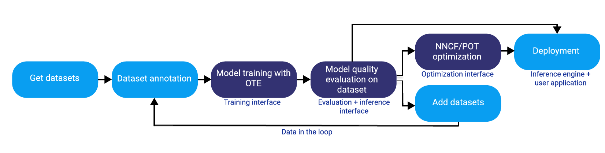

# OpenVINO™ 训练扩展 {#ote_documentation_zh_CN}


OpenVINO™ 训练扩展 (OTE) 提供了一套高级算法来训练深度学习模型，并使用 [OpenVINO™ 工具套件](https://software.intel.com/en-us/openvino-toolkit)对模型进行转换，以实现优化推理。您可以使用它导出模型，并将模型转换为所需的格式。OTE 独立创建和训练模型。它是开源的，并且在 [GitHub] (https://github.com/openvinotoolkit/training_extensions) 上提供。

## 详细工作流程



1. 要开始使用 OTE，请准备并注释数据集。例如，在 CVAT 上。

2. OTE 使用训练接口训练模型，并使用评估和推理接口评估数据集上的模型质量。

注意：准备一个单独的数据集或拆分您拥有的数据集，以便更准确地进行质量评估。

3. 成功收到评估结果后，您就有机会使用 NNCF 和 POT 部署模型或继续优化模型。有关这些框架的更多信息，请转到[优化指南](@ref openvino_docs_model_optimization_guide_zh_CN)。

如果结果不令人满意，请添加数据集，并从数据集注释开始执行相同的步骤。

## OTE 组件

- [OTE SDK](https://github.com/openvinotoolkit/training_extensions/tree/master/ote_sdk)
- [OTE CLI](https://github.com/openvinotoolkit/training_extensions/tree/master/ote_cli)
- [OTE 算法](https://github.com/openvinotoolkit/training_extensions/tree/master/external)

## 入门

## 必备条件

- Ubuntu 18.04 / 20.04
- Python 3.8+
- [CUDA 工具套件 11.1](https://developer.nvidia.com/cuda-11.1.1-download-archive) - 用于在 GPU 上训练
   请单击[此处](https://github.com/openvinotoolkit/training_extensions/tree/master/QUICK_START_GUIDE.md)开始使用 OpenVINO™ 训练扩展。

## 安装

1. 运行以下命令克隆工作目录中的存储库：

   ```
   git clone https://github.com/openvinotoolkit/training_extensions.git
   cd training_extensions
   git checkout -b develop origin/develop
   git submodule update --init --recursive
   ```

2. 运行以下命令安装必备组件：

   ```
   sudo apt-get install python3-pip python3-venv
   ```

3. 搜索可为不同任务类型创建 Python 虚拟环境的可用脚本：

   ```bash
   find external/ -name init_venv.sh
   ```

   示例输出：

   ```
   external/mmdetection/init_venv.sh
   external/mmsegmentation/init_venv.sh
   external/deep-object-reid/init_venv.sh
   ```

4. 创建、激活对象检测虚拟环境并安装 `ote_cli`：
   ```
   ./external/mmdetection/init_venv.sh det_venv
   source det_venv/bin/activate
   pip3 install -e ote_cli/
   ```
   如需了解有关 OTE CLI 命令的更多信息，请转到 [GitHub](https://github.com/openvinotoolkit/training_extensions/blob/master/QUICK_START_GUIDE.md)。

## 教程

[对象检测](https://github.com/openvinotoolkit/training_extensions/blob/master/ote_cli/notebooks/train.ipynb)

## 参与

如果您想要参与，请在开始创建拉取请求 (Pull Request) 之前参阅[参与指南](https://github.com/openvinotoolkit/training_extensions/blob/master/CONTRIBUTING.md)。

深度学习部署工具套件按照 [Apache 许可版本 2.0](https://github.com/openvinotoolkit/training_extensions/blob/master/LICENSE) 授予许可。
参与项目即表示您同意其中的许可和版权条款，并会根据这些条款进行参与。