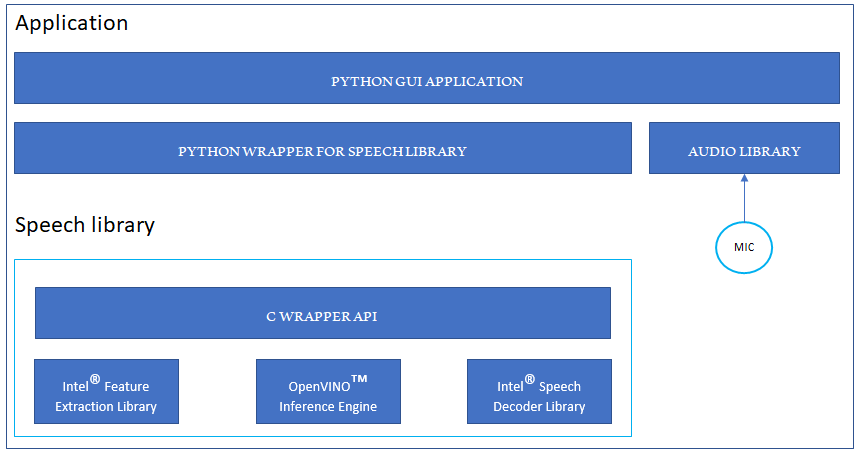

# Live Speech Recognition Demo {#openvino_inference_engine_samples_speech_libs_and_demos_Live_speech_recognition_demo}

This demo provides a GUI interface for automatic speech recognition using selected OpenVINO&trade; Inference Engine plugin, OpenVINO&trade; Feature Extraction Library, and OpenVINO&trade; Decoder Library.

## How It Works

The application transcribes audio from a WAV file and/or audio device. It supports recognition of two audio sources in parallel, for example audio coming from your microphone and audio coming from your PC (loopback). That enables use cases like audio conference or transcribing audio from an online video stream. Among other things, user can select a specific plugin to use for the recognition, set batch size, and control volume.

The software stack used by the demo is as follows:

## Running

The application main window looks like this:

Refer to the sections below for instructions for particular scenarios.

### Transcribing Speech from WAV File

Click **Select File (9)** and navigate to the audio file using the file selection window dialog. Ensure the selected audio format is 16 kHz, 16 bit, 1 channel stored as WAV.

Alternatively, use the audio file that is already selected upon launching the app.

Click **Recognize (10)**.

Transcription appear in the **Source 1** box.

### Transcribing Speech from Audio or Video Playback (Loopback)

Select a proper audio output device **(3)**.

Click **Recognize (5)** and play your video or other multimedia.

Transcription appears in the **Source 1** box.

> **NOTE**: Loopback on Linux\* OS may need manual settings in PulseAudio Control or via a config file.

### Transcribing Speech Captured with Microphone

Select a microphone **(6)**.

Click **Recognize (8)** and start speaking.

Transcription appears in the **Source 2** box.

### Transcribing Speech from Audio Output and Microphone at the Same Time (Audio Conference)

Select an audio output device **(3)**.

Select a microphone **(6)**.

Click both **Recognize** buttons: **(5)** and **(8)**. Then start speaking.

Transcriptions appear in both **Source 1** and **Source 2** boxes.

> **NOTE**: Loopback on Linux OS may need manual settings in PulseAudio Control or via a config file.

### Changing Speech Recognition Model

Select the desired configuration from the dropdown list **(1)**.

To reset the application to default configuration, click **Reload (2)**.

### Controlling Volume

Audio volume for each stream can be controlled with sliders **(4)** and **(7)**.
Current audio levels of each stream are shown in the bar on the same row as its source selector.

### Selecting Inference Engine Plugin

Select an Inference Engine plugin and batch size with **(11)** and **(12)**.

## Demo Output

The resulting transcription for each audio source is presented in the application in real time.
