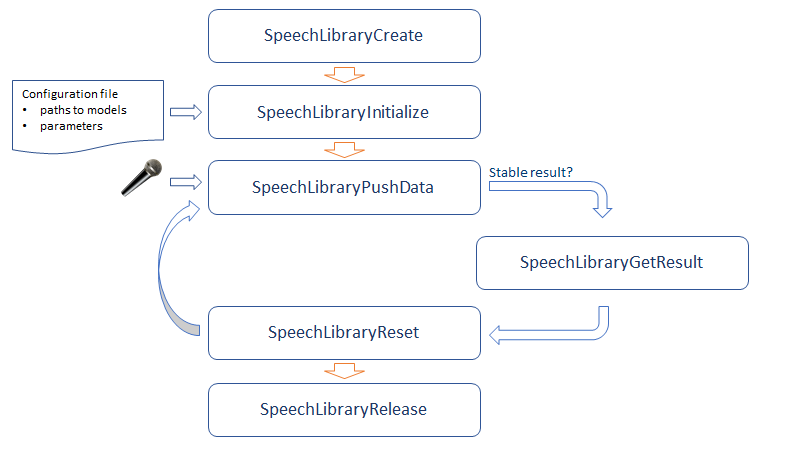

# Speech Library {#openvino_inference_engine_samples_speech_libs_and_demos_Speech_library}

## Overview

Speech Library provides an easy way to work with the end-to-end speech recognition pipeline.
The software stack is created to minimize effort required to build speech-enabled applications.
Speech Library wraps all of the processing blocks and exposes a simple API. The library takes care of proper initialization and data passing between all the components in the pipeline.

Speech Library contains:

- Two core binary libraries in the `lib` folder: Intel&reg; Feature Extraction library and Intel&reg; Speech Decoder
- Speech library source code in the `src` folder
- Speech library header files in the `include` folder. The library API is in the file `speech_library.h`.

To compile the libraries, please run a `.bat/.sh` file in the root folder of speech libraries and demos, or run the demonstration script `<INSTALL_DIR>/deployment_tools/demo/speech_recogintion.bat/sh`. 

## Architecture

The implementation of speech recognition pipeline used in demo applications is based on classic HMM/DNN approach.

The pipeline consists of the following stages:

1. Mel-frequency cepstral coefficients (MFCC) feature extraction: the input audio signal or waveform is processed by Intel&reg; Feature Extraction library to create a series of MFCC features
2. Neural acoustic scoring: the OpenVINO &trade; Inference Engine transcribes the extracted features into a sequence of phonemes using a neural acoustic model
3. Language model decoding: the Intel&reg; Speech Decoder turns the phonemes into text hypothesis. The decoding graph takes into account the grammar of the data, as well as the distribution and probabilities of contiguous specific words (n-grams)

## Speech Library API

The Speech Library API consists of simple routines:

* Build recognizer pipeline
* Provide audio samples for processing
* Inform about new stable recognition result

The flow is described below:

See `<INSTALL_DIR>/data_processing/audio/speech_recognition/include/speech_library.h` for details about the API.

A great example on how to use the API is the source code of [offline speech recognition demo](Offline_speech_recognition_demo.md).

## Run Your Application

Before running compiled binary files, make sure your application can find the Inference Engine, Speech, Decoder, and Feature Extraction libraries.

On Linux* operating systems, including Ubuntu*, the `LD_LIBRARY_PATH` environment variable is usually used to specify directories to search libraries in.

You can update the `LD_LIBRARY_PATH` with paths to the directories in the Inference Engine installation directory where the libraries are placed.

Please check `run_demo.sh` of offline and live speech recognition demos to learn how the `LD_LIBRARY_PATH` environment parameter can be set.
