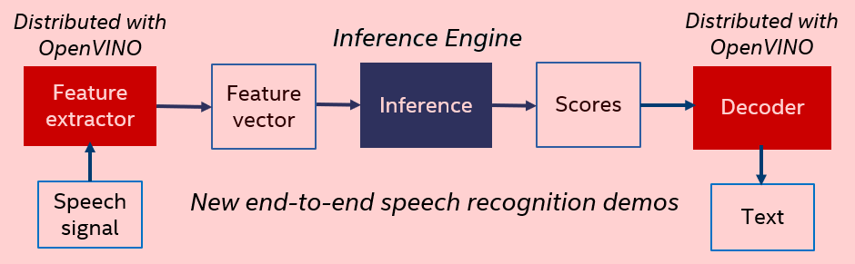
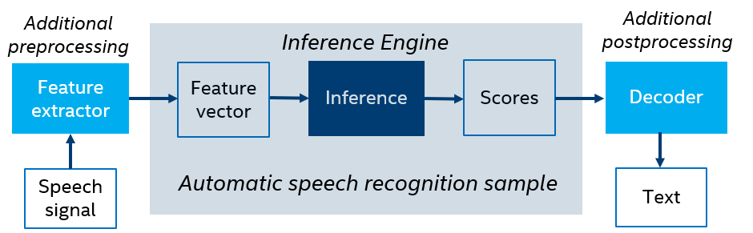

# Speech Library and Speech Recognition Demos {#openvino_inference_engine_samples_speech_libs_and_demos_Speech_libs_and_demos}

Starting with the 2020.1 release, OpenVINO&trade; provides a set of libraries and demos to demonstrate end-to-end
speech recognition, as well as new acoustic and language models that can work with these demos.
The libraries are designed for preprocessing (feature extraction) to get a feature vector from a speech signal, as well
as postprocessing (decoding) to produce text from scores. Together with OpenVINO&trade;-based neural-network speech recognition,
these libraries provide an end-to-end pipeline converting speech to text. This pipeline is demonstrated by the
end-to-end demos:



Note that the OpenVINO&trade; package also includes an [automatic speech recognition sample](../speech_sample/README.md) demonstrating acoustic model inference based on Kaldi\* neural networks. The sample works with Kaldi ARK files only, so it does not cover an end-to-end speech recognition scenario (speech to text),requiring additional preprocessing (feature extraction) to get a feature vector from a speech signal, as well as postprocessing (decoding) to produce text from scores:



The main purpose of the sample is to demonstrate a variety of features and options provided by OpenVINO&trade;
for speech recognition neural networks.

Find new libraries, demos, and models at `<INSTALL_DIR>/data_processing/audio/speech_recognition`.

> **NOTE**: These components are installed only if you select the **Inference Engine Runtime for Intel&reg; Gaussian & Neural Accelerator** component during installation. However, the Speech Library and speech recognition demos do not require the GNA accelerator. See <a href="#hardware-support">Hardware support</a> for details.

## Package Components

The package contains the following components:

* [Speech Library](Speech_library.md), which includes a feature extractor and decoder

* [Offline Speech Recognition Demo](Offline_speech_recognition_demo.md), which can process wave files with recorded speech

* [Live Speech Recognition Demo](Live_speech_recognition_demo.md), which showcases transcription from a microphone or speakers

* [Kaldi Statistical Language Model Conversion Tool](Kaldi_SLM_conversion_tool.md), which converts custom language models to use in the decoder

Additionally, [new acoustic and language models](http://download.01.org/opencv/2020/openvinotoolkit/2020.1/models_contrib/speech/kaldi/librispeech_s5/) to be used by new demos are located at [download.01.org](https://01.org/).

## <a name="run-demos">Run Speech Recognition Demos with Pretrained Models</a>

To download pretrained models and build all dependencies:

* On Linux* OS or macOS*, use the shell script `<INSTALL_DIR>/deployment_tools/demo/demo_speech_recognition.sh`

* On Windows* OS, use the batch file `<INSTALL_DIR>\deployment_tools\demo\demo_speech_recognition.bat`

The script follows the steps below:

  1. Downloads US English models trained on the LibriSpeech dataset prepared for direct usage by the Inference Engine
  2. Installs the required components
  3. Runs the command line offline demo
  4. Runs live speech recognition application with graphical interface

If you are behind a proxy, set the following environment variables in a console session before running the script:

* On Linux* OS and macOS*:

```sh
export http_proxy=http://{proxyHost}:{proxyPort}
export https_proxy=https://{proxyHost}:{proxyPort}
```

* On Windows* OS:

```sh
set http_proxy=http://{proxyHost}:{proxyPort}
set https_proxy=https://{proxyHost}:{proxyPort}
```

## <a name="hardware-support">Hardware Support</a>

The provided acoustic models have been tested on a CPU, graphics processing unit (GPU), and Intel&reg; Gaussian & Neural Accelerator (Intel&reg; GNA), and you can switch between these targets in offline and live speech recognition demos.  

> **NOTE**: Intel&reg; GNA is a specific low-power coprocessor, which offloads some workloads, thus saving power and CPU resources. If you use a processor supporting the GNA, such as Intel&reg; Core&trade; i3-8121U and Intel&reg; Core&trade; i7-1065G7, you can notice that CPU load is much lower when GNA is selected. If you selected GNA as a device for inference, and your processor does not support GNA, then execution is performed in the emulation mode (on CPU) because `GNA_AUTO` configuration option is used.   
> See [the GNA plugin documentation](https://docs.openvinotoolkit.org/latest/_docs_IE_DG_supported_plugins_GNA.html) for more information.

Speech Library provides a highly optimized implementation of preprocessing and postprocessing (feature extraction and decoding) on CPU only.

## Custom Models Requirements

Before running demonstration applications with custom models, follow the steps below:

1. Build the Speech Library and demonstration application using the `demo_speech_recognition.sh/.bat` file mentioned in <a href="#run-demos">Run Speech Recognition Demos with Pretrained Models</a>
2. Train acoustic and statistical language models using the Kaldi framework (if required)
3. [Convert the acoustic model](../../../docs/MO_DG/prepare_model/convert_model/Convert_Model_From_Kaldi.md) using Model Optimizer for Kaldi
4. [Convert the language model](Kaldi_SLM_conversion_tool.md) using the Kaldi toolkit and provided converter
5. Create a configuration file that lists all the models required for recognition
6. Copy configuration file to `{OpenVINO build folder}/data_processing/audio/speech_recognition/models/{LANG}`. The demo models are trained for US English, so use `en-us` for the `{LANG}` folder name.

Then you can use new models in the live speech recognition demo.
To perform speech recognition using a new model and the command-line application, provide the path to the new configuration file as an input argument of the application.

## Convert Acoustic Model with OpenVINO&trade; Model Optimizer for Kaldi*

In order to convert acoustic models, the following Kaldi files are required:

- Acoustic model file, `final.nnet` – RAW neural network without topology information
- Counts file, `pdf.counts` (if used)
- Feature transformation file, `final.feature_transform` (if used)

For conversion steps, follow [Converting a Kaldi* Model](../../../docs/MO_DG/prepare_model/convert_model/Convert_Model_From_Kaldi.md).

> **NOTE**: Set the path to the XML file with the converted model in the configuration file.

## Convert Language Model with Provided Converter

In order to convert language models, the following Kaldi files are required:
- Acoustic model with the Hidden Markov Model (HMM) topology, `final.mdl`
- Language model Weighted Finite-State Transducers (WFST) graph, `HCLG.wfst`
- Label symbol file, `words.txt`.

All these files are required to create resources for demo applications.

Model conversion from Kaldi requires the following steps:

1. Save HCLG WFST as the openFST const type:
   ```
   $KALDI_ROOT/tools/openfst/bin/fstconvert --fst_type=const HCLG.fst HCLG.const_fst
   ```

2. Generate transition ID information using `phones.txt` and `final.mdl`:
   ```
   $KALDI_ROOT/src/bin/show-transitions phones.txt final.mdl > transitions.txt
   ```

3. Convert HCLG WFST using resource conversion executable:
   ```
   kaldi_slm_conversion_tool HCLG.const_fst transitions.txt words.txt cl.fst labels.bin
   ```

> **NOTE**: Put the paths to `cl.fst` and `labels.bin` files in the configuration file to use them with the Live Speech Recognition Demo Application.

See the [offline speech recognition demo documentation](Offline_speech_recognition_demo.md) to learn about the configuration file format.

See [Kaldi* Statistical Language Model Conversion Tool](Kaldi_SLM_conversion_tool.md) for more information on the conversion tool.
