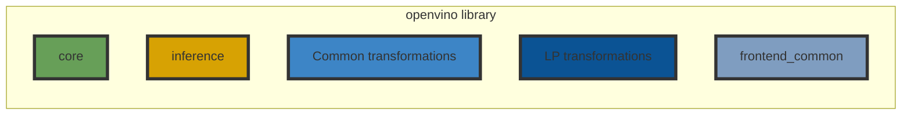

# OpenVINO™ Core Components

This section provides references and information about OpenVINO core components.

```
bindings/           // OpenVINO bindings
cmake/              // Common cmake scripts
common/             // Common components
core/               // OpenVINO core component provides model representation, operations and other core functionality
frontends/          // OpenVINO frontends
inference/          // Provides API for model inference
plugins/            // OpenVINO plugins
tests/              // A backed of tests binaries for core and plugins
```

## OpenVINO Runtime library

OpenVINO Runtime is a common OpenVINO library which provides functionality for Neural Network inference. The library includes next parts:



 * [core](./core/README.md) is responsible for model representation, contains a set of supported OpenVINO operations and base API for model modification.
 * [inference](./inference/README.md) provides the API for model inference on different accelerators.
 * Transformations:
    * [common transformations](../src/common/transformations) - a set of common transformations which are used for model optimization
    * [low precision transformations](../src/common/low_precision_transformations) - a set of transformations which are needed to optimize quantized models
 * **frontend_common** provides frontend common API which allows to support frontends for different frameworks.

## OpenVINO Frontends

OpenVINO Frontends allow to convert model from framework to OpenVINO representation.

Go to the [Frontends page](./frontends/README.md) to get more information.

## OpenVINO Plugins

OpenVINO Plugins provide support for hardware devices.

To get more information about supported OpenVINO Plugins, go to the [Plugins page](./plugins/README.md).

## OpenVINO Bindings

OpenVINO provides bindings for different languages. To get the full list of supported languages, go to the [bindings page](./bindings/README.md).

## Core developer topics

 * [OpenVINO architecture](./docs/architecture.md)
 * [Plugin Development](https://docs.openvino.ai/2025/documentation/openvino-extensibility/openvino-plugin-library.html)
 * [Thread safety](#todo)
 * [Performance](#todo)

## See also
 * [OpenVINO™ README](../README.md)
 * [Developer documentation](../docs/dev/index.md)
