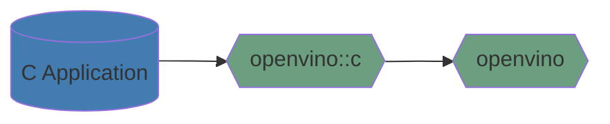

# OpenVINO C API

OpenVINO C API is a key part of the OpenVINO extension for C API users. This component provides C API for OpenVINO Toolkit.

OpenVINO C API uses [the common coding style rules](../../../docs/dev/coding_style.md).

## Key contacts

People from the [openvino-c-api-maintainers](https://github.com/orgs/openvinotoolkit/teams/openvino-c-api-maintainers) group have the rights to approve and merge PRs to the C API component. They can assist with any questions about C API component.

## Components

OpenVINO C API has the following structure:
 * [docs](./docs) contains developer documentation for OpenVINO C APIs.
 * [include](./include) contains all provided C API headers. [Learn more](https://docs.openvino.ai/2025/api/api_reference.html).
 * [src](./src) contains the implementations of all C APIs.
 * [tests](./tests) contains all tests for OpenVINO C APIs. [Learn more](./docs/how_to_write_unit_test.md).

## Tutorials

* [How to integrate OpenVINO C API with Your Application](https://docs.openvino.ai/2025/openvino-workflow/running-inference.html)
* [How to wrap OpenVINO objects with C](./docs/how_to_wrap_openvino_objects_with_c.md)
* [How to wrap OpenVINO interfaces with C](./docs/how_to_wrap_openvino_interfaces_with_c.md)
* [Samples implemented by OpenVINO C API](../../../samples/c/)
* [How to debug C API issues](./docs/how_to_debug_c_api_issues.md)
* [How to write unit test](./docs/how_to_write_unit_test.md)

## How to contribute to the OpenVINO repository

See [CONTRIBUTING](../../../CONTRIBUTING.md) for details.

## See also

 * [OpenVINO™ README](../../../README.md)
 * [OpenVINO Runtime C API User Guide](https://docs.openvino.ai/2025/openvino-workflow/running-inference.html)

