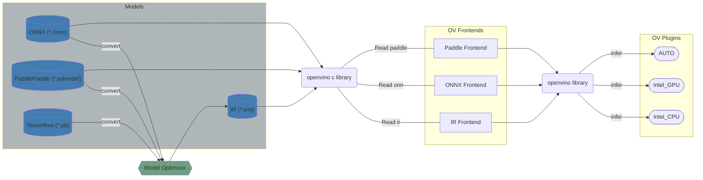

# OpenVINO C API

OpenVINO C API is key part to extend OpenVINO for C API users. This component is responsible for:
 * Representations for the objects in OpenVINO - this part using structure with C code to represent the classes & structures in OpenVINO, such as `ov_core_t` for `ov::Core`. For more details please read [Mapping Relationship of Objects](./docs/Mapping_Relationship_of_Objects.md).
 * Representations for the API in OpenVINO - this part implemented the most APIs provided by OpenVINO (read model, inference, property set and so on) with C code. For more information please read [Mapping Relationship of Interfaces](./docs/Mapping_Relationship_of_Interfaces.md).

OpenVINO C API uses [the common coding style rules](../../docs/dev/coding_style.md).

## Key person

People from the [openvino-c-api-maintainers](https://github.com/orgs/openvinotoolkit/teams/openvino-c-api-maintainers) allows to approve and merge PRs to the C API component. These guys can help in case of any questions about C API component.

## Components

OpenVINO C API has the next structure:
 * [docs](./docs) contains developer documentations for OpenVINO C APIs.
 * [include](./include) contains all provided C API headers. Details information about provided API can be found [here](https://docs.openvino.ai/).
 * [src](./src) contains the implementations of all C APIs.
 * [tests](./tests) contains all tests for OpenVINO C APIs. More information about OpenVINO C API tests can be found [here](./docs/How_to_Write_Unite_Test.md).

> **NOTE**: Here also includes C API (version 1.0) [header file](./include/c_api/ie_c_api.h), [source file](./src/ie_c_api.cpp), [unite test](./tests/ie_c_api_test.cpp), but version 2.0 is more recommended to users. 

## Tutorials

* [How to integrate OpenVINO C API with Your Application](https://docs.openvino.ai/)
* [How to wrap OpenVINO objects with C](./docs/How_to_Wrap_OpenVINO_Objects_with_C.md)
* [How to wrap OpenVINO interfaces with C](./docs/How_to_Wrap_OpenVINO_Interfaces_with_C.md)
* [Samples implemented by OpenVINO C API](./docs/Samples_Implemented_by_OpenVINO_C_API.md)
* [How to debug C API issues](./docs/How_to_Debug_C_API_Issues.md)
* [How to write unite test](./docs/How_to_Write_Unite_Test.md)

## How to contribute to the OpenVINO repository

See [CONTRIBUTING](../../../CONTRIBUTING.md) for details. Thank you!

## See also

 * [OpenVINO™ README](../../../README.md)
 * [Developer documentation](../../../docs/dev/index.md)
 * [OpenVINO Runtime C API User Guide](https://docs.openvino.ai/)
 * [Migration of OpenVINO C API](https://docs.openvino.ai/)
