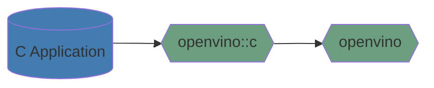

# OpenVINO C API

OpenVINO C API is key part to extend OpenVINO for C API users. This component provides C API for OpenVINO Toolkit.

OpenVINO C API uses [the common coding style rules](../../../docs/dev/coding_style.md).

## Key person

People from the [openvino-c-api-maintainers](https://github.com/orgs/openvinotoolkit/teams/openvino-c-api-maintainers) allows to approve and merge PRs to the C API component. These guys can help in case of any questions about C API component.

## Components

OpenVINO C API has the next structure:
 * [docs](./docs) contains developer documentations for OpenVINO C APIs.
 * [include](./include) contains all provided C API headers. Details information about provided API can be found [here](https://docs.openvino.ai/latest/api/api_reference.html).
 * [src](./src) contains the implementations of all C APIs.
 * [tests](./tests) contains all tests for OpenVINO C APIs. More information about OpenVINO C API tests can be found [here](./docs/how_to_write_unite_test.md).

> **NOTE**: Here also includes legacy API (for C) [header file](./include/c_api/ie_c_api.h), [source file](./src/ie_c_api.cpp), [unite test](./tests/ie_c_api_test.cpp), but no plan to extend legacy API anymore. So, C API 2.0 is more recommended to users. 

## Tutorials

* [How to integrate OpenVINO C API with Your Application](https://docs.openvino.ai/latest/openvino_docs_OV_UG_Integrate_OV_with_your_application.html)
* [How to wrap OpenVINO objects with C](./docs/how_to_wrap_openvino_objects_with_c.md)
* [How to wrap OpenVINO interfaces with C](./docs/how_to_wrap_openvino_interfaces_with_c.md)
* [Samples implemented by OpenVINO C API](./docs/samples_implemented_by_openVINO_c_api.md)
* [How to debug C API issues](./docs/how_to_debug_c_api_issues.md)
* [How to write unite test](./docs/how_to_write_unite_test.md)

## How to contribute to the OpenVINO repository

See [CONTRIBUTING](../../../CONTRIBUTING.md) for details. Thank you!

## See also

 * [OpenVINO™ README](../../../README.md)
 * [OpenVINO Runtime C API User Guide](https://docs.openvino.ai/latest/openvino_docs_OV_UG_Integrate_OV_with_your_application.html)
 * [Migration of OpenVINO C API](https://docs.openvino.ai/latest/openvino_2_0_transition_guide.html)
