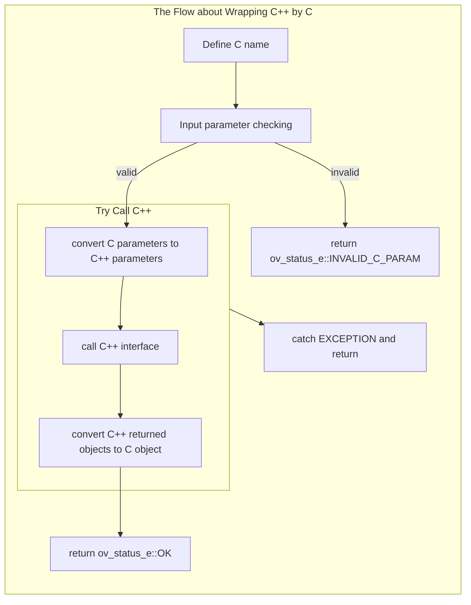

# How to wrap OpenVINO interfaces with C

Library `openvino_c` implements the most C++ interfaces provided in OpenVINO with C, the details mapping relationship can be found in [Mapping Relationship of Interfaces](./docs/Mapping_Relationship_of_Interfaces.md). Here is the details about how to wrap interfaces(C++) from OpenVINO to interfaces(C), main steps including:
 1) define C interface name and input parameters
 2) check the validation of input parameters
 3) convert C input parameters to C++ interface using
 4) call C++ interface and get return
 5) convert C++ return object to C object



According to the ability, all C provided interfaces can be classified to three kinds of methods:
- Wrap C++ interface to create object
- Wrap C++ interface to operate object
- C implement interfaces 

## Wrap C++ interface to create object
Like the C++ programming create `class` instance, C also need to create related object such as creating `ov::Core`, `ov::Model`, `ov::InferRequest` and so on. C wrap this operation directly and save a shared pointer to the object(C++) back to C `struct` object. Based on the above wrapping method, example about creating `ov::Core` instance will be introduction for more details to illustrate how to wrap C++ interfaces.

Thinking about the C++ interface `Core(const std::string& xml_config_file = {})`, C wrap as following:
```ruby
// 1) define C interface name and input parameters
ov_status_e ov_core_create_with_config(const char* xml_config_file, ov_core_t** core) {
    // 2) check the validation of input parameters
    if (!core || !xml_config_file) {
        return ov_status_e::INVALID_C_PARAM;
    }

    try {
        std::unique_ptr<ov_core_t> _core(new ov_core_t);
        _core->object = std::make_shared<ov::Core>(xml_config_file);   // 4) call C++ interface and get return
        *core = _core.release();                                       // 5) convert C++ return object to C object
    }
    CATCH_OV_EXCEPTIONS
    return ov_status_e::OK;
}

// 1) define C interface name and input parameters
ov_status_e ov_core_create(ov_core_t** core) {
    return ov_core_create_with_config("", core);
}
```
Because the C++ core create API has default parameter `const std::string& xml_config_file = {}`, C has to create two APIs for it. For default parameter missing case, C calls the func with default parameter but value is NULL. So the following introduction focus on the func with default parameter. The first define the API name `ov_core_create_with_config` and than do the input parameters checking. For core creates no need C parameters convert to C++, call C++ API directly and make a shared pointer `std::make_shared<ov::Core>(xml_config_file)`. Than get result from C++ call and save to C object `*core = _core.release()`. If no error, return success `return ov_status_e::OK;`. Note that almost all C interfaces pass a pointer parameter to save result, which also need to be freed after use.

## Wrap C++ interface to operate object
C++ interface provides many ways to operate instances, such as set/get property for core, infer request do infer, get info from model and so on. C also need provides those related operations. Here is an example about doing inference:
```ruby
// 1) define C interface name and input parameters
ov_status_e ov_infer_request_infer(ov_infer_request_t* infer_request) {
    // 2) check the validation of input parameters
    if (!infer_request) {
        return ov_status_e::INVALID_C_PARAM;
    }

    try {
        infer_request->object->infer(); // 4) call C++ interface
    }
    CATCH_OV_EXCEPTIONS

    return ov_status_e::OK;
}
```
This interface call C++ API directly without return value need to save. But need to note the input parameter, which is a C `struct` pointer for providing operation object.

## C implement interface
To provide more convenience for C users, C implements some C++ class by rewriting including `shape`, `dimension`, `partial shape` and so on. Because of this, C also implements some interface to create/operate C `struct` objects, which also needs the conversion from C object to C++ object before C++ call.

For example, the C `shape` created by
```ruby
ov_status_e ov_shape_create(const int64_t rank, const int64_t* dims, ov_shape_t* shape) {
    if (!shape || rank <= 0 || (dims && !check_shape_dimension(dims, rank))) {
        return ov_status_e::INVALID_C_PARAM;
    }

    try {
        std::unique_ptr<int64_t> _dims(new int64_t[rank]);
        shape->dims = _dims.release();
        if (dims) {
            std::memcpy(shape->dims, dims, rank * sizeof(int64_t));
        }
        shape->rank = rank;
    }
    CATCH_OV_EXCEPTIONS

    return ov_status_e::OK;
}
```
As we can see no C++ interface called. But when the object needs to be used for C++ call, which will provide info to create the related C++ object before call, such as:
```ruby
ov_status_e ov_tensor_create(const ov_element_type_e type, const ov_shape_t shape, ov_tensor_t** tensor) {
    if (!tensor || element_type_map.find(type) == element_type_map.end()) {
        return ov_status_e::INVALID_C_PARAM;
    }
    try {
        std::unique_ptr<ov_tensor_t> _tensor(new ov_tensor_t);
        auto tmp_type = get_element_type(type);
        ov::Shape tmp_shape;
        // the `ov_shape_t shape` need to be convert to `ov::Shape` for using
        std::copy_n(shape.dims, shape.rank, std::back_inserter(tmp_shape)); 
        _tensor->object = std::make_shared<ov::Tensor>(tmp_type, tmp_shape);
        *tensor = _tensor.release();
    }
    CATCH_OV_EXCEPTIONS
    return ov_status_e::OK;
}
```
The tensor create needs to specify the shape info, so C shape need to be converted to C++ class before C++ interface using. Vice versa, the object needs to convert to C rewriting object for C users convenience.

 ## See also
 * [Mapping Relationship of Objects](./docs/Mapping_Relationship_of_Objects.md)
 * [Mapping Relationship of Interfaces](./docs/Mapping_Relationship_of_Interfaces.md).


