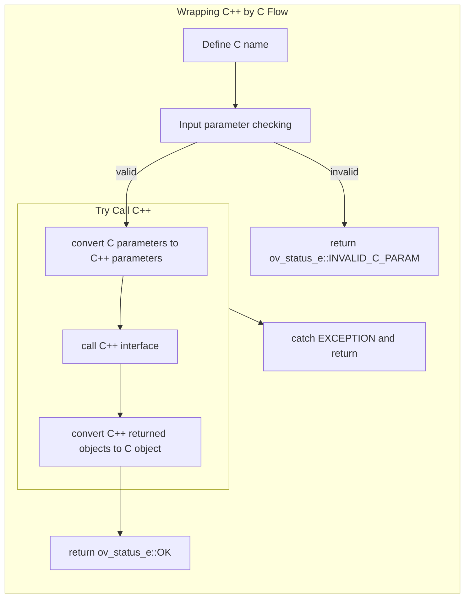

# How to wrap OpenVINO interfaces with C

The library `openvino_c` implements most C++ interfaces provided in OpenVINO with C.
This page describes how to wrap C++ interfaces from OpenVINO to C interfaces:
 1) Define C interface name and input parameters
 2) Check the validation of input parameters
 3) Convert C input parameters to C++ interface parameters
 4) Call C++ interface and get return object
 5) Convert C++ return object to C object

All C-provided interfaces can be classified into three types of methods:
- Wrap C++ interface to create an object
- Wrap C++ interface to operate an object
- Interfaces implemented by C

## Wrap C++ interface to create an object
Like the C++ programming create `class` instance, C also need to create related object such as creating `ov::Core`, `ov::Model`, `ov::InferRequest` and so on. C wrap this operation directly and save a shared pointer to the object(C++) back to C `struct` object. Based on the above wrapping method, example about creating `ov::Core` instance will be introduction for more details to illustrate how to wrap C++ interfaces.

Thinking about the C++ interface:

https://github.com/openvinotoolkit/openvino/blob/d96c25844d6cfd5ad131539c8a0928266127b05a/src/inference/include/openvino/runtime/core.hpp#L46-L58

C wrap as following:

https://github.com/openvinotoolkit/openvino/blob/d96c25844d6cfd5ad131539c8a0928266127b05a/src/bindings/c/src/ov_core.cpp#L48-L64

Because the C++ core create API has default parameter `const std::string& xml_config_file = {}`, C has to create two APIs for it. For default parameter missing case, C calls the func with default parameter but value is NULL. So the following introduction focus on the func with default parameter. The first define the API name `ov_core_create_with_config` and than do the input parameters checking. For core creates no need C parameters convert to C++, call C++ API directly and make a shared pointer `std::make_shared<ov::Core>(xml_config_file)`. Than get result from C++ call and save to C object `*core = _core.release()`. If no error, return success `return ov_status_e::OK;`. Note that almost all C interfaces pass a pointer parameter to save result, which also need to be freed after use.

## Wrap C++ interface to operate object
C++ interface provides many ways to operate instances, such as set/get property for core, infer request do infer, get info from model and so on. C also need provides those related operations. Here is an example about doing inference:

https://github.com/openvinotoolkit/openvino/blob/d96c25844d6cfd5ad131539c8a0928266127b05a/src/bindings/c/src/ov_infer_request.cpp#L236-L247

This interface call C++ API directly without return value need to save. But need to note the input parameter, which is a C `struct` pointer for providing operation object.

## C implement interface
To provide more convenience for C users, C implements some C++ class by rewriting including `shape`, `dimension`, `partial shape` and so on. Because of this, C also implements some interface to create/operate C `struct` objects, which also needs the conversion from C object to C++ object before C++ call.

For example, the C `shape` created by

https://github.com/openvinotoolkit/openvino/blob/d96c25844d6cfd5ad131539c8a0928266127b05a/src/bindings/c/src/ov_shape.cpp#L17-L33

As we can see no C++ interface called. But when the object needs to be used for C++ call, which will provide info to create the related C++ object before call, such as:

https://github.com/openvinotoolkit/openvino/blob/d96c25844d6cfd5ad131539c8a0928266127b05a/src/bindings/c/src/ov_tensor.cpp#L41-L55

The tensor create needs to specify the shape info, so C shape need to be converted to C++ class before C++ interface using. Vice versa, the object needs to convert to C rewriting object for C users convenience.

 ## See also
 * [OpenVINO™ README](../../../../README.md)
 * [C API developer guide](../README.md)
 * [C API Reference](https://docs.openvino.ai/2025/api/api_reference.html)
