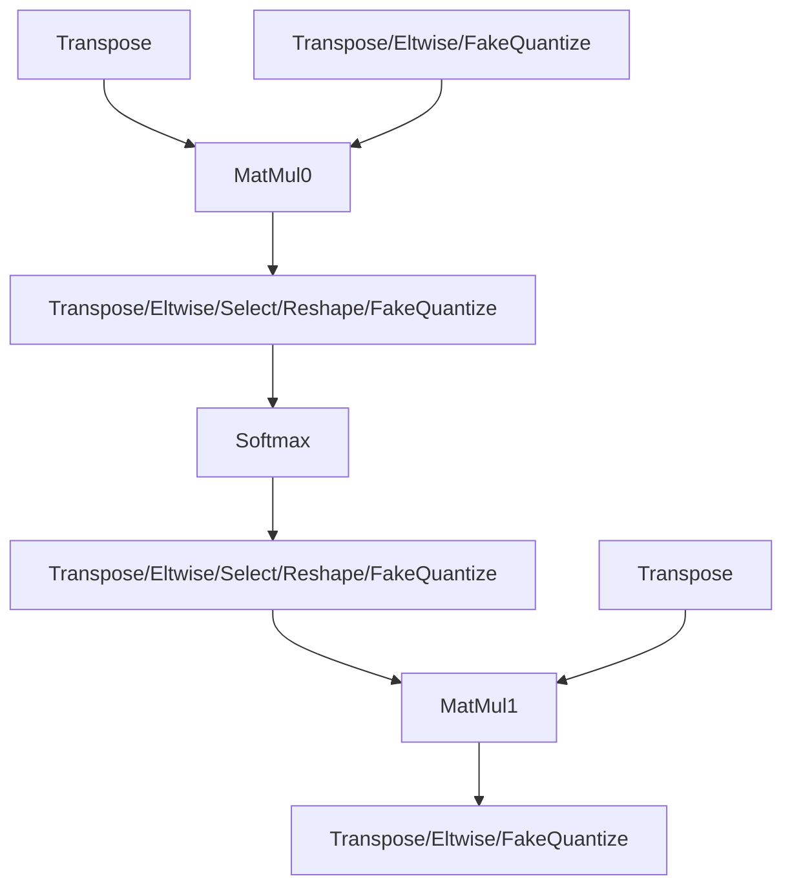
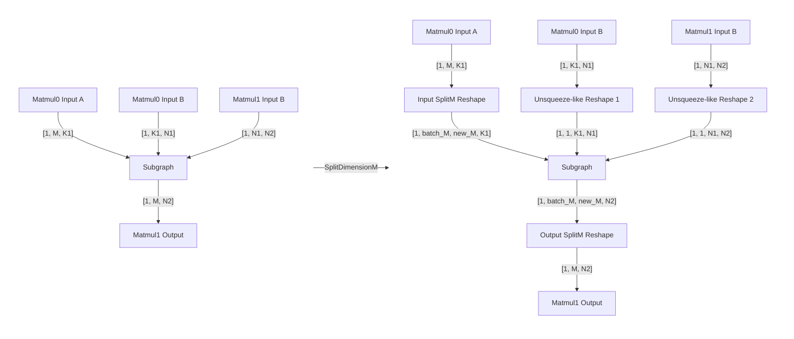

# MHA Optimization Guide

## Introduction

This guide explores the mechanism of the Multi Head Attention (MHA) patterns tokenization and several methods that are used for MHA performance optimization.
Also, there is provided several recommendations on how to fine-tune performance of the specific MHA pattern.

## MHA Tokenization

This structure represents the basic MHA pattern that can be tokenized by Snippets:

The main layers in MHA pattern are `MatMul0`, `Softmax` and `MatMul1`. Other layers are optional.
Please note, that layers, denoted by `/`, can represent both single nodes and sequences of nodes.
The code, which performs the tokenization, is placed in [TokenizeMHASnippets](../src/pass/mha_tokenization.cpp) transformation.

### CPU Plugin Callback for MHA Tokenization

The tokenization pass can be adjusted via callback
In CPU plugin, the callback disables tokenization in 3 types of cases:

1. Operations that are not supported by Snippets CPU backend.
For example, because fusing is not expected to bring sufficient optimization opportunities.
2. Operations skipped deliberately to allow for plugin-specific fusings.
For example, elementwise operations that follow Convolution nodes are skipped because the eltwises will be fused into Convolutions by the CPU plugin.
3. Operations that are not tokenized for performance reasons: executing MHA operations one-by-one may be faster in some cases.

The CPU plugin callback for TokenizeMHASnippets is placed in [transformation_pipeline.cpp](../../../plugins/intel_cpu/src/transformations/transformation_pipeline.cpp) file (please see the code in `MainSnippets` method).

**Please note that the CPU callback is usually ignored in cpu functional tests: SnippetsMode::IgnoreCallback is used for that**.
Currently, SnippetsMode has 3 states: `Enable`, `IgnoreCallback` and `Disable`.
For the details, please refer to [ov::intel_cpu::Config](../../../plugins/intel_cpu/src/config.h).

## Snippets Common Optimizations

After tokenization, snippets [common optimizations](../src/pass/common_optimizations.cpp) are applied to the tokenized Subgraphs.
These transformations can modify both the Subgraph's body and its surroundings (e.g. extract constant nodes outside the Subgraph).
Let's explore several transformations that can impact MHA performance.

### ExtractUnsupportedTransposes

[ExtractUnsupportedTransposes](../src/pass/extract_unsupported_transposes.cpp) moves up unsupported Transposes outside the Subgraph.

Snippets support 2 types of Transposes:

1. Transposes which are fused into Brgemm (which supports strided read/write) node by [FuseTransposeBrgemm](../src/pass/fuse_transpose_brgemm.cpp) data flow transformation.
The supported Transpose orders for Brgemm fusion are defined by `TokenizeMHASnippets::get_fusion_transpose_order` in [mha_tokenization.cpp](../src/pass/mha_tokenization.cpp)
2. The rest of transposes are decomposed by [TransposeDecomposition](../src/pass/transpose_decomposition.cpp) data flow transformation.
The supported by decomposition Transpose orders are defined by `TokenizeMHASnippets::get_decomposed_transpose_order` in [mha_tokenization.cpp](../src/pass/mha_tokenization.cpp)

**Please note: the "unsupported" Transpose actually can be executed via Snippets decomposition, however CPU plugin implementation is expected to work faster in this particular case.**

### SplitDimensionM

[SplitDimensionM](../src/pass/split_dimension_m.cpp) splits M dimension of MHA in 2 parts (`batch_m` and `new_m`) by inserting Reshape on A input of the first Matmul and output of the second Matmul (the rest Subgraph's inputs are reshaped by Unsqueeze-like reshapes in order not to break subgraph semantic).
This optimization increases parallel work amount by `batch_m` times thus enabling a more efficient parallel execution in some cases.
The splitting is performed based on heuristic algorithm which can be found in `SplitDimensionM::split` method.

Let's consider an example of the transformation:

**Important notes:**
- Since `SplitDimensionM` depends on parallel concurrency, the transformation result depends not only on the HW platform, but on number of streams used during model inference as well.
For instance, this might lead to different result in throughput and latency hint modes.
- `SplitDimensionM::can_be_optimized` is used in CPU plugin callback: if this method reports that appropriate parallel work amount can not be set for the MHA, the tokenization doesn't happen.

## Brgemm Blocking

Within the Snippets CPU backend, the MatMul is executed using the Brgemm primitive.
For enhancing the execution efficiency, blocking across the M, K, and N matmul dimensions is used.

### Blocking Parameters

The heuristics for determining the optimal block sizes can be found in [BrgemmCPUBlocking](../../../plugins/intel_cpu/src/transformations/snippets/x64/pass/lowered/brgemm_cpu_blocking.cpp).

**Please note: Blocking by M dimension is shared between both Brgemms. Please see [SplitLoops](../include/snippets/lowered/pass/split_loops.hpp) lowered pass for the details.**

### Blocking Order

The lowered pass [BrgemmBlocking](../../../common/snippets/src/lowered/pass/brgemm_blocking.cpp) performs blocking loops creation on LinearIR.
Currently, the order of blocking loops is following (from outer to inner): `M->N->K`.

## MHA Performance Tuning Recommendations

Based on previously discussed information, we provide the following recommendations for the MHA performance fine-tuning:

1. Check if there are MHA's which were not tokenized because of [CPU plugin callback](#cpu-plugin-callback-for-mha-tokenization).
2. Check how the graph was changed by [CommonOptimizations](#snippets-common-optimizations).
In local experiments, some transformations might be worth to change:
    - Disable [ExtractUnsupportedTransposes](#extractunsupportedtransposes) transformation in order to benchmark Snippets Transpose implementation.
    - Adjust [SplitDimensionM](#splitdimensionm) heuristics in order to benchmark another splitting, or disable the pass at all.
3. [Blocking parameters](#blocking-parameters): adjust blocking heuristics in `BrgemmCPUBlocking`.
    - Please note that there are 2 Matmul nodes inside a single MHA, and each Matmul can have his own optimal K, N blocking params.
    M block is better to keep the same since the corresponding blocking loop is shared between both Matmuls.
    - For the BF16/INT8 blocking loops, 2 options are possible: blocking can be done only for Brgemm node, or for BrgemmCopyB repacking too.

Following these recommendations, the performance of some specific MHA patters can be fine-tuned.
Additionally, the results of these experiments can be used as a solid foundation for the subsequent heuristics adjustments.