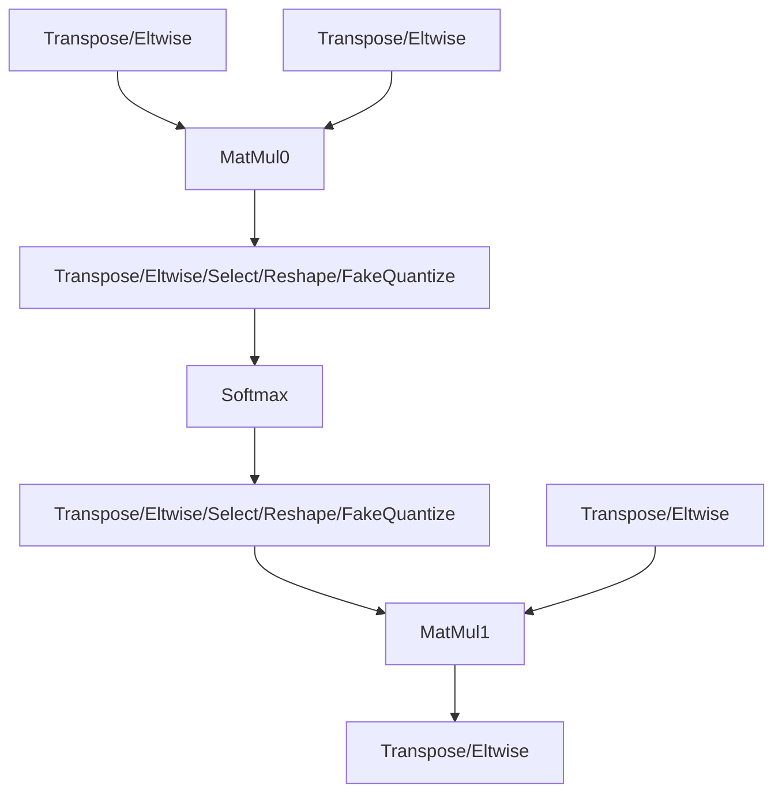

# MHA Optimization Guide

## Introduction

This guide explores the mechanism of the Multi Head Attention (MHA) patterns tokenization and several methods that are used for MHA performance optimization. Also, there is provided several recommendations on how to fine-tune performance of the specific MHA pattern.

## MHA Tokenization

This structure represents the basic MHA pattern that can be tokenized by Snippets MHA pattern:

Please note, that layers, denoted by `/`, can represent both single nodes and sequences of nodes. The code, which performs the tokenization, is placed in [TokenizeMHASnippets](../src/pass/mha_tokenization.cpp) transformation.

### CPU Plugin Callback for MHA Tokenization

The tokenization can be regulated via callback. In CPU plugin, the callback prevents tokenization in certain cases, which can be categorized into two types:

1. Pattern unsupported by Snippets CPU backend.
2. Tokenization restrictions for performance reasons: executing MHA as separated operations may be faster in some cases.

The CPU plugin callback for TokenizeMHASnippets is placed in [transformation_pipeline.cpp](../../../plugins/intel_cpu/src/transformations/transformation_pipeline.cpp) file (please see the code in `MainSnippets` method).

**Please note that the CPU callback is usually ignored in cpu functional tests.**

## Snippets Common Optimizations

After tokenization, snippets [common optimizations](../src/pass/common_optimizations.cpp) are applied to the tokenized Subgraphs. These transformations can modify both the Subgraph's body and its surroundings (e.g. extract constant nodes outside the Subgraph). Let's explore several transformations that can impact MHA performance.

### ExtractUnsupportedTransposes

[ExtractUnsupportedTransposes](../src/pass/extract_unsupported_transposes.cpp) moves up unsupported Transposes outside the Subgraph. **Please note: the "unsupported" Transpose actually can be executed via Snippets, however CPU plugin implementation usually works faster.**

### SplitDimensionM

[SplitDimensionM](../src/pass/split_dimension_m.cpp) splits M dimension of MHA on 2 parts (`batch_m` and `new_m`) by inserting Reshape on A input of the first Matmul and output of the second Matmul (the rest Subgraph's inputs are reshaped by Unsqueeze-like reshapes in order not to break subgraph semantic). This allows to increase parallel work amount due to `batch_m`. The splitting is performed based on heuristic algorithm which can be found in `SplitDimensionM::get_splited_dimensions` method.

**Important notes:**
- Since `SplitDimensionM` depends on parallel concurrency (number of threads which are used in one stream), the transformation result depends not only on the HW platform, but on number of streams used during model inference as well. For instance, this might lead to different result in throughput and latency hint modes.
- `SplitDimensionM::can_be_optimized` is used in CPU plugin callback: if this method reports that appropriate parallel work amount can not be set for the MHA, the tokenization doesn't happen.

## Brgemm Blocking

Within the Snippets CPU backend, the MatMul is executed using the Brgemm primitive. For enhancing the execution efficiency, blocking across the M, K, and N matmul dimensions is used.

### Blocking Parameters

The heuristics for determining the optimal block sizes can be found in [SetBrgemmCPUBlockingParams](../../../plugins/intel_cpu/src/transformations/snippets/x64/pass/set_brgemm_cpu_blocking_params.cpp).

**Important notes:**
- Blocking by M dimension is shared between both Brgemms. Please see [SplitLoops](../include/snippets/lowered/pass/split_loops.hpp) lowered pass for the details.
- The heuristics from `SetBrgemmCPUBlockingParams` are not currently applied by K and N dimensions for BF16/INT8 Brgemms, although it is technically supported.

### Blocking Order

The lowered pass [BrgemmBlocking](../../../plugins/intel_cpu/src/transformations/snippets/x64/pass/lowered/brgemm_blocking.cpp) performs blocking loops creation on LinearIR. Currently, the order of blocking loops is following (from outer to inner): `M->N->K`.

## MHA Performance Tuning Recommendations

Buiding on the information presented upper, this section focuses on providing recommendations for fine-tuning the performance of specific MHA pattern.

1. Check if there are MHA's which were not tokenized because of [CPU plugin callback](#cpu-plugin-callback-for-mha-tokenization).
2. Check how the graph was changed by [CommonOptimizations](#snippets-common-optimizations). In local experiments, some transformations might be worth to change:
    - Disable [ExtractUnsupportedTransposes](#extractunsupportedtransposes) transformation in order to benchmark Snippets Transpose implementation.
    - Adjust [SplitDimensionM](#splitdimensionm) heuristics in order to benchmark another splitting, or disable the pass at all.
3. [Blocking parameters](#blocking-parameters): adjust blocking heuristics in `SetBrgemmCPUBlockingParams`.
    - Please note that there is 2 Matmul nodes inside a single MHA, and each Matmul can have his own optimal K, N blocking params. M block is better to keep the same since the corresponding blocking loop is shared between both Matmuls.
    - For the BF16/INT8 blocking loops, 2 options are possible: blocking can be done only for Brgemm node, or for BrgemmCopyB repacking too.
4. [Blocking order](#blocking-order): blocking order changing might have an effect as well. But please note, that blocking by M dimensions is shared between both Brgemms only if blocking by M is outermost.

By following these recommendations, signifficant performance improvement for the specific MHA can be achieved. Additionally, the results of these experiments can be used as a solid foundation for the subsequent heuristics adjusting.