# Snippets Design Guide
## Introduction

Any artificial neural network topology can be represented as a sequence of mathematical operations (or `Ops`) on some data. 
The first thing we need to do in order to evaluate an `Op` is to load its input data to the processing unit (typically CPU or GPU, we consider CPU below for definiteness). 
Then the unit can perform all the necessary manipulations with the data. 
When this stage is finished, the computation results should be stored back to memory to make space for the next portion of input data, and also to make the results available to subsequent `Ops`. 
So basically an `Op` execution time is defined by two factors: how fast we can move data from the memory to the processor (and back), and how fast the processor can perform the computations. 
These factors are called memory and computation bandwidth, respectively.

Due to significant advancements in microprocessor technologies, computational bandwidth has grown faster than the memory bandwidth over the past decades. 
As a result, the majority of `Ops` are memory-bound, so their execution time is controlled by a memory bandwidth. 
The rare exceptions include convolutions and matrix multiplications. 
These exceptions could be very important for some workloads, so a lot of work is done to increase their computational bandwidth (Advanced Matrix Registers for example). 
However, this topic is covered elsewhere and here we will focus on more common memory-bound `Ops`.

A typical approach to accelerate execution of memory-bound `Ops` is to perform vertical fusings (or simply fusings below). 
It is important to understand the concept of fusings, so let's cover it in more detail. 
Imagine we need to execute two operations as a part of our workflow: `Op 1` and `Op 2`, as shown on the picture below.

`Op 1` takes `Tensor 1` as a single input and produces `Tensor 2` as an output, this tensor is then read by `Op 2` that in turn produces `Tensor 3`. 

A typical execution pipeline of this minimalistic example is depicted on the next figure. 
Note that the pipeline is usually deployed on multicore processing units which can run several execution threads in parallel.
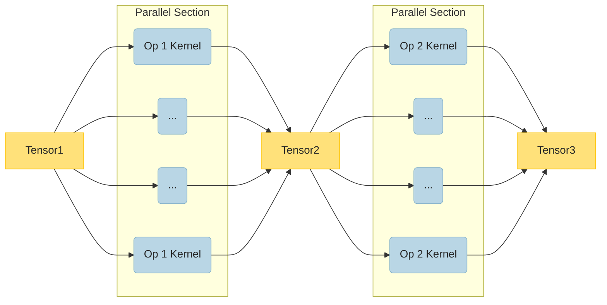
 In order to take advantage of the multithreading, the `Op's` input tensor is divided into several blocks that could be processed independently, we will call them `subtensors`. 
 Then each of the threads executes its own copy of `Op's` kernel that reads only a part of the input tensor and writes a corresponding part of the output tensor. 
 As one can see from the picture, tensors serve as synchronisation points between parallel regions. 
 It means that a thread that finished earlier has to wait for all other threads to complete the task, which could impact overall performance of the pipeline.

To understand another potential performance bottleneck, let's have a look at `Op 1 Kernel` implementation scheme which is shown on the graph below.
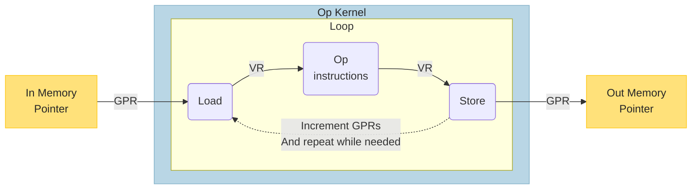
In order to make any manipulations with data, the kernel needs to know where the input data is located and where it should place the output data. 
So the typical kernel takes input and output memory pointers as runtime arguments. 
In our example, input memory pointers are passed to the kernel in general-purpose registers (note the `GPR` label on the arrow to `Load`). 
At first, a small portion of data is loaded from this location into a vector register (or several registers), which is designated by the `Load` box and `VR` label on the picture. 
Then the kernel performs all the necessary manipulations with the registers (the `Op instructions` box) and places the result in another vector register. 
This result should then be written to memory using the provided output memory pointer (the `Store` box). 
Note that each vector register can contain only a tiny amount of data (16 32 bit floats on modern processors, for example), so the described loop should be repeated many times. 
Also keep in mind that we need to increment `GPRs` after every iteration to account for the processed data entries.

So the kernel has three main blocks: `Op instructions`, `Load` and `Store`. 
Let's now consider what factors impact their performance. 
The `Op instructions` works with data that is already in vector registers, so its execution time is computation bound. 
On the contrary, the `Load` and `Store` blocks move data between the memory and vector registers, so their performance is controlled by the memory bandwidth. 
Note that almost every modern processor has a very high-bandwidth on-chip memory called cache, so we don't have to load data directly from RAM on every iteration of the kernel loop. 
Instead, a larger data chunks, are copied from RAM to cache, and then the kernel can load from the cache. 
This however doesn't change the overall picture since every data record should be copied all the way from RAM to the vector register. 
As was discussed in the beginning of this section, computational bandwidth of modern processors is usually much higher than the memory bandwidth, so the overall kernel performance is controlled by the performance of the `Load` and `Store` blocks.

In order to tackle this problem, we need to perform more computations per every loaded data entry. 
One of the ways to do so is to fuse consecutive operations into one kernel, as shown on the figure below.
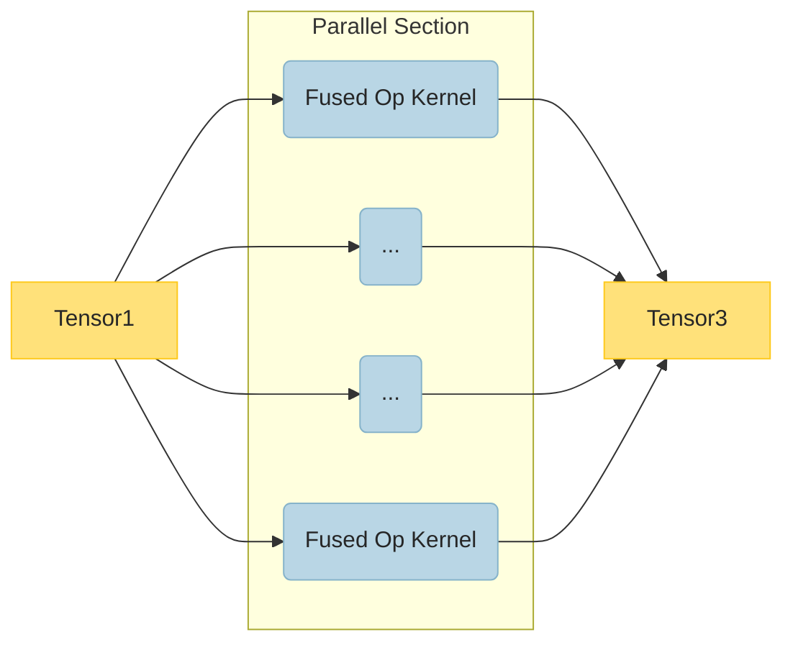
Note that there is no `Tensor 2` anymore, since the `Fused Op Kernel` reads from `Tensor 1`, performs both `Op 1` and `Op 2` calculations, and writes directly to `Tensor 3`. 
It's important to keep in mind that not every two operations could be fused, since a thread needs to work on its piece of data independently in order to run in parallel. 
So there must be no data dependencies between the parts of `Tensor 1` or `Tensor 2` assigned to different threads. 
A good example of such operations is addition and multiplication (or any other elementwise `Ops`), since every data entry is processed independently of the others. 
It doesn't mean that other operations can't be fused, but additional care must be taken to account for data dependencies. 

Fusings could significantly improve performance. 
Firstly, fusing eliminates thread synchronization point, since there is no `Tensor 2` anymore. 
Secondly, as shown on the scheme below, fused op kernel executes both `Op 1` and `Op 2 instructions` without redundant `Store` and `Load`.
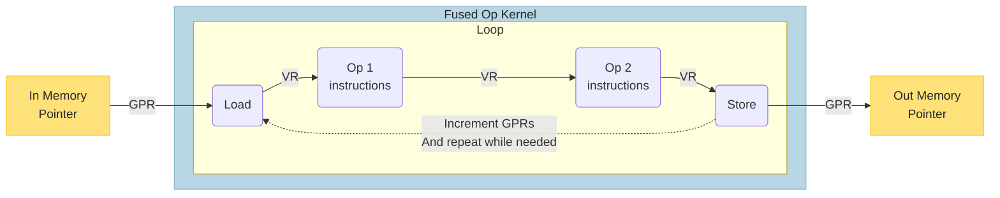
In other words, instead of writing the results of `Op 1 instructions` to memory (via `Store`) and reading them back (via `Load`), `Op 2 instructions` are executed directly on vector registers available after `Op 1 instructions'` execution. 
This way we increase the amount of computations performed per every `Load`-`Store` cycle and thus relax the memory bandwidth limitation.

The described fusing technique is well-established and widely used across the industry. 
It is especially profitable, since it allows one to reduce execution time without any associated accuracy penalties.
Note however, that fusings are not entirely free, since they are introducing additional complications to existing pipeline: 
* First, you have to implement single `Op` jit kernels (`Load`, `Store`, `Op instructions` blocks).
* Next, you need a mechanism that allows to merge several jit kernels into one (execute several `Op instructions` blocks inside one kernel).
* Finally, you need to develop an algorithm that understands what kinds of `Ops` can be fused, and accounts for their data dependencies.

A common approach to tackle these issues is to create a set of hand-crafted fusing transformations. 
For instance, OneDNN offers a post-ops fusing mechanism, and it is relatively easy to implement fusigns of simple elementwise operations using this mechanism. 
This approach has proven to be both convenient and effective in the past, however it does not meet the demands of the present. 
Indeed, a rapidly increasing variety of deep-learning models creates an even faster growing demand for new fusing patters. 
This makes it increasingly expensive to support and extend the set of hand-crafted fusing transformations, so a new more scalable approach is required. 
The `Snippets` were specifically designed to address this issue.

The `Snippets` is a code generation framework that provides a scalable approach to operations' fusings and  enablement. 
One of the most distinctive feature of `Snippets` is a flexible yet universal design. 
They are not bound to a specific backend or concrete kernel implementations, but provide a jit kernel interface instead. 
This interface allows `Snippets` to perform register assignment as well as a wide range of other backend-independent optimizations. 
`Snippets` are also highly configurable and allow a backend to provide a custom optimizations that can be executed at different stages of the pipeline. 
This unique combination of flexibility and scalability is driven by `Snippets` design, so let's discuss it in more detail. 

## Design
Before we consider any specific transformations and implementation features, it is very useful to keep in mind a clear coarse-grained picture of the whole pipeline. 
So we start our discussion with `Snippets` architecture.
### Architecture

The first thing you need to know about `Snippets` architecture is that the `Snippets` is a compiler, a highly specialized compiler for computational graphs. 
So let's consider a typical compiler architecture on the figure below.

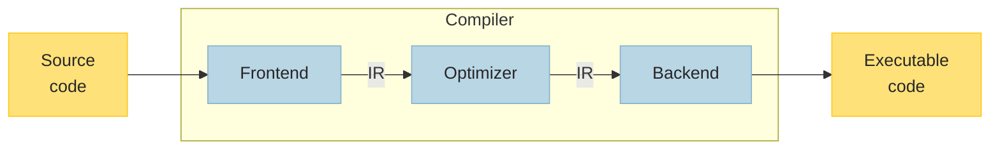
A typical compiler consists of three main units: `Frontend`, `Optimizer` and `Backend`. 
`Frontend` takes source code as an input and produces an intermediate representation (or simply `IR`), or several `IRs`. 
`IR` is an object that describes the essence of the source code, but in a more convenient way than the source files. 
This `IR` is then used by the `Optimizer` to improve the program in a desired way (increase the performance for example) without modification of it's meaning. 
Finally, the `Backend` uses the optimized `IR` to produce executable code. 
As shown on the figure below, `Snippets` are organized in a very similar way.
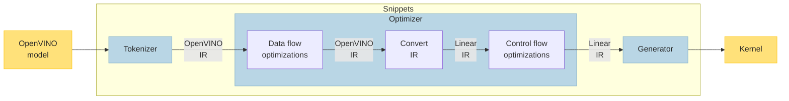
Instead of a source code, `Snippets` take `OpenVINO` model as an input. 
Then the `Tokenizer` (which is essentially a `Snippets` `Frontend`) parses an input `OpenVINO model`, and tries to find a part of the model that could be processed by `Snippets`. 
If such a part is found, `Tokenizer` converts it to an `OpenVINO IR` and stores inside a `Subgraph` node. 
`OpenVINO IR` - is one of the two `IR` types used by `Snippets`, it is simply a small `OpenVINO model` that can contain `Snippets`-specific operations. 

`OpenVINO IR` is then passed to the `Optimizer` unit that in turn consists of three subunits. 
The purpose of the first subunit is to perform data flow optimizations. The second subunit converts `OpenVINO IR` (data-flow-oriented representation) to `Linear IR` (control-flow-focused IR). Finally, the third subunit is dedicated to control flow optimizations.

After all optimizations, the `Linear IR` is used by the `Generator` (which is `Snippets` `Backend`) to produce executable code, which we will refer to as `Kernel`. 
As discussed in the Introduction, the purpose of the `Kernel` is to process a part of the initial tensor, and several `Kernels` are usually executed in parallel to process the whole tensor. 
Note that a `Kernel` usually applies several operations (`Op instructions` blocks from the Introduction), the exact number depends on the source model topology: sometimes it's just a couple, but could more than twenty `Ops`.

#### Plugin integration

The `Snippets` workflow discussed above provides a somewhat simplified picture, since all snippets-irrelevant stages were skipped for the sake of clarity. 
In reality the workflow stages are not executed successively, but triggered at different stages of the plugin pipeline. 
The `Snippets` integration into the plugin pipeline is schematically depicted below. 

```mermaid
 graph LR
   subgraph Plugin[<font size=+2> Plugin pipeline </font>]
    direction LR
    subgraph openvino[<b> Transformations on OpenVINO model </b>]
        direction LR
        common[Common \n Transformations]
        lpt[Low \n Precision]
        tokenize[Tokenizer]
        convert[Conversion to \n Plugin opset]
        common-->lpt-->tokenize-->convert
    end
    subgraph internal[<b> Transformations on internal plugin graph </b>]
         direction LR
         init["init()"]
         subgraph create["CreateComputePrimitive"]
            direction LR
            optimize[Optimizer]
            generate[Generator]
            optimize-->generate
         end
         subgraph execute["Execute"]
            direction LR
            Executable[Kernel]
         end
         init-->etc[...]-->create
         create-->execute
    end
   end
   Source[OpenVINO \n model]-->|Main \n flow|common
   convert~~~internal
classDef no-bg-color fill:none,stroke-width:0px
classDef steel1 fill:#B9D6E5, stroke: #86B3CA, color: #262626
classDef daisy1 fill:#FFE17A, stroke: #FEC91B, color: #262626
classDef dafault_node1 fill:#ECECFF
class tokenize,optimize,generate steel1
class Source,Executable daisy1
class create,execute dafault_node1
```
As one can see from the picture, overall plugin pipeline consists of two major blocks: the first block applies transformations to `OpenVINO model` while the second one works with the internal plugin graph representation. Since `Snippets` is a backend-independent framework, it can't work with the plugin graph or plugin-specific `Ops` directly, so the tokenization is performed immediately before plugin-specific operations are introduced into the graph (`Conversion to Plugin opset`). 
`Tokenizer` replaces parts of the `OpenVINO model` that can be executed by `Snippets` with `ov::op::Subgraph` OpenVINO nodes. 
Each of the nodes stores a piece of the initial `OpenVINO model` that was replaced by the node. 
This piece is stored as an OpenVINO model itself, which we refer to  as `OpenVINO IR` to distinguish from the original `OpenVINO model`. 
Note that sometimes the exact type of `IR` is not important in our discussion. 
In such cases, we will refer to the `IR` (`OpenVINO` or `Linear`) as `body function`, or simply `body`. 

When the plugin finalizes all `OpenVINO model` transformations, the model is converted to an internal plugin graph representation. 
At this point `ov::op::Subgraph` is converted to `ov::intel_cpu::node::Snippet` which still retains the `OpenVINO IR`. 
This IR is then optimized and an executable `Kernel` is produced during the `CreateComputePrimitive` stage (`CreatePrimitive()` stage in CPU plugin). 
Finally, multiple copies of the produced kernel executed in parallel during the `Execute` stage.

This brief description finalizes our discussion of Snippets architecture.
To summarize, `Snippets` workflow consists of three major blocks: `Tokenizer`, `Optimizer` and `Generator`. Let's discuss each of them in detail below.

### Tokenizer

`Tokenizer` is run on an `OpenVINO model` and its main purpose is to identify subgraphs that are suitable for code generation. 
These subgraphs are then replaced with the `ov::op::Subgraph` node. 
This stage is called tokenization because the `Tokenizer` employs a greedy  algorithm similar to the ones used for parsing input stream of characters into tokens. 
One of the distinctive features of this algorithm is its flexibility, so it can seamlessly handle arbitrary operations' patterns. 
This differentiates the tokenization from the pattern matching approach used in traditional and MLIR-based compilers. 
Pattern matching can indeed process only a limited set of predefined operations' configurations, so the relations between the operations are fixed in this case. 
Thus, the tokenization's flexibility becomes a significant advantage when the number of new ML topologies increases rapidly, so it becomes more and more expensive to support and extend a large set of patterns.

The tokenization algorithm is depicted on the flowchart below.
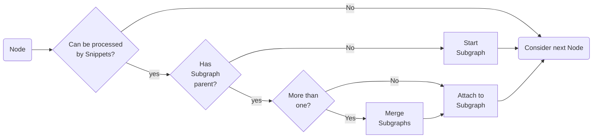
Let us briefly describe the process:
1. If a Node is not supported by `Snippets`, then ignore it and proceed to the next one.
2. If a Node has no `Subgraph`  parents, then replace it with `Subgraph` node and copy the initial Node to the `Subgraph's` body (which is in the `OpenVINO IR` form).
3. If a Node has a single `Subgraph` parent, then attach it to the `Subgraph`. It means copy the Node to the `Subgraph's` body, and remove it from the original `OpenVINO model`. Note that if the Node has more than one parent, corresponding parents' outputs will be connected with the updated `Subgraph` as shown on the diagram below.
4. If a Node has multiple `Subgraph` parents, then they will be merged into a single `Subgraph` and the Node will be attached to it.
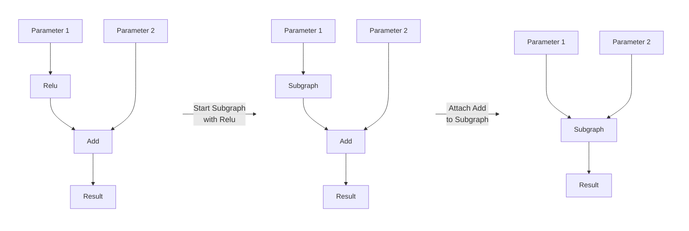

The algorithm described above reflects a general idea behind the tokenization process, but there are of course other details that should be considered in a real-life implementation. 
For instance, the `Tokenizer` should take additional care to avoid creation of cyclic dependencies when attaching a Node to `Subgraph`. 
Similarly, `Subgraph` is not allowed to connect with more than one `Result` node. 
In both of the cases, a new `Subgraph` is started instead of attaching to the existing one to avoid an illegal configuration. 
Another interesting case is the tokenization of constant nodes. 
If a `Constant` represents a single value (scalar) and its child was attached to a `Subgraph`, then the `Constant` also attached to the same `Subgraph`. 
If a `Constant` is not scalar, then it can't be tokenized since storing `Constant's` values requires memory management, and memory management is a plugin responsibility. 
Please refer to the [collapse_subgraph.cpp](../src/pass/collapse_subgraph.cpp) to gain more insights on the tokenization process.

There is however one more aspect of the tokenization process that is worth covering here. 
As discussed in the **Plugin integration** section above, the `Tokenizer` is executed before the plugin converts the `OpenVINO model` to an internal graph representation. 
It means that the tokenized nodes will not be visible to the plugin (since they are hidden inside `Subrgaphs'` body functions), so they will be ignored by plugin optimization passes. 
In particular, the plugin won't be able to fuse the nodes using the OneDNN post-ops mechanism. 
This type of fusings is backend-specific, therefore can't be supported by `Snippets` directly, but it's still important from the performance perspective.

To avoid this kind of fusing conflicts, `Snippets` allow a plugin to mark a node as `SkippedByPlugin` so it will be ignored by the `Tokenizer`. 
It is a plugin responsibility to mark all nodes that (can be tokenized, but) should be ignored by `Snippets` with a `SkippedByPlugin` tag (defined in [tokenization.hpp](../include/snippets/pass/tokenization.hpp)). 
This is usually implemented as a separate markup transformation that is applied immediately before the tokenization. 
Please, refer to the [snippets_mark_skipped.cpp](../../../plugins/intel_cpu/src/transformations/snippets/x64/pass/snippets_mark_skipped.cpp) pass for a detailed example.

### Optimizer

As briefly discussed in the ***Architecture*** section, `Optimizer` consists of two major units: the first one performs data flow optimization, and the second one is focused on control flow. 
Note however that some data-flow-related passes can be performed only after the control flow optimizations, so the second unit modifies the dataflow as well. 
Nevertheless, we will refer to the units as `Data flow optimizer` and `Control flow optimizer` to reflect their main purpose. 
Keep in mind that, as discussed above, the `Data flow optimizer` operates exclusively on the `OpenVINO IR`, while the `Control flow optimizer` works with the `Linear IR`. 
We will discuss these units in more detail below.

#### Data flow optimizer

 Before `Data flow optimizer` can modify data flow, it needs to perform a preliminary stage called `Canonicalization`. 
 To understand the stage's purpose we need to make a step back to the tokenization. 
 The `Tokenizer` saves a part of the initial `OpenVINO function` in `Subgraph's` body. 
 The problem is that the `OpenVINO function` has no information about data layouts that will be used by the `Subgraph's` parents during the `Execution` stage. 
 This happens because the plugin assigns layouts on internal graph representation well after the tokenization is finished. 
 The purpose of `Canonicalization` is to incorporate the plugin-defined input layouts into the body function. 
 If an input's layout was changed to a blocked one, then the corresponding body input `Parameter` will be reshaped, and new shapes will be propagated through the body function. 
 `Snippets` support different layouts on different inputs. 
 Trailing `1` will be appended to the shapes of the inputs with planar layouts in this case to match the blocked inputs. 
 These cases will be properly handled by the `Snippets` pipeline using automatic broadcasting. 
 This way `Canonicalization` incorporated plugin-provided layouts into the `Subgraph` and thus produces layout-aware output shapes that will be used for scheduling.

 The next stage is the actual data flow optimizations, the stage has two main objectives. 
 First, it inserts utility operations to make the data flow explicit and suitable for further optimizations and code generation. 
 Second, it replaces some `Ops` (or `Ops'` patterns) with operations from the custom `Snippets::op` opset to allow for generation of a more efficient code. 
 The data flow optimizations are shape-agnostic transformations which allow to perform the stage `Data flow optimization` on subgraphs with dynamic shapes.
 Let's consider an example below to clarify this stage's mechanics.

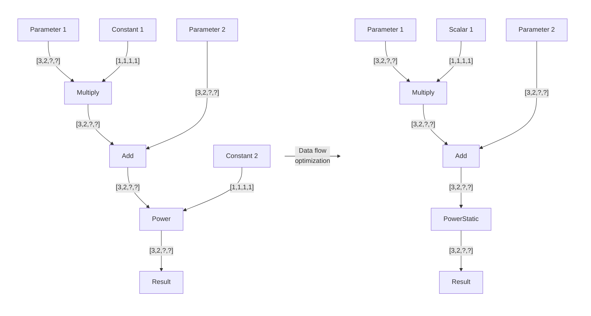
The picture above demonstrates body functions' state before (left) and after (right) the `Data flow optimization`, labels on the arrows designate output shapes of corresponding operations. 
Here what happend with the graph during the optimizations:
1. `Constant` nodes were replaced with `Scalars` from `Snippets` opset. This is needed to allow for generation of a more efficient code, since a corresponding ScalarEmitter allows to store values directly inside the `Kernel`.
2. The `Scalar->Power`sequence was replaced with the `PowerStatic` operation (`Snipppets` opset). Again, this allows to generate more specialized and performant code.

This should give you a general idea on how the `Data flow optimizer` works, please refer to `data_flow_transformations(...)` in [subgraph.cpp](../src/op/subgraph.cpp) for more details. 
The last thing worth mentioning here is that the `Snippets` also allow a plugin to perform target-specific optimizations by providing set of positioned passes to
`snippets::op::Subgraph::generate(...)` (which in turn calls both `data_flow_transformations(...)` and `control_flow_transformations(...)`).
Positioned passes (defined in [positioned_pass.hpp](../include/snippets/pass/positioned_pass.hpp)) represent the transformation itself and the place where it should be registered in the transformation manager,
which allows the plugin to flexibly register its own passes.

#### Control flow optimizer

As follows from its name, the main objective of `Control flow optimizer` is to manage and optimize control flow of the kernel. 
Since the `OpenVINO IR` doesn't have an explicit control flow representation, a special control-flow-oriented `IR` was developed. 
It is called `Linear IR` (or simply `LIR`), let's discuss it first, before we consider the transformation pipeline.

##### Linear Intermediate Representation

`Linear IR` is specially designed to facilitate manipulations with control flow. 
It is called linear, because it is essentially a sequence of `Expressions` (an analog of OpenVINO `Op`) that represents control flow. 
So if `Expression 1` is followed by `Expression 2` in `LIR` then the code for `Expression 1` will be emitted before the code for `Expression 2`. 
Note that this doesn't necessarily mean that the `Expression 2` uses the result of `Expression 1`, they can be completely unrelated from the data flow standpoint. 
The only restriction here is that all the `Expression's` inputs must be ready by the time it is executed. 
This restriction is the same as in `OpenVINO IR`, but an important distinction here is that `LIR` allows to permute `Expressions` while this data-dependency condition is fulfilled. 
So the `LIR` preserves data dependencies, but also allows for a more control on expressions' order that represents control flow. 
This is a brief rationale behind the linear `IR`, now let's move to the implementation.

A coarse grained `LIR` implementation scheme is shown on the figure below (to the left). 
Let's discuss all the presented elements one-by-one.
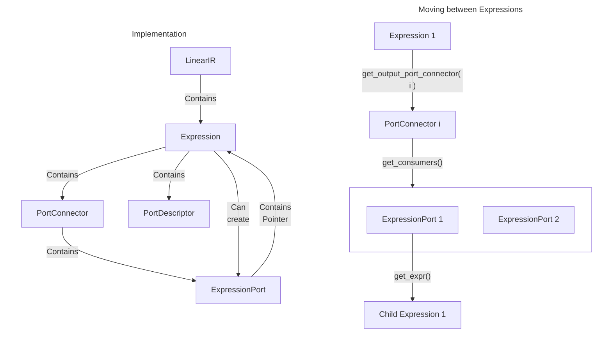

`LinearIR` is our graph representation, it's an analog to an OpenVINO model. 
It is simply a container for `Expressions`, the order of `Expressions` represents control flow. 
`LIR` also incorporates a range of useful methods to manage the `Expressions`, for example `create_expression(...)` to build `Expressions` from OpenVINO nodes. 
Please refer to the implementation in [linear_ir.cpp](../src/lowered/linear_ir.cpp) for more details.

`Expression` is the main building block of a `Linear IR`. 
It contains a pointer to the OpenVINO node it was created from and a pointer to the emitter it will be mapped to (which is null until `Expression::init_emitter(...)` is called). 
An `Expression` can have an arbitrary number of inputs and outputs, we will refer to them simply as ports. 
Every port can be uniquely identified by the `ExpressionPort` class. 
The `ExpressionPort` contains a pointer to the `Expression` which port it represents, the port type (`input` or `output`) and its index (input/output number). 
Note that the `ExpressionPort` is not stored in the `Expression` because you don't typically need it if you already have the `Expression`. 
It can however be constructed on demand by the `get_input_port(i)` or `get_output_port(i)` methods.

While the `ExpressionPort` uniquely identifies an expression and its port, `PortDescriptor` specifies how the `Expression` interprets the data on the port. 
For instance, `PortDescriptor` stores a tensor shape and layout it expects (or utilizes) on the port. 
It also describes the port's subtensor, which is a part of the tensor that will be processed by a dedicated emitter on a single iteration. 
This information will be used by the control flow optimization pipeline to determine whether two `Expressions` are compatible (can be executed inside one loop for example), or to calculate proper pointer increments between consecutive loop iterations. 
An `Expression` internally stores two separate vectors of input and output `PortDescriptors` which could be accessed by calling `get_input_port_descriptors()` or `get_input_port_descriptor(i)` (and similar for outputs).

Finally, `PortConnectors` specify how the `Expression's` ports are connected. 
Note that an `Expression` output can be connected to several inputs (like with OpenVINO nodes), So every `PortConnector` stores one source `ExpressionPort` and a set of consumer `ExpressionPorts` that can be accessed by the `get_source()` or `get_consumers()` methods, respectively. 
Like with `PortDescriptors`, an `Expression` stores input and output `PortConnectors` in two separate vectors accessed via `get_input_port_connector(i)` (or its output twin).

An example on how `PortConnectors` can be used to move between `Expressions` is given on the right side of the above picture. 
So if we need to get a child expression connected to the i-th expression's output, we need to call `expression->get_output_port_connector(i)` first to obtain a corresponding connector, then to call `connector->get_consumers()` to obtain a set of connected `ExpressionPorts`, and finally `ExpressionPort->get_expr()` to access a child expression. 
Note that if a `PortDescriptor` is required, you can obtain it directly (without getting `Expression` first) by calling `ExpressionPort->get_descriptor_ptr()`, so the `ExpressionPort` will snag the right `PortDescriptor` from the `Expression` for you.

Concluding this section, it's worth mentioning that the `LinearIR` currently provides several debug features: `debug_print()`, serialization, performance counters and segfault detector. 
The first one prints input and output `PortConnectors` and `PortDescriptors` for every `Expression` to stderr. 
The second one allows users to serialize the `LIR` in two representations: as a control flow graph of `LinearIR` using the pass `SerializeControlFlow` and 
as a data flow graph of `LinearIR` using the pass `SerializeDataFlow` (control flow operations (e.g. `LoopBegin`/`LoopEnd`) are not serialized).
The both serializations are saved in `xml` OpenVINO graph format, where a lot of useful parameters are displayed for every `Expression`.
Please see [perf_count.md](./debug_capabilities/perf_count.md) and [snippets_segfault_detector.md](./debug_capabilities/snippets_segfault_detector.md) for more info regarding the performance counters and segfault detector. 

The `LinearIR` also provides a a convenient interface for working with new `Expressions`.
This interface includes the `insert_node(...)` method that creates a new `Expression` based on the passed `ov::Node` and inserts it in the specified place in the `LinearIR`.
The `insert_node(...)` method automatically performs all the necessary actions for full integration into the `LinearIR` (connection with parents and consumers and updates of the corresponding `LoopInfo`).
This helper is used in several control flow transformations, that are usually named `InsertSomething`. Consider the `InsertLoadStore` pass as an example [insert_load_store.cpp](../src/lowered/pass/insert_load_store.cpp).
The method `replace_with_node(...)` replaces the existing `Expressions` in the `LinearIR` with the new `Expression`. This `Expression` is created from the passed `ov::Node`.
The example of using the helper might be found in the `LoadMoveBroadcastToBroadcastLoad` pass inside [load_movebroadcast_to_broadcastload.cpp](../src/lowered/pass/load_movebroadcast_to_broadcastload.cpp).
The method `replace_with_expr(...)` replaces the existing `Expressions` in the `LinearIR` with the passed `Expression`.
For more details regarding these helpers please refer to the relevant descriptions in `LinearIR` interface inside [linear_ir.cpp](../src/lowered/linear_ir.cpp).

##### Control flow optimization pipeline

The pipeline is mainly focused on an automatic loop injection and loop optimizations, but some transformations affecting data flow are also included. 
The exact set of transformations executed in the pipeline will likely change as the `Snippets` evolve and develop, but it is worthwhile to cover some of them briefly to give you an idea on how the pipeline looks like:
1. `MarkLoops` - performs an analysis of `Expressions'` connectivity and their `PortDescriptors`. 
Based on this information, the pass divides the `Expression` into groups, so that each of the groups can be executed inside one loop. 
Every group is described by a `loop_id`, and additional information is saved in `LoopInfo`.
2. `FuseLoops` - analyzes the assigned `loop_ids` and `LoopInfo`, fuses some loops if possible. 
This pass can move some `Expressions` up or down the graph, so the `Expressions` with the same `loop_ids` are grouped together.
3. `InsertBuffers` - analyzes `LoopInfo` and `Expression` semantics, inserts `snippets::op::Buffer`. `Buffer` is an operation that represents a memory buffer needed to save some intermediate results.
4. `InsertLoadStore` - inserts explicit memory access operations like `Load` and `Store` (both from `snippets::op`). 
These are needed, so appropriate instructions will be emitted during the code generation stage to move data between memory and vector registers.
5. `InitLoops` - initialize data pointer shift parameters (pointer increments and finalization offsets for each loop port) in `LoopInfo`.
6. `InsertLoops` - inserts explicit `LoopBegin` and `LoopEnd` (`snippets::op`) operations based on the acquired `LoopInfo`. 
Again, the explicit operations are needed to emit appropriate instructions later.
7. `InsertBroadcastMove` insert `MoveBroadcast` before `Expressions` with several inputs since a special broadcasting instruction needs to be generated to broadcast a single value to fill the whole vector register.
8. `LoadMoveBroadcastToBroadcastLoad` fuse `Load->MoveBroadcast` sequences into a single `BroadcastLoad` expressions.
9. `AllocateBuffers` is responsible for a safe `Buffer` data pointer increments and common memory size calculation. For more details refer please to the end of this section.
10. `CleanRepeatedDataPointerShifts` - eliminates redundant pointer increments from the loops.
11. `PropagateLayout` - propagates data layouts to `Parameters` and `Results` (actually to corresponding `Expressions`), so `Kernel` will be able to calculate appropriate data offsets for every iteration of an external parallel loop.

As mentioned above the `op::Buffer` operations are managed by the pass `AllocateBuffers`.
Before describing the algorithm, it is necessary to briefly consider the structure of `Buffer`:
* All `Buffers` represent `Buffer scratchpad` together (a common memory that is needed for intermediate results storing).
* Each `Buffer` has an `offset` relative to the common data pointer (pointer of `Buffer scratchpad`), `RegGroup` (the `Buffers` with the same `RegGroup` have the same assigned register) and `ClusterID` (the buffers from the same cluster refer to the same memory area - they have the same `offset` relative to the `Buffer scratchpad` data pointer).

The algorithm supports two modes: optimized and non-optimized.
The optimized one calculates minimal memory size and minimal unique `RegGroup` count required to handle all the buffers.
The non-optimized version assigns each buffer an unique `RegGroup`, `ClusterID` and `offset`.
The first mode is the default one, while the second one might be used for debugging the optimized version.
The optimized algorithm `AllocateBuffers` has the main following steps:
1. `SetBufferRegGroup` - analyzes `Buffers` access patterns to avoid redundant pointer increments. A graph coloring algorithm is utilized for this purpose.
2. `DefineBufferClusters` - creates sets of `Buffer` ops (buffer clusters) and set `ClusterID` value to `Buffer` ops.
As noticed above, `Buffers` from one cluster refer to the same memory area.
For example, there is a loop with `Buffer` ops on input and output. If the body of this loop can write data to the memory from which it was read, these `Buffers` are in one cluster.
3. `SolveBufferMemory` - calculate the most optimal memory size of `Buffer scratchpad` based on `BufferClusters` and life time of `Buffers`.

More details on control flow optimization passes could be found in the `control_flow_transformations(...)` method inside [subgraph.cpp](../src/op/subgraph.cpp). 
When all the passes are applied, the `LinearIR` is handled further to the `Generator` to emit executable code.

### Generator
The main purpose of the `Generator` is to emit executable code. 
The code emission process could be divided into two stages: `Preparation` that could be shared between several targets, and target-specific `Emission`. 
The `ov::snippets::Generator` class provides a target-independent interface to the generation process and performs the `Preparation` stage. 
It also stores the `TargetMachine` instance, which is responsible for the `Emission` stage. 
Let's discuss the target-independent stage first.

The `Preparation` consists of low-level target-independent transformations needed to prepare the `IR` for code generation. 
There are currently two such transformations:
1. `AssignRegisters` assigns abstract registers to `Expressions` based on their data dependencies. 
The easiest way to think about the assignment logic is that a register is assigned to every `PortConnector` to ensure appropriate data propagation. 
However, every `Expression` needs to know the assigned registers, so they are stored is the `PortDescriptors` (and could be obtained via `get_reg()`). 
Consequently, all the ports connected to the same `PortConnector` will have the same register in their `PortDescriptors`. 
`AssignRegisters` also supports register re-utilization, so if all `ExpressionPorts` connected to this `PortConnector` are evaluated, then the corresponding register may be reused by other `PortConnector`. 
In other words, when all the `Expressions` that required input data in a certain register are evaluated, the register may be reused to hold another `Expression's` output. 
`AssignRegisters` also supports two types of registers: general-purpose and vector ones. 
Different types of registers are managed and assigned independently, and a particular register type required by an `Expression` is provided by the `ov::snippets::Generator` (or a derived generator for target-specific `Ops`).  
2. `InsertTailLoop` injects tail-processing section after a loop body if needed. 
Note that every loop has two parameters that specify how its body is evaluated: `work_amount` and `increment` The `work_amount` indicates how much of the data needs to be processed, it often equals to the dimension's size the loop is working on. 
The `increment` defines how many data entries are processed on every loop iteration (it usually equals to vector size for the innermost loops of elementwise subgraph). 
So if a loop's `work_amount` is not evenly divisible by its `increment`, it means that a tail processing is required. 
`InsertTailLoop` duplicates the body of such a loop, rescales pointer increments and load/store masks appropriately, and injects these `Ops` immediately after the processed loop.
3. `CleanupLoopOffsets` "fuses" the finalization offsets of loop with an outer loop's pointer increments and zeroes the offsets before `Result` operations.
4. `OptimizeLoopSingleEvaluation` moves all pointer arithmetic to finalization offsets in `LoopEnd`, and marks the loops that will be executed only once.
This information will be used during code emission to eliminate redundant instructions.

Please see [assign_registers.cpp](../src/lowered/pass/assign_registers.cpp) and [insert_tail_loop.cpp](../src/lowered/pass/insert_tail_loop.cpp) for more info regarding the main passes in the `Preparation` stage. 
When the `Preparation` is finished, the `Generator` constructs target-specific emitters by calling `init_emitter(target)` method for every `Expression` in the `LinearIR`, where the `target` is a `TargetMachine` instance.

The `TargetMachine` is a class that provides generator with target-specific information, such as supported instruction sets, vector register size etc. 
`TargetMachine` also maps the OpenVINO's `DiscreteTypeInfo` (stored in the `Expression`) to the emitter that actually implements the operation. 
The mapping is done using the `jitters` map defined in [target_machine.hpp](../include/snippets/target_machine.hpp). 
In order for this mechanism to work, every `Snippets'` code generation backend should create emitter implementations derived from the `Emitter` base class defined in [emitter.hpp](../include/snippets/emitter.hpp). 
The backend then should create its own target machine class (derived from the common `TargetMachine`) and populate the `jitters` map, see the [cpu_generator.cpp](../../../plugins/intel_cpu/src/emitters/x64/cpu_generator.cpp) for an implementation example.

Note that `init_emitters(...)` only initializes the appropriate emitters, but do not actually emit any code. 
To perform code emission, a `snippets::op::Kernel` operation is constructed (see [generator.cpp](../src/generator.cpp)), its constructor takes the `IR` with all the initialized emitters as an only input argument. 
Then a `KernelEmitter` is created from the `Op` using the standard mapping approach. 
Finally, the `kernel->emit_code({}, {})` command initiates the code emission. 
Note that the `emit_code(...)` is called only for the `KernelEmitter`, and the emitter is responsible for calling the same method for the rest of the expressions in the `IR` This encapsulation is needed because the `KernelEmitter` performs mapping of the assigned abstract registers to physical registers available on a particular platform. 
Another important function of the `KernelEmitter` is to calculate input/output data offsets based on dimension indices provided in runtime, and to shift corresponding data-handling registers accordingly. 
Keep in mind however, that the required functionality of the `KernelEmitter` depends on how the rest of the emitters are implemented (particularly for `Load`/`Store` `Ops`). 
We've discussed above how the emitters for the `intel_cpu` plugin are implemented (see [jit_snippets_emitters.cpp](../../../plugins/intel_cpu/src/emitters/x64/jit_snippets_emitters.cpp) for more details), but a different backend might require a different approach depending on hardware specifics.

## See also

 * [OpenVINO™ README](../../../../README.md)
 * [OpenVINO Snippets](../README.md)
 * [OpenVINO Core Components](../../../README.md)
 * [Developer documentation](../../../../docs/dev/index.md)

