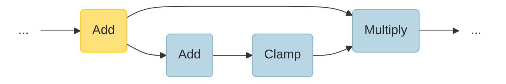
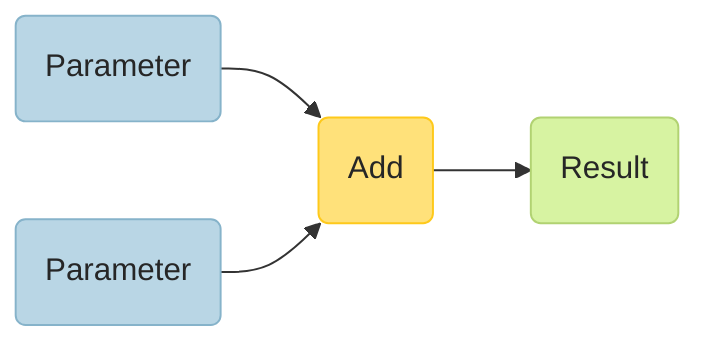
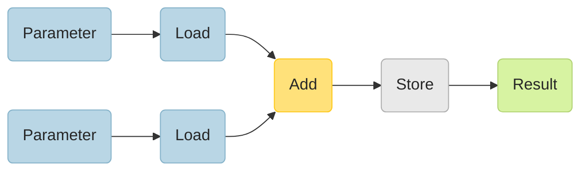
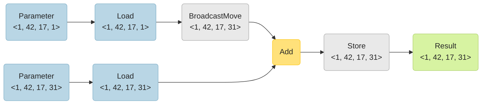
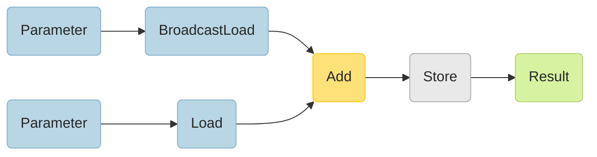
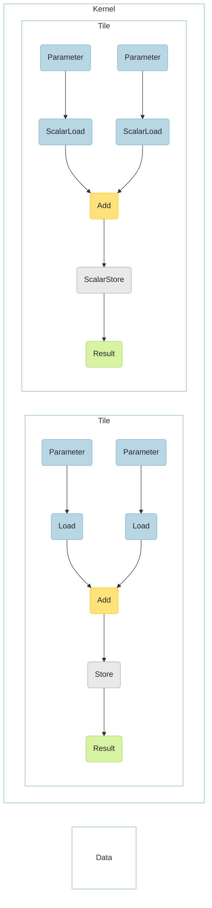

# SnippetS Design Guide
This document describes the design and rationale for a snippets code generator. Implementation of code functionality is located [here](https://github.com/openvinotoolkit/openvino/tree/master/src/common/snippets). A proposal for CPU backend integration is [here](https://github.com/openvinotoolkit/openvino/pull/2824).

## Rationale

Core **CNN operators (convolution, gemm, fully connected) are limited by compute, the rest is memory bound**. Math approximations (like transcendental functions) are rare in emerging workloads and could be treated with the same machinery. **Snippets are designed to optimize topology for memory**, while leaving compute intensive kernels for backend developers.

The **potential speedup is proportional to shrink in memory-walked bytes**. Therefore, you can transform the problem to a task to optimize for memory walks, whatever pattern snippet has and operations it contains. The number of memory walks should be less or equal to handcrafted optimizations. This guarantees performance improvements over the previous approach (excluding corner cases caused by cache effects). *Shrinkage factor might be encoded to some cost function in future evolution of code generator*. Snippets generator provides diagnostics to estimate this shrinkage factor with `ov::snippets::op::Subgraph::print_statistics(bool verbose)` member.

The SnippetS generator is designed for back-end developers. The main purpose of inventing the snippets code generator is an **operator fusion**, **register allocation** and **target kernel generation** decomposition. This allows modifications (like new fusion support) and feature extensions (like new operation support) to be done in a single point of modification and avoid combinatorial explosion for fusions/types/architectures etc.

Creating a full-fledged compiler or usage of existing compiler infrastructure (like LLVM & MLIR) is superfluous at this point of evolution. The aim is to provide a **flexible and performant framework for operation fusions**, leaving micro optimizations (for example, instruction scheduling) to the backend H/W.

There are no plans to invent a DSL for SnippetS. DSL gives users more flexibility to express uncommon operations. However, the shift towards an approach to encode topologies with elementary operations followed by smart enough fusions is already expressive and performant enough.

**Snippet** is a compiled compute **kernel** generated from a subgraph using the SnippetS code generator for a specific architecture with a **scheduling domain**. Using this scheduling domain and calling convention backend can execute generated compute kernels. For the first generation, snippets are **statically scheduled towards the output domain**. Multi-output snippets are supported if all outputs are broadcast-compatible in a sense that domains for all outputs can be broadcasted from one root domain that defines snippet schedule. It is a subject of extension for future generations.

nGraph is used as the highest level IR for subgraph representation and lowering transformations. **Opset1** is a base operation set for code generation. The aim is to **keep the minimal possible and sufficient operation set** (or ISA) and keep it **RISC-like** (memory and compute decomposed).

**One subgraph corresponds to one snippet**. Operations which cannot be scheduled by a single schedule should not be placed in the same subgraph. A snippet is somewhat conceptually close to OpenCL kernel without a restriction to express only embarrassingly parallel tasks.
**Subgraph** once extracted from full topology IR is **treated as an operation and data flow descriptor in scalar notation** (similar to OpenCL/CUDA). Tensor sizes are used for defining scheduling domain and detecting broadcasts/reductions.

Operations are split into 3 groups: **layout-oblivious (LOO), layout-aware(-tolerant) and layout-dependent(-specific)**. **Layout-oblivious** operation semantics and implementation are completely agnostic to a specific layout in which tensors are placed in memory. For example, like elements-wise math and ReLU in this category. Implementation of **layout-aware** operation depends on the layout of input/output tensors. For example, convolutions and other block-wise kernels or layout repacks. **Layout-specific** operation semantics and implementation depend on the layout. For example, the Yolo region. Patterns to fuse are constructed in terms of taxonomy above.

## Design

Code generation is split into 2 phases, **tokenization** and **lowering**.

### Tokenization

Tokenization runs on full topology nGraph function inside a specific plugin in a stage of common transformations. Input of tokenization is a topology graph. Output is a modified topology graph with `ov::snippets::op::Subgraph` operations installed. Each subgraph contains nGraph function (called **body**) which holds a part of original topology legal for snippet generation (can be scheduled with a single schedule).

A procedure of finding subgraphs suitable for code generation is called **tokenization**. During tokenization the topology tree is split into subgraphs in the same greedy approach which is used for parsing input stream of characters into the tokens. It may also be seen as and modified into a basic block construction problem, since there is a leader and potentially terminators. See the example of implementation [here](https://github.com/openvinotoolkit/openvino/blob/master/src/common/snippets/src/pass/collapse_subgraph.cpp).

Tokenization has an advantage over the pattern matching approach (used in traditional and MLIR-based compilers) since it can handle arbitrary patterns of operations. Pattern matching deduces specific configuration of operations to translate to another one, more suitable for target machine or further lowering. This means that relations between operations are fixed. Tokenization, on the other hand, has the only limitation on specific operation types which are **suitable and profitable** to fuse, respecting original topology correctness (keeping it as a direct acyclic graph).

The extracted body comes to a plug-in wrapped as a composite `Subgraph` operation which is seen as a block box from a plugin standpoint and can participate in any plugin specific subroutines (for example, layout assignment, memory allocation, etc.).

### Supported subgraph patterns

Subgraph accepts arbitrary numbers of inputs and outputs. There is 1:1 mapping for external (subgraph node’s) and internal (body) parameters indexes.

Pattern here is an exact subgraph configuration (nodes and edges between them). **The first generation of snippets supports only layout-oblivious operations which may have broadcast on inputs and broadcast-compatible outputs**. For example Shapes `<1, 42, 17, 31>`, `<1, 42, 17, 1>` and `<1, 42, 1, 31>` are considered as broadcast-compatible. Layout-oblivious operation with multiple outputs serves as a snippet leader and forms a new subgraph. The most beneficial patterns are subgraphs with complex control flow but minimal number of inputs/and outputs. For example, GeLU has a 5x shrinkage factor from original unfused subgraph in number of bytes walked. Subgraph below could be considered as an example of such a subgraph. Leader detection procedure aims to find such subgraphs.



Operations are greedily added to the subgraph until
1. New operation does not introduce a loop in a topology function.
1. Number of inputs and outputs satisfies target criteria.
1. Operation is not a predecessor of topology output.
1. Resulting subgraph can be scheduled (all outputs are broadcast-compatible).

If a potential subgraph does not meet any of the criteria above, the procedure continues to find a new leader.

### Lowering

Lowering is a sequence of subgraph (snippet body) traversal passes to generate a compute kernel out of subgraphs of operations extracted by tokenization.

1. Common optimizations
1. Canonicalization
    1. Domain normalization
    1. Conversion to snippets dialect
1. Target-specific optimizations
1. Register allocation
1. Schedule generation
1. Target code emission

#### Common optimizations

Constants are treated as inputs for a subgraph with an exception for scalar cases (since they do not need to be scheduled). `snippets::op::Scalar` is used to represent this kind of constants.

If such Scalar comes as a second input of Power operation, it is replaced with `snippets::op::PowerStatic`.

#### Canonicalization

The goal of this step is to apply target-independent and schedule-related optimizations and to make a snippet **schedulable**.

##### Domain normalization

All input and output shapes are normalized to 6D for future schedule generation. If shape propagation fails or leads to inconsistent output shapes an exception is raised.

The layout assigned by a user code and passed to a `generate` function is propagated through a subgraph on this step as well. The layout is passed to a `generate` function as a `BlockedShapeVector` which is a `std::vector<BlockedShape>` , while `BlockedShape` is `std::tuple<ov::Shape, ov::AxisVector, ov::element::Type>`. For example, if backend supports `NCHW16c` layout and a tensor has a size of `<1, 42, 17, 31>` and holds single precision floating point, this structure should be `std::make_tuple(ov::Shape {1, 3, 17, 31, 16}, ov::AxisVector {0, 1, 2, 3, 1}, ov::element::f32);`. This allows generic layout representation.

##### Dialect conversion

The goal for this step is to transform a subgraph (body function) into a form possible for code generation. Input for this step is a subgraph in a canonical form. Output is a subgraph in snippets dialect.

A snippet or a kernel is formed around the subgraph body in a sequence of traversal steps. Let us walk through these steps with the smallest possible subgraph which contains a single `[Add]` operation.

When subgraphs are extracted with the tokenization part, Parameters and Results are explicitly inserted to its body to form a complete nGraph Function.



This function represents operation dependencies in scalar (similar to OpenCL) notation while shapes of tensors are used to generate schedules. At this point, kernel-schedule decomposition is made (similar to Halide/OpenCL/TVM).

###### Explicit memory operations

As a next step, explicit memory operations are placed for each input and output. `InsertLoad` and `InsertStore` passes derive from `MatcherPass`.



By default, memory operations assume vector memory access. If scalar access is needed, special `ReplaceLoadsWithScalarLoads` and `ReplaceStoresWithScalarStores` passes should be executed.

###### Explicit broadcast

For each operation in body function inputs are checked against broadcasting. When Parameters are to be broadcasted, an explicit broadcast operation is generated. For example, with `<1, 42, 17, 31>` and `<1, 42, 17, 1>` for the subgraph above, the resulting subgraph will be:



If Load followed by Broadcast is detected, then this pair is replaced by a single BroadcastLoad instruction:



Broadcast and regular streaming vector load is possible from the same pointer. BroadcastLoad should always go before streaming load. BroadcastLoad for non the most varying dimension is not generated, however it affects the generated schedule.

#### Target-specific optimizations

Target developers can plug in to the code generation pipeline some specific optimizations with passing `ov::pass::Manager` into `generate` function of `subgraph`. **Passes are executed on subgraph in canonical form converted to a snippet dialect**.

*It might be also extended to provide an interface for target independent optimizations in future*

#### Register allocation

Canonicalized subgraph in a snippets dialect forms a basic block or region inside a snippet (kernel). Registers are allocated globally for the whole subgraph. Since all operations for a subgraph are assumed to be vector, only vector registers are allocated for the first generation of SnippetS. Linear scan register allocation algorithm is used. Register allocator is implemented as the `ov::snippets::pass::AssignRegisters` function pass and store allocated registers for each node into `rt_info`. `rt_info` for a node holds a register for Node's output. *However, this part should be refactored better, either to become target independent or to use target-specific abstraction to acquire a new register*

#### Schedule generation

The goal of this step is to transform subgraphs in a scalar notation into kernel functions callable from user code. The `Kernel` and `Tile` operations are introduced for this purpose. Each of these operations has a constructor from code region described as a collection of operation and operand pairs `Kernel(const std::vector<std::pair<std::shared_ptr<ov::snippets::Emitter>, ov::snippets::RegInfo>>& region);`.

The example above can be used for the following hierarchical IR. If the scope to layout oblivious operations with broadcasting support is limited, `Tile` could be generated as a single loop over the most warning dimension. The second `Tile` is generated to handle tails and can be omitted if not needed. A special pass replaces memory operations on vector with scalar versions for tail subgraph.



Where
* `Kernel` is a collection of the tiles, corresponds to a Subgraph node and is responsible for function signature generation. It calls generators for all tiles and data sections.
* `Tile` contains a single subgraph body, a vector or a scalar.
* `Data` corresponds to data section aggregated for all nodes in all Tile’s subgraphs.

#### Target code emission

A target code emission is table based. A target is responsible for filling `jitters` table field in `Generator` class.

```
std::map<const ov::DiscreteTypeInfo, std::function<std::shared_ptr<Emitter>(std::shared_ptr<ov::Node>)>> jitters;
```

##### Interface with a target

An OpenVINO plugin is treated as a target for snippets.

Each nGraph node is mapped to a converter function which creates `Emitter` form of the node. Each specific emitter should extend from `Emitter`. It is used to map the node to the target code and has `emit_code` and `emit_data` methods. The `emit_data` is used during data section generation. All operations from snippets dialect which are legal for code generation should be expressed as operations derived from nGraph Op as well as `Emitter` derived `snippets::Emitter` class which knows how to translate this Op to Target-specific ISA. (for example, xbyak is a jit backend for CPU plugin).

For minimal code generator support, a target should provide emitters for the following operations:

* `Kernel`
* `Tile`
* `Data`
* `Load`
* `ScalarLoad`
* `BroadcastLoad`
* `Store`
* `ScalarStore`

Once a schedule is generated, a target code is emitted from a kernel in `Generator::generate` method by executing `Kernel::emit_code` function. Since `Kernel` and `Tile` represent hierarchical IR.

##### Dialect extensibility

A target can potentially extend the snippets dialect with a target-specific operation for code emission. It should implement:

* nGraph operation (for example, `class FMA : public ov::op::Op`)
* Emitter for the operation (for example, `class FmaEmitter : public Emitter` )
* register the pair in `jitters` map

### Calling convention

Parameters for a generated snippet are split into schedule invariant and schedule dependent. Schedule-invariant parameters include pointers to input/output tensors and strides for each of them with the same rank as the scheduling domain.

### Diagnostics

#### Reference mode

A subgraph can be executed with nGraph references if no generator is present.

## See also

 * [OpenVINO™ README](../../../../README.md)
 * [OpenVINO SnippetS](../README.md)
 * [OpenVINO Core Components](../../../README.md)
 * [Developer documentation](../../../../docs/dev/index.md)
