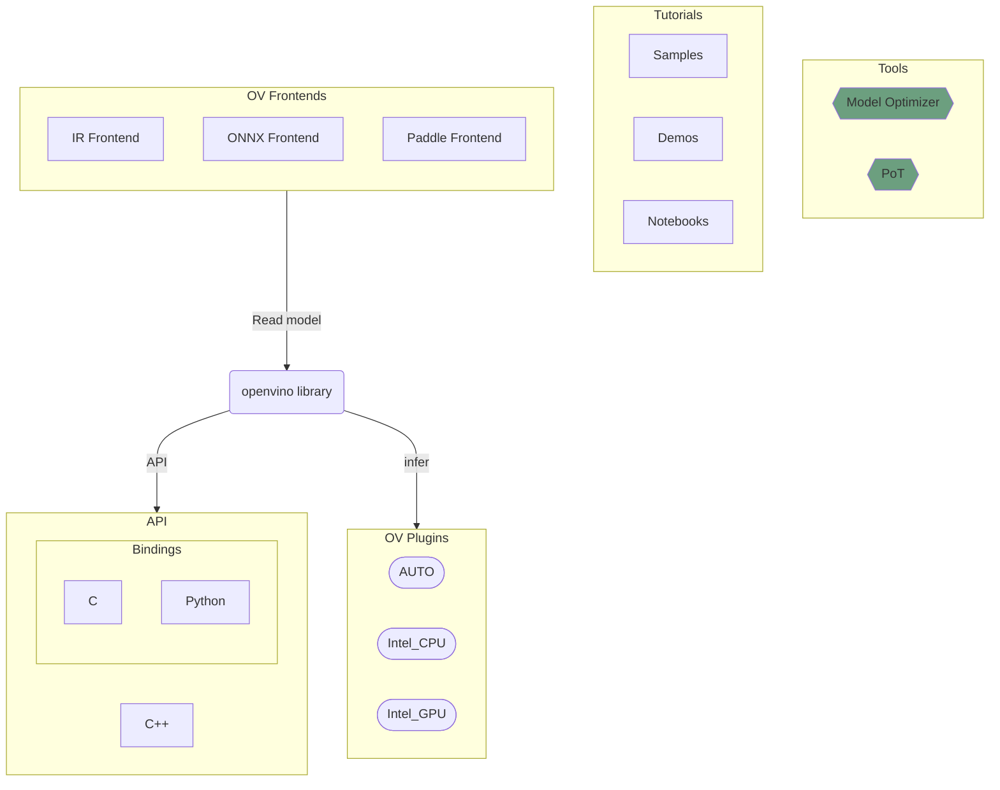
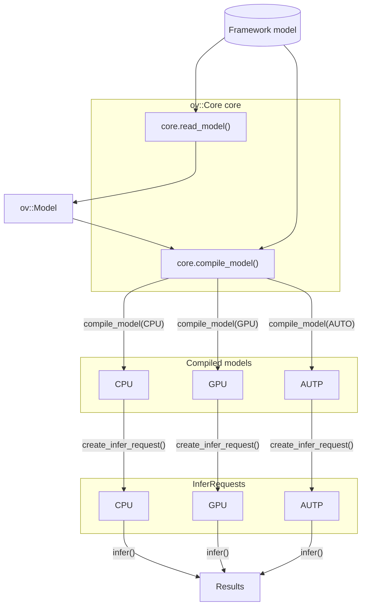

# OpenVINO Architecture

This guide encompasses existed architectural ideas and guidelines for architecture development.

## Main architectual design concepts

OpenVINO development is based on next principals:
 * Performance and Scalability - OpenVINO should provide the optimal performance in different customer cases
 * Availability and Resilience - OpenVINO is high quality product and we should demonstrate this high level in different cases
 * Security - OpenVINO is applied in different applications, it is why we have a strict validation pipelines which allow to find vulnerabilities on the development stage.

Each OpenVINO component is projected with using DOTADIW (Do One Thing And Do It Well) approach, it means that OpenVINO is highly granularity product and we are avoiding mixing of responsibilities for different components.

### OpenVINO Component responsibilities

All OpenVINO components can be logicaly divided to several groups:

 * **OpenVINO library** is a core library which provides the OpenVINO API.
 * **Bindings** are libraries which provide OpenVINO API for different languages.
 * **Frontends** are libraries which converts model from framework representation to OpenVINO format.
 * **Plugins** are components which allow to run models on different accelerators.
 * **Tools** a set of different components which provide additional opportunities for OpenVINO.
 * **Tutorials** different applications which show how user can work with OpenVINO.

### OpenVINO Inference pipeline

OpenVINO inference pipeline has several objects which are responsible for different stages of model inference.

 * `Core` object is a global context for Model inference, allows to create the unique environment for inference pipeline.
     * `read_model()` finds the right frontend and converts Framework model to OpenVINO representation.
     * `compile_model()` loads hardware plugin and compiles model on the device.
 * `CompiledModel` represents the hardware specified model, this model can contain additional plugin optimization and on this stage model already was compiled for the specific device.
 * `InferRequest` provides an interface for running inference.

## See also
 * [OpenVINO Developer documentation](../../docs/dev/index.md)
