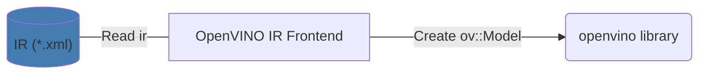

# OpenVINO IR Frontend

The primary function of the OpenVINO IR Frontend is to load an OpenVINO IR into memory.

OpenVINO IR frontend uses [the common coding style rules](../../../docs/dev/coding_style.md).

## Key contacts

People from the [openvino-ir-frontend-maintainers](https://github.com/orgs/openvinotoolkit/teams/openvino-ir-frontend-maintainers) have the rights to approve and merge PRs to the core component. They can assist with any questions about the component.

## Components

OpenVINO IR Frontend contains the next components:

* [include](./include) is a public frontend API.
* [src](./src/) folder contains the sources of the component.
* [tests](./tests/) folder contains tests for the component. To get more information, read [How to run tests](./docs/tests.md).

## Architecture

OpenVINO IR Frontend uses the [pugixml](https://github.com/zeux/pugixml/blob/master/README.md) library to parse xml files.
For detailed information about OpenVINO IR Frontend architecture, read the [architecture guide](./docs/architecture.md).

## Tutorials

 * [How to support a new opset](./docs/support_new_opset.md)
 * [How to run tests](./docs/tests.md)

## See also
 * [OpenVINO™ README](../../../README.md)
 * [OpenVINO Core Components](../../README.md)
 * [Developer documentation](../../../docs/dev/index.md)
