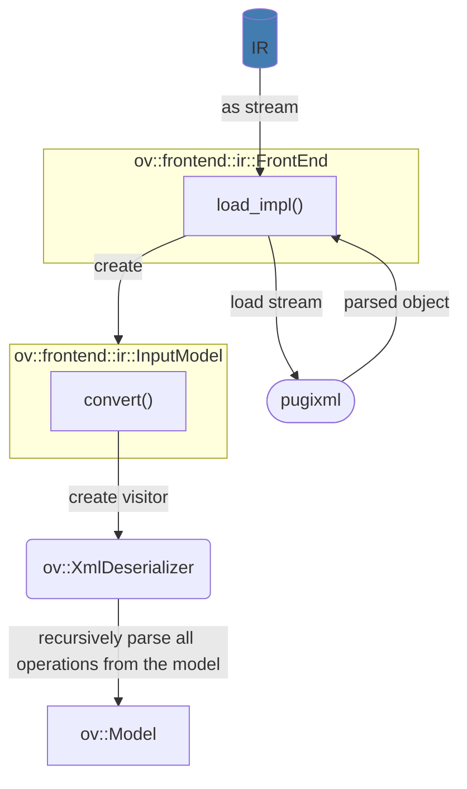

# OpenVINO IR Frontend Architecture

OpenVINO IR Frontend uses [pugixml](../../../thirdparty/pugixml/README.md) library to parse xml files. After that based on version and name of operation we found supported operation and create it using OpenVINO Visitor API:

## Extensions

OpenVINO IR Frontend supports extensions. To add an extension, use `ov::frontend::ir::Frontend::add_extension()` API.
The next extension types are supported:

* `ov::TelemetryExtension` - enable telemetry for the frontend
* `ov::BaseOpExtension` - enable support of a custom operation
* `ov::detail::SOExtension` - allow to support `ov::BaseOpExtension` extensions loaded from the external library.

## See also

 * [OpenVINO IR Frontend README](../README.md)
 * [OpenVINO™ README](../../../../README.md)
 * [Developer documentation](../../../../docs/dev/index.md)
