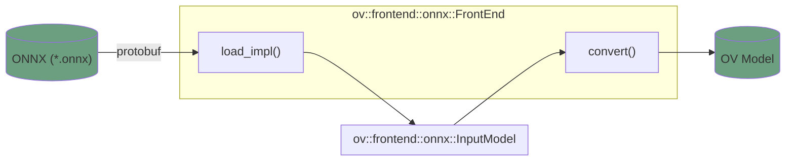

# OpenVINO ONNX Frontend

The main responsibility of the ONNX Frontend is to import ONNX models and convert them into the `ov::Model` representation. 
Other capabilities of the ONNX Frontend:
* modification of tensors properties (like data type and shapes)
* changing the topology of models (like cutting subgraphs, inserting additional inputs and outputs)
* searching the models in a user-friendly way via tensors and operators names

The component is written in `C++`. If you want to contribute to the ONNX Frontend, follow [the common coding style rules](../../../docs/dev/coding_style.md).

## Key contacts

In case of any questions, review and merge requests, contact the [openvino-onnx-frontend-maintainers](https://github.com/orgs/openvinotoolkit/teams/openvino-onnx-frontend-maintainers) group.

## Components

ONNX Frontend implements an interface common to all frontends defined in the [Frontends API](../common/include/openvino/frontend).
For backward compatibility reasons, the ONNX importer API (more lower-level abstraction approach) is still maintained. You can find it in the [ONNX Importer](./frontend/include/onnx_import/onnx.hpp).

The API of ONNX Frontend can be called directly. It is also used internally by [OpenVINO Model Converter](../../../tools/ovc) during the conversion from ONNX to Intermediate Representation (IR). The capabilities of ONNX Frontend are used by the [ONNX Runtime via OpenVINO Execution Provider](https://onnxruntime.ai/docs/build/eps.html#openvino).

Both `C++` and `Python` tests are implemented for the ONNX Frontend. Read the [ONNX Frontend tests](./docs/tests.md#onnx-frontend-testing-places) page for more details. 

## Architecture
The diagram below shows an overview of the components responsible for the basic model importing flow:

Find more details in the [ONNX Frontend architecture](./docs/architecture.md) document.

## Tutorials
* [How to add a new operation](./docs/how_to_add_op.md)
* [How ONNX Frontend is tested](./docs/tests.md)

## See also
 * [OpenVINO™ README](../../../README.md)
 * [OpenVINO Core Components](../../README.md)
 * [Developer documentation](../../../docs/dev/index.md)
 * [ONNX standard repository](https://github.com/onnx/onnx/blob/main/README.md)
 * [ONNX operators list](https://github.com/onnx/onnx/blob/main/docs/Operators.md)
 * [ONNX Runtime OpenVINO Provider](https://github.com/microsoft/onnxruntime-openenclave/blob/openenclave-public/docs/execution_providers/OpenVINO-ExecutionProvider.md)
